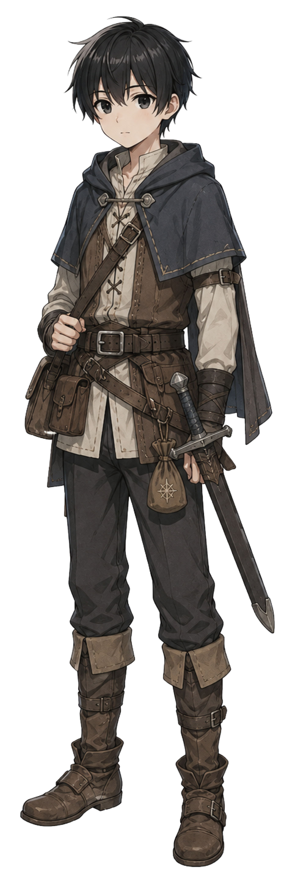
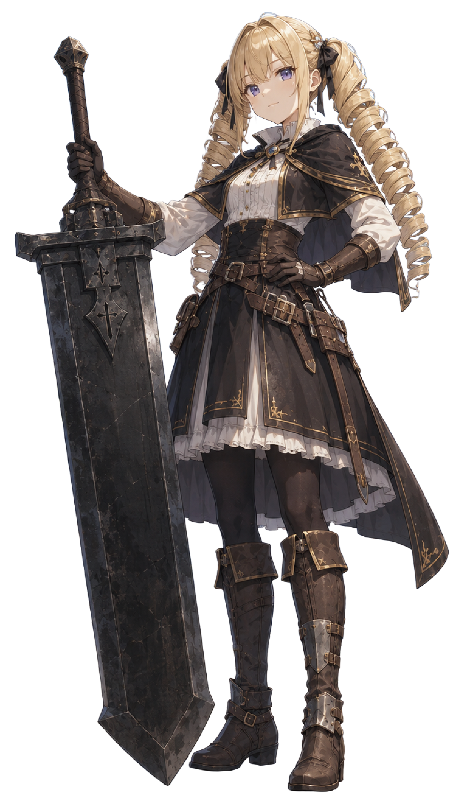
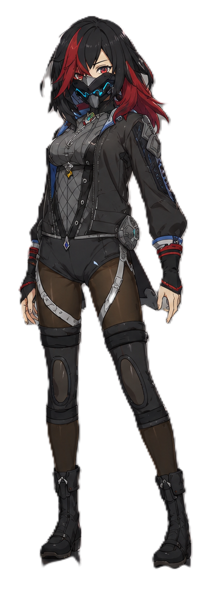
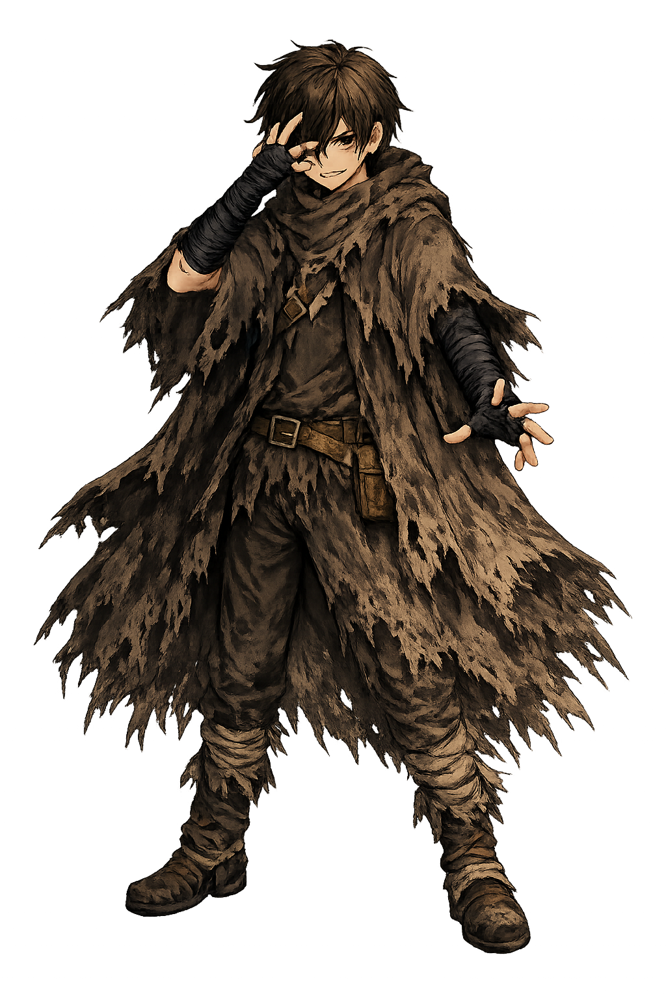

# 星明かりの道しるべ 公開資料

創作プロジェクト「妄想世界／星明かりの道しるべ」のリプレイ小説や、公開可能な世界設定をまとめるリポジトリです。

参加したプレイヤーが物語を読み返せることと、公開を許可された範囲で作品世界を楽しんでもらうことを目的としています。

## 公開中の資料

- [`【ネタバレ注意！】シナリオ「銅色の初仕事」`](【ネタバレ注意！】シナリオ「銅色の初仕事」/README.md)
  - カイト編の正史リプレイ
  - フィトリアット編の正史リプレイ
  - カーヴェイン編の正史リプレイ
  - マイン・A・レッドフォックス編の正史リプレイ
  - フィトリアット編の進行AI比較シミュレーション

## PCキャラクター

「星明かりの道しるべTRPG」で実際に冒険し、世界の住人となったPCたちです。

### カイト

村を守れる人になるため、中継都市で冒険者として歩き始めた少年。

[カイトの公開プロフィールを見る](PCキャラクター/カイト.md)

### フィトリアット・マリアベル

特大剣グランを相棒と呼び、自分の強さを信じて歩き始めた少女。

[フィトリアット・マリアベルの公開プロフィールを見る](PCキャラクター/フィトリアット・マリアベル.md)

### マイン・A・レッドフォックス

暗殺一家で育ち、父の言葉を受けて、広い世界を知るため冒険者となった小太刀使いの少女。

[マイン・A・レッドフォックスの公開プロフィールを見る](PCキャラクター/マイン・A・レッドフォックス.md)

### カーヴェイン

右腕に悪魔を封じた永劫の存在を名乗り、世界を手中に収める覇道を歩き始めた仕込み刀使いの少年。

[カーヴェインの公開プロフィールを見る](PCキャラクター/カーヴェイン.md)

[PCキャラクター一覧を見る](PCキャラクター/README.md)

世界設定などの公開資料は、今後このリポジトリへ追加します。

## 読む前に

- `【ネタバレ注意！】` と書かれたフォルダーには、完了済みシナリオのネタバレが含まれます。
- GM専用情報、未完了シナリオ、未公開設定、生のチャットログは収録しません。
- 正史版と比較シミュレーション版は、各ファイル冒頭の区分表示で明確に分けます。
- 比較シミュレーションだけで発生した出来事は、正史へ反映されません。
- プレイヤー名は、本人が公開を許可した表示名だけを使用します。

## 正本との関係

この公開リポジトリは、完成版リプレイ小説と公開可能資料の保管先です。

世界設定、人物履歴、通貨、所持品、負傷、継続状態の現行正本は、非公開リポジトリ `SealiceAltair/hoshiakari-no-michishirube` の `main` で管理します。公開リプレイだけを根拠に、未決定設定や世界共通設定を追加しません。

## 権利について

このリポジトリに明示的な許諾が記載されていない文章・設定・画像の著作権は、それぞれの権利者に帰属します。無断転載、再配布、学習データとしての再収集は許可していません。

Copyright (c) 2026 SealiceAltair. All rights reserved.
