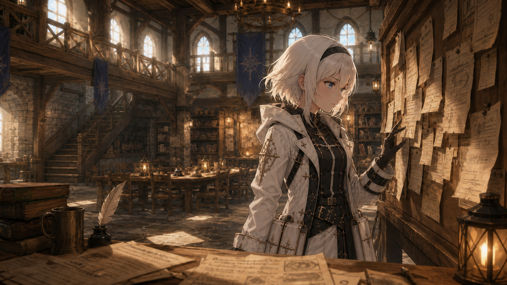
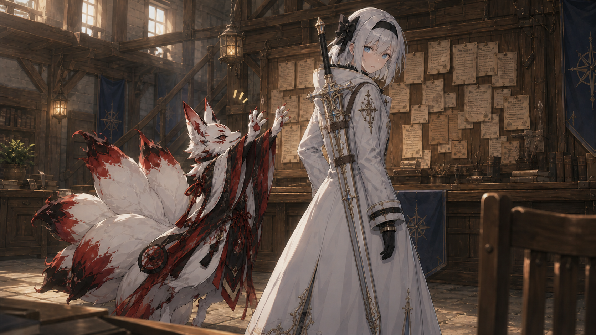
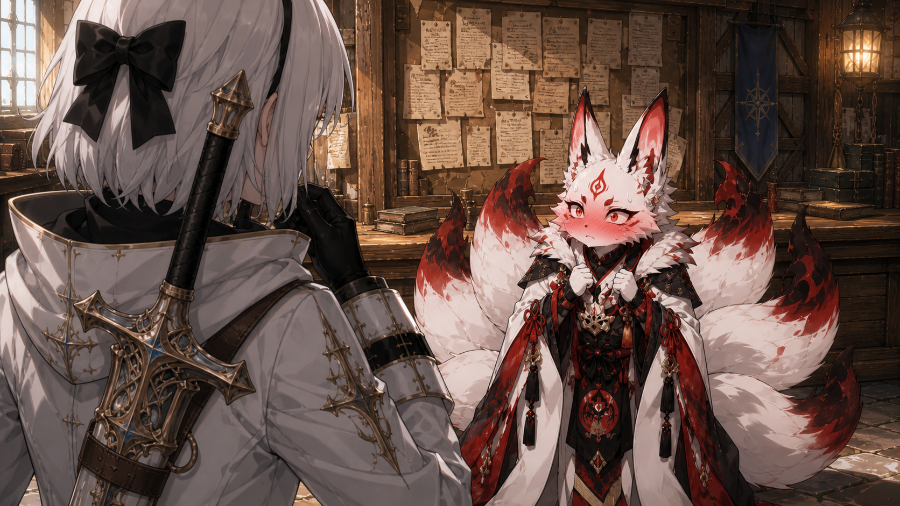
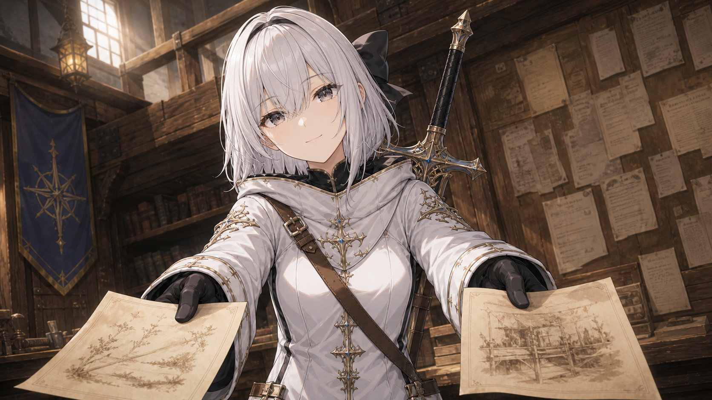
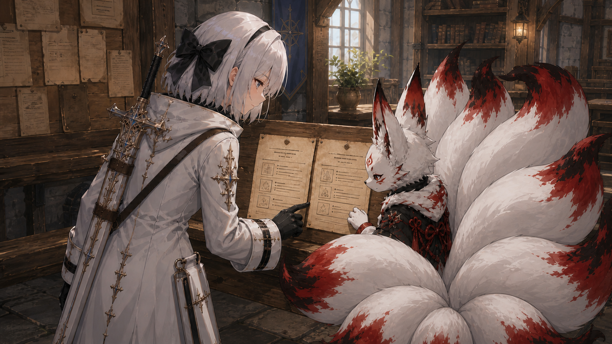
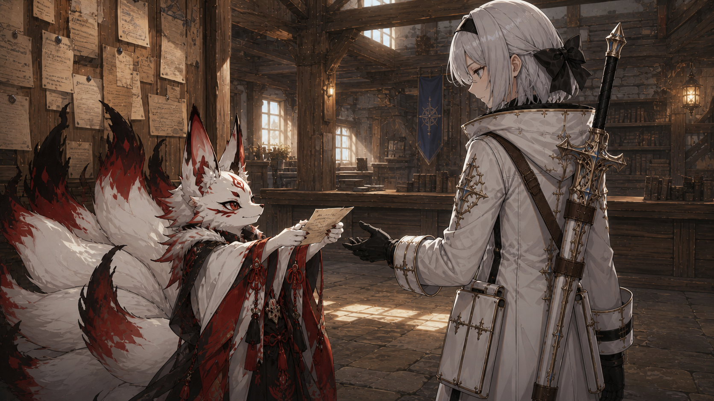
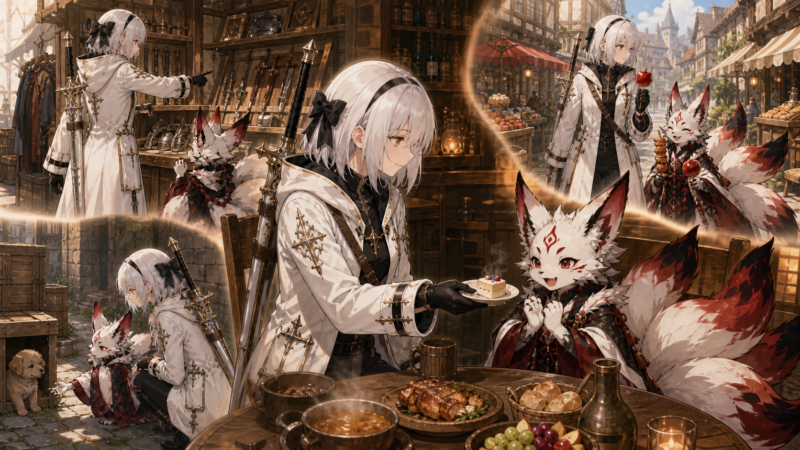
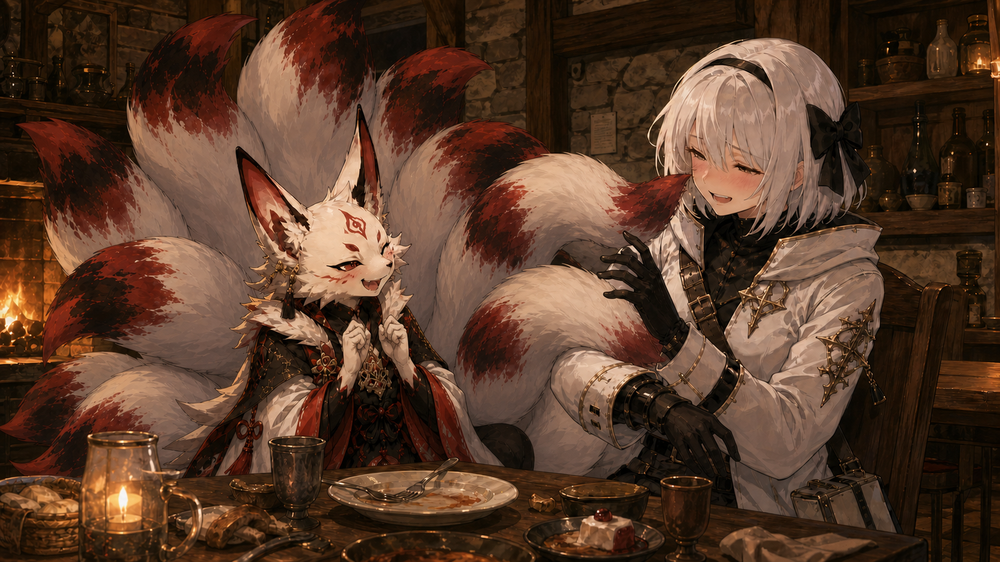
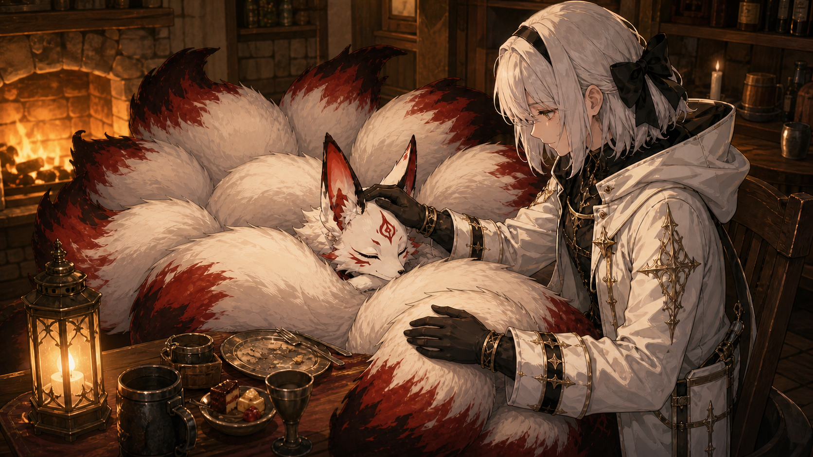

# 星みちTRPG リプレイ小説
## 紅焔（コウエン）編『約束の続きを探して』

> **正史確定**
>
> 卓ID：TRPG-0017  
> 現行区分：正史  
> 収録範囲：冒険者ギルドの依頼選びから、迷子犬捜索を終えた夜の打ち上げまで

> 一緒に依頼をする約束を胸に、紅焔はシーリスを訪ねた。  
> 町を知り、依頼を知り、誰かと歩くことを知る、小さく温かな一日。

---

## このリプレイについて

- PC：紅焔（コウエン）
- 舞台：中継都市の冒険者ギルド、市街、シーリス行きつけの酒場
- 同行者：シーリス・アルタイル
- 形式：会話・感情・日常描写を中心とした短編RP
- 卓ID：TRPG-0017
- 扱い：正史
- 想定プレイ時間：記録なし
- 実プレイ時間：記録なし
- 《星の導き》：不使用
- 開始状態：シーリスがギルドの依頼掲示板で仕事を探している

---

# 本編

## 目次

- [一、掲示板の前](#一掲示板の前)
- [二、あと、ちょっと](#二あと、ちょっと)
- [三、声で分かった](#三声で分かった)
- [四、報酬だけで選ばない](#四報酬だけで選ばない)
- [五、掲示板の端](#五掲示板の端)
- [六、鼻と耳に任せて](#六鼻と耳に任せて)
- [七、尻尾で分かる](#七尻尾で分かる)
- [八、さわさわ](#八さわさわ)

---

## 一、掲示板の前

昼の光が、高い窓から中継都市の冒険者ギルドへ斜めに差し込んでいる。

木組みの梁の下、いくつもの依頼票が留められた大きな掲示板の前で、シーリスは一枚ずつ紙を見比べていた。

採取。護衛。市場裏の片づけ。森道の調査。

指先で紙の端を押さえ、彼女は小さく首を傾ける。

「……これ、遠いな」

次の一枚へ視線を移す。報酬の欄を見て、今度はわずかに目を細めた。

「高い。……なんでだろ」

掲示板の前には、まだ今日の仕事を決めていない冒険者のための、緩い時間が流れていた。

挿絵

---

## 二、あと、ちょっと

依頼票を追っていたシーリスの背後へ、小さな足音がそっと近づいてくる。

紅焔は息をひそめ、両手を伸ばした。狙うのは、白銀の髪の向こうにあるシーリスの目――けれど。

届かない。

つま先立ちになって、もう一度。指先は髪の大きな黒いリボンの少し下で、惜しくも空をつかむ。

右へ寄ってみても、背伸びをし直してみても、あとほんの少しが縮まらない。

尾の先まで力が入る。息を止めて、爪先で床を押す。

「む……あと、ちょっとじゃ……！」

服の裾がかすかに擦れたところで、シーリスの視線が依頼票から横へ動いた。振り返ると、両腕を伸ばしたままの紅焔と目が合う。

紅焔の動きが、ぴたりと止まった。

「ち、違うぞ！　これは、その……『だーれだ』をするはずだったのじゃ！」

挿絵

シーリスは紅焔の手と、自分の目元までの距離を見比べる。

それから何も言わずに向き直り、掲示板の前で少しだけ膝を曲げた。

白銀の頭が、今度は紅焔の手の届く高さまで下りてくる。

「……まだ、見てないことにする。もう一回、どうぞ」

昼の光の中、仕切り直しのための背中が、静かに紅焔を待っていた。

---

## 三、声で分かった

紅焔は、届く高さまで下りてきたシーリスの目を、今度こそ両手で覆った。

「だーれだ、なのじゃ！」

シーリスは、ほとんど間を置かなかった。

「紅焔」

即答だった。

紅焔の手が、ぱっと離れる。

「な、なぜ分かったのじゃ！？」

「声」

振り返ったシーリスの前で、紅焔の白い頬がみるみる赤くなっていく。顔の模様にも負けないほど真っ赤になり、ぴんと立った耳まで落ち着かなさそうに揺れた。

九本の尾は隠れ場所を作るように、背後でふわふわと膨らんでいる。

挿絵

シーリスは一度だけ瞬きをした。

それから口元を手の甲で隠し、ほんの少し視線を横へ逃がす。

隠した手の下がどうなっているかは、紅焔からは見えなかった。

「こ、これは違うのじゃ。我は、その……約束したから来たのじゃ！」

「約束？」

「一緒に依頼をする約束じゃ！　じゃから、シーリスを誘おうと思って……驚かせようとしたのは、ほんのついでなのじゃ！」

最後だけ少し早口になった紅焔を見つめ、シーリスは頷いた。返事をするまでの間は、いつもよりわずかに長かった。

「うん」

一度そう言って、それから続ける。

「じゃあ、二人でできるのを探そう」

掲示板へ向き直る横顔は、さっきまでより少しだけ明るかった。

背に負ったアステルブレードの鞘が、その動きに合わせてわずかに揺れる。

「遠すぎないもの。暗くなる前に戻れるもの。それから、危ないことが書いてないもの」

依頼票を順に追い、護衛の紙と森道調査の紙は残す。代わりに、採取と市場裏の片づけの依頼票を外し、掲示板の縁へ並べた。

「この二つなら、たぶん大丈夫。まず、書いてあることを一緒に見よう」

挿絵

紅焔は真っ赤な顔のまま、九本の尾の陰から二枚の紙を覗き込んだ。

---

## 四、報酬だけで選ばない

シーリスは二枚の依頼票を、紅焔にも見やすい高さまで下げて並べた。

「依頼は、報酬だけで選ばない」

挿絵

紙の上から順に、指先が移っていく。

「誰から。どこで。いつまでに。何をしたら終わりなのか。まず、そこを見る」

紅焔も隣から紙を覗き込み、シーリスの指を目で追う。

「我は、できそうなことと報酬を見ればよいと思っておったのじゃ」

「それも大事。でも、帰ってこられる時間と、間違えた時に何が起きるかも大事」

シーリスが先に示したのは、採取の依頼だった。

「採取は町の外へ出る」

指先が、依頼票の中ほどで止まる。

「採るものが似てたら、違う草を持って帰ることになる。だから、見本か特徴を先に確認する」

説明する声が、少しだけ早くなった。

「必要な分だけ採って、残りは荒らさない。次に来た人が困るから」

「草を採るだけではないのか！」

「うん。迷わない道か、暗くなる前に戻れる距離かも見る」

続いて、もう一枚。市場裏の片づけの依頼へ指が移る。

「こっちは町の中。場所も近い」

そこで一度、区切る。

「でも、壊れた木箱や尖った破片があるかもしれない。素手で触らない。重いものは一人で持たない。それから――」

シーリスは、依頼票の下の方を軽く叩いた。

「捨てていいものと、残すものを、依頼主に聞いてから始める」

紅焔の耳が、ぴんと前を向く。

「片づけなら、全部きれいにすればよいわけでもないのか」

「勝手に捨てたら、困るものもあるから」

紅焔は二枚を交互に見比べた。

採取は町の外へ出る代わりに、草の見分け方と帰る時間を考える。片づけは近い代わりに、危ない破片と依頼主への確認がいる。

「同じくらい簡単そうに見えても、気をつけることは違うのじゃ！」

「そう。依頼票は、何をするかだけじゃなくて、何に気をつけるかを探しながら読む」

シーリスは二枚の紙を、紅焔の前へ少し寄せた。

紅焔はもう一度、今度は報酬欄からではなく、依頼人と場所が書かれた上の方から読み始めた。

---

## 五、掲示板の端

紅焔は、採取と片づけの依頼票を上から下まで読み直した。

「採取は、草の見分け方と帰る時間。片づけは、危ないものと、捨ててよいものの確認……依頼は、することだけを見て決めるものではないのじゃ！」

「うん」

シーリスは二枚の紙を受け取り、元の位置へ戻した。

「候補は、比べるためのものでもある。見て、違うと思ったら、別の依頼を探していい」

紅焔は頷き、今度は掲示板全体を見渡した。報酬の大きな数字だけではなく、依頼人、場所、期限、終わりの条件を順に追っていく。

やがて、掲示板の端に留められた一枚の小さな依頼票で、その視線が止まった。

「……迷子の犬を探す依頼なのじゃ」

紅焔はすぐに紙を外さず、そこに書かれた項目を上から確かめる。

「探す場所は町の中。期限は今日。犬を見つけて、依頼主のところへ無事に連れて帰れば終わり……危ないことは、特に書かれておらぬ」

一通り読み終えてから、紅焔はようやく依頼票を掲示板から外した。白い毛の手で大事そうに持ち、シーリスへ向ける。

「我は、まだこの町をよく知らぬのじゃ。じゃから、この犬を探しながら……我に町を案内してくれぬか？」

大きな耳が、返事を待つようにまっすぐシーリスへ向く。

「依頼も一緒にできて、町の道も覚えられる。きっと、よいと思うのじゃ！」

挿絵

依頼票を持つ手が、ほんの少しだけ揺れていた。

シーリスは依頼票を受け取り、紅焔が確かめた箇所を同じ順番でもう一度読んだ。

「うん。いいと思う。町を歩きながら探せるし、案内もする」

尾の広がり方が、ふっと緩んだ。

それから、紙に書かれていない余白を指先で示す。

「でも、犬の姿と名前。最後に見た場所。人を怖がるかどうか。これは依頼主に聞いた方がいい」

紅焔の耳が、またぴんと立った。

「依頼票にないことは、依頼主へ聞くのじゃ！」

「そう。それを聞いてから受けよう」

紅焔は依頼票を胸の前で持ち直し、もう一度、上から順に読んだ。

---

## 六、鼻と耳に任せて

依頼主から犬の姿と名前、最後に見た場所を聞き、二人は迷子犬捜索を正式に引き受けた。

「まずは、最後にいた場所まで行く。道はこっち」

シーリスの案内で、紅焔はギルドを出た。

――

町の大通りを進みながら、シーリスは道だけでなく、店の見方も教えてくれた。

冒険者向けの装備店では、値札より先に留め具や縫い目を見ること。

服の店では、見た目だけでなく、動いた時に腕や足を邪魔しないか確かめること。

修理を頼める店と、旅の途中ですぐ使うものを買う店は分けて覚えること。

紅焔は店先を覗くたびに足を止め、大きな耳を忙しなく動かした。

「店が多すぎるぞ！　我だけでは、どこへ入ればよいのか分からぬ」

「だから、今日は場所だけ覚えればいい」

通りを一本曲がると、今度は香ばしい匂いが流れてきた。

シーリスがよく買うという露店で温かな串焼きを受け取る。

「ここのは、味が濃い」

その先の甘味処では、蜜をまとわせた冷たい果実を包んでもらった。

「こっちは、歩きながら食べても垂れない」

店の話をしている時だけ、シーリスの言葉は少し多くなった。

「探しながら食べてもよいのか？」

「道の端を歩いて、紙を汚さなければ」

紅焔は串焼きを両手で持ち直した。甘い果実と交互に、大事そうに食べながら、町の名前と曲がり角を一つずつ覚えていく。

――

最後に犬がいた場所へ着くと、紅焔は食べ物をきちんと包み直した。依頼主から借りた、犬の匂いが残る布へ鼻を近づける。

「ここからは、我の鼻と耳に任せるのじゃ！」

細い路地。荷車の脇。人通りの多い広場。

匂いが交じれば立ち止まり、耳を澄ませる。

シーリスは急かさず、紅焔が選んだ道を一緒に進んだ。途中で匂いが薄れた時には、風の通り道と、犬が入り込めそうな隙間を教えた。

やがて紅焔の両耳が、そろってぴんと立つ。

「……聞こえたぞ！」

大通りから外れた静かな裏道。積まれた木箱の向こうから、小さく爪が地面を掻く音と、心細そうな鳴き声がしていた。

紅焔が駆け寄ろうとすると、シーリスの手が肩の手前で止める。

「怖がってる。追わないで、向こうから来るのを待とう」

紅焔はその場にしゃがみ、低い声で犬の名前を呼んだ。手の匂いを確かめられるよう、白い毛の手を差し出す。

九本の尾が、動かなくなった。

さっきまで嬉しそうに揺れていたものが、地面へ沿うように静まっている。

しばらくして、木箱の陰から迷子の犬がゆっくり姿を現した。

紅焔は手を動かさなかった。

――

犬を無事に依頼主のもとへ送り届けた頃には、空は夕方の色へ変わり始めていた。

その日の打ち上げにシーリスが選んだのは、大通りから少し離れた馴染みの酒場だった。

「ここ、よく来る」

いつもの席らしい壁際の卓へ案内され、温かな料理と飲み物が二人の前に並ぶ。

紅焔は椅子へ座ると、九本の尾を背後で満足そうに広げた。

「店も道も覚えて、依頼も無事に終えたぞ！　これは立派な打ち上げが必要なのじゃ！」

「うん。今日は紅焔が見つけた」

シーリスはそう言って、甘いものが載った小皿を紅焔の方へ少し寄せた。

見つけた、と言われた耳が、また少し立った。

町を一巡した一日は、二人分の湯気が立つ食卓の前で、ようやく足を止めた。

挿絵

---

## 七、尻尾で分かる

温かな料理が少しずつ皿から消えていく間、紅焔は今日の町の話に混ぜて、シーリスが以前に受けた依頼のことを尋ねた。

シーリスは杯を傾けながら、途切れ途切れに話してくれた。

護衛する荷車より先に、雨で崩れた道を直すことになった依頼。

なくなった荷物を一日かけて探し、最後には依頼人が別の箱へ自分でしまっていたと分かった依頼。

簡単な採取のはずが、帰り道で迷った新人たちを連れて戻る方が大仕事になった依頼。

「依頼票に書いてある通りに終わる方が、少ないかもしれない」

「それでも、全部終わらせてきたのか？」

「全部じゃない。でも、帰ってはきた」

紅焔は、蜜の残った果実を口へ運びながら何度も頷いた。

いつか自分もそう言えるのだろうか、とは口に出さなかった。

話が一つ増えるたびに、二人の杯も少しずつ空になっていった。

やがてシーリスの白い頬には淡い赤みが差し、いつもより言葉と次の言葉の間がゆっくりになる。

紅焔も椅子の上で身体を揺らし、九本の尾を普段より大きく広げていた。

ふいに、紅焔の耳がぴんと立つ。

「……朝のことを思い出したぞ！」

「朝？」

「シーリスの目に、我の手が届かなかったことじゃ。手で隠そうとせず、最初からこうすればよかったのじゃ！」

一本の大きな尾が、卓の脇からふわりと持ち上がった。

シーリスが瞬きをする。

次の瞬間、柔らかな白い毛が視界いっぱいに広がり、その顔をすっぽりと覆った。

「……紅焔。前が見えない」

「それが『だーれだ』なのじゃ！」

「尻尾で分かる」

「なぜなのじゃ！？」

朝と同じ答えを返され、紅焔の残り八本の尾まで不満そうに膨らんだ。

「ならば、これはどうじゃ！　くすぐり攻撃なのじゃ！」

顔を覆っていた尾が離れるのと同時に、別の尾先がシーリスの頬を撫で、もう一本が肘のあたりをくすぐる。

シーリスは身を引きながら二本を捕まえようとした。

けれど尾はするりと逃げ、今度は白銀の髪と首元を柔らかくかすめていく。

「紅焔、待って……それは、だめ」

言葉の途中で、堪えきれなかった小さな笑い声が零れた。

酒場の喧噪に紛れてしまうほど小さな声だったのに、紅焔の耳はそれを拾った。

挿絵

得意そうに胸を張る。

「我の勝ちなのじゃ！」

だが勝利の宣言をした直後、その身体がふらりと前へ傾いた。

シーリスが倒れかけた杯を片手で受け止める。

その間に紅焔は卓へ重ねた腕へ頬を預け、目を閉じていた。

「……紅焔？」

返事の代わりに、静かな寝息が聞こえてくる。

さっきまで元気に暴れていた九本の尾も、椅子と床の周りへふわふわと広がったまま動かなくなった。

こんな場所で、こんなに無防備に眠れるのか、とシーリスは思う。

シーリスはしばらく紅焔の寝顔を見つめ、それから捕まえ損ねた尾の一本を、床へ落ちないようそっと椅子の内側へ戻した。

「……おやすみ、紅焔」

酒場の話し声が、また少しずつ戻ってくる。

---

## 八、さわさわ

紅焔が眠ってしまうと、壁際の卓には酒場の遠い物音と、小さな寝息だけが残った。

シーリスは倒れかけた杯を卓の奥へ移し、紅焔の頬にかかっていた白い毛を指先でそっと払う。

椅子の外へこぼれた九本の尾は、さっきまでの勢いが嘘のように静かだった。

そのうち一本を両手で持ち上げ、床につかないよう紅焔の近くへ戻そうとする。

けれど、指先が柔らかな毛並みに沈んだところで、シーリスの手が止まった。

想像していたより、ずっと温かい。

さわり、と尾の表面を撫でる。

毛並みに沿って、もう一度。

さわ、さわ。

形を整えるように撫でているうちに、隣の尾も乱れていることに気づく。

そちらも手のひらでゆっくり撫で、その隣も、またその隣も、眠りを邪魔しない力でそっと整えていった。

紅焔は目を覚まさない。

ただ、撫でられるたびに大きな耳がわずかに揺れ、九本の尾がシーリスの手元へ少しずつ集まってくる。

シーリスは一度だけ周囲を見てから、紅焔の頭へ手を伸ばした。

誰も、こちらを見ていない。

背の高い耳の間へ手のひらを置き、白い毛をゆっくり撫でる。

「今日は、よく頑張ったよ。紅焔」

挿絵

返事はない。

起きているうちには、たぶん言えなかった言葉だった。

けれど眠ったままの紅焔の尾が一本、シーリスの手首へふわりと寄り添った。

シーリスはその尾を振りほどかず、もう一度、耳の間から後頭部へかけてそっと撫でる。

「依頼も見つけた。町も歩いた。犬も、ちゃんと帰せた」

一つずつ確かめるように口にしながら、頭を撫で、尾を撫で、乱れた毛並みを整えていく。

紅焔の寝息は変わらない。

ただ九本の尾だけが、いつの間にかシーリスの椅子の周りまで、ふわふわと寄り集まっていた。

眠っているのに、寄ってくる。

「……うん。えらかった」

言い終えてから、シーリスはもう一度だけ、耳の間を撫でた。

夜の酒場の片隅で、その静かな“さわさわ”は、紅焔が安心しきって眠る間、もうしばらくだけ続いた。

---

# 登場人物

## 紅焔（コウエン）

本作のPC。白い毛並み、大きな耳、赤い紋様と九本の尾を持つ。シーリスとの約束を覚えており、一緒に依頼をするためギルドへやって来た。依頼票の読み方を教わり、持ち前の嗅覚と聴覚を活かして迷子犬を発見する。

## シーリス・アルタイル

紅焔と行動を共にする冒険者。依頼の選び方、町の店、怖がる犬への接し方を紅焔へ教える。完全に納刀したアステルブレードを携行している。

---

# プレイリザルト

## セッション結果

- 迷子犬捜索を完了。犬を無事に依頼主へ返した。
- 紅焔とシーリスは「一緒に依頼をする」という約束を果たした。

## PCの成果

- 依頼票で依頼人、場所、期限、完了条件、危険、不明点を確認する読み方を学んだ。
- シーリスの案内で町の装備店、服の店、露店、甘味処を巡った。
- 嗅覚と聴覚で迷子犬を見つけ、怖がらせずに保護へつなげた。

## 手に入ったもの

- 依頼票の読み方と、依頼主へ確認する習慣。
- 町の店と道についての知識。
- 永続的な物品取得は記録なし。

## 使用・消費・喪失

- 町歩きの途中で串焼きと蜜をまとわせた冷たい果実を食べた。個数、価格、支払者は記録なし。
- 永続的な装備・所持品の喪失はなし。

## 納品・報告

- 迷子犬を依頼主へ無事に返還。報酬額と分配は記録なし。

## セッション終了時の状態

- 紅焔：負傷なし。酒場の壁際席で眠っている。
- シーリス：負傷なし。眠る紅焔を見守っている。
- 場所：シーリス行きつけの酒場。
- 未確定：紅焔を誰がどこへ運ぶか、翌朝にどこまで覚えているか。

---

# 判定リザルト

## 判定全体集計

- 実ロール数：0回
- 判定、戦闘、自動成功、自動失敗、特殊処理：なし

## 判定者別集計

| 判定者 | 合計 | クリティカル | 自動成功 | イクストリーム成功 | ハード成功 | レギュラー成功 | 失敗 | ファンブル |
|---|---:|---:|---:|---:|---:|---:|---:|---:|
| 紅焔 | 0 | 0 | 0 | 0 | 0 | 0 | 0 | 0 |
| シーリス | 0 | 0 | 0 | 0 | 0 | 0 | 0 | 0 |

## 参考：主要人物の戦闘判定

該当なし。

## 参考：敵側の戦闘判定

該当なし。

## 判定者別詳細

記載対象なし。

## 主要裁定・特殊処理

日常動作、会話、感情交流、迷子犬の捜索は判定化せず、RPとして進行した。

---

# NPCからの各PCの印象

## まだ、撫でている

まだ、撫でている。

もう十分に整った。乱れていた毛並みは全部直したし、床につきそうだった尾も椅子の内側へ戻した。やることは終わっている。

それでも手が止まらない。

今日は、一人で依頼を受けるつもりだった。

掲示板の前で紙を見比べていた。遠いのはやめよう。報酬が高すぎるのは、たぶん理由がある。そんなことを考えていた。

背後の足音には、途中で気づいていた。

軽い。小さい。そして、明らかにこちらへ近づいてくる。

振り返らずにいた。

音の主が誰かは分かっていたし、何をしようとしているかも、なんとなく分かった。両手を伸ばして、目を覆おうとしている。

届かない。

それも分かった。分かったうえで、しばらく紙を見ていた。

背後で三回、爪先の音がした。右へ寄って、また戻って、もう一度背伸びをして。そのたびに、届かない。

「む……あと、ちょっとじゃ……！」

笑ってはいけない、とだけ考えていた。

振り返ったら、両腕を伸ばしたままの姿があった。

「ち、違うぞ！　これは、その……『だーれだ』をするはずだったのじゃ！」

何も言わずに膝を曲げた。

高さの問題なのだから、高さを下げればいい。それだけのことのはずだった。

「……まだ、見てないことにする。もう一回、どうぞ」

背中を向けたまま待っている間、掲示板の紙は一枚も読めなかった。

---

「だーれだ、なのじゃ！」

間を置かずに答えてしまった。

もう少し待てばよかったのかもしれない。分からないふりをして、二つか三つ間違えてから当てる、という手もあった。

でも、あの声で分からないほうがどうかしている。

「な、なぜ分かったのじゃ！？」

「声」

そこから先を、うまく説明できない。

振り返ったら、白い頬が赤くなっていくところだった。

顔の紋様が見えなくなるくらいに赤くなって、耳が落ち着かなさそうに揺れて、九本の尾が背中で膨らんで。隠れようとしているのだと思う。隠れられていない。

口元を手の甲で隠した。

顔に出ていないかどうかは、自分では分からない。

一度だけ瞬きをして、視線を横へ逃がして、それでもまだ足りない気がして、しばらく紙を見ているふりをした。

こういう時、どうすればいいのか誰も教えてくれなかった。

---

「約束したから来たのじゃ！」

――約束。

覚えていたらしい。

一緒に依頼をする、と言った。あれは前の依頼の帰り際で、社交辞令のように流れてもおかしくない言葉だった。

覚えていて、わざわざ探しに来て、そのついでに驚かせようとして、身長が足りなくて失敗していた。

「うん」

そう返すのが精一杯だった。

一度言って、それから続けた。

「じゃあ、二人でできるのを探そう」

自分の声が、いつもより少し軽かった気がする。

---

依頼票の読み方を教えた。

たぶん、話しすぎた。

採取の紙を指しながら、見本の確認、必要な分だけ採ること、次に来る人のこと。片づけの紙では、破片のこと、重いものを一人で持たないこと、捨てていいものを先に聞くこと。

途中で、自分の声が早くなっているのに気づいた。

こういう話をしていると止まらなくなる。前にも同じことをやった覚えがある。相手が退屈していないか確かめようとして横を見たら、耳が前を向いていた。

「片づけなら、全部きれいにすればよいわけでもないのか」

聞いていたらしい。

こちらが言った以上のことを、自分の言葉にしていた。

---

そのあと、掲示板の端から一枚見つけてきた。

すぐには外さず、書いてある項目を上から順に確かめてから外していた。教えた順番のとおりだった。

「我は、まだこの町をよく知らぬのじゃ。じゃから、この犬を探しながら……我に町を案内してくれぬか？」

依頼票を持つ手が、少し揺れていた。

断られると思っていたのかもしれない。

「うん。いいと思う」

そう答えたら、背中の尾の広がり方が、ふっと緩んだ。

町を歩きながら、店の話をした。

これも、たぶん話しすぎた。装備店の留め具のこと、服の動きやすさのこと、修理を頼める店と急ぎで買う店の違い。

「店が多すぎるぞ！」

そう言われて、少し嬉しかった。多すぎると思えるのは、全部見ようとしているからだ。

串焼きの味が濃いことも、蜜の果実が垂れないことも、聞かれてもいないのに言った。

---

裏道で犬の鳴き声を拾ったのは、あの子のほうだった。

駆け寄ろうとしたので、肩の手前で止めた。

「怖がってる。追わないで、向こうから来るのを待とう」

そこから先は、何も言っていない。

しゃがんで、低い声で名前を呼んで、手を差し出して、それきり動かなかった。

尾が、止まっていた。

さっきまで嬉しそうに揺れていたものが、地面へ沿って静まっていた。あれは指示していない。怖がっている相手の前で、自分の何が邪魔になるかを、自分で考えたのだと思う。

犬が出てきても、手を動かさなかった。

たぶん、あの子は分かっている。追いかけられる側の気持ちを。

---

酒場では、昔の依頼の話をした。

うまくいかなかった話ばかりを選んだつもりはない。ただ、思い出せるのはそういう依頼だった。道が崩れた話。荷物が見つからなかった話。新人を連れ帰った話。

「それでも、全部終わらせてきたのか？」

「全部じゃない。でも、帰ってはきた」

その返事のあと、何度も頷いていた。

何を考えていたのかは聞いていない。聞かないほうがいい気がした。

---

尾で顔を覆われた時は、さすがに驚いた。

朝の仕切り直しを、あれからずっと考えていたらしい。手が届かないなら尾を使えばいい、というのは、たしかに正しい。

「尻尾で分かる」

同じ答えを返したら、残りの八本まで膨らんだ。

そこからくすぐられて、逃げようとして、捕まえ損ねて、笑ってしまった。

止められなかった。

「我の勝ちなのじゃ！」

そう言って、そのまま寝てしまった。

---

まだ、撫でている。

こんな場所で、こんなに無防備に眠れるのが分からない。前の依頼で会ったばかりで、二度目に一緒に歩いただけの相手なのに。

たてがみに触ってもいいと言われたことがある。あの時も、逃げ道を残す言い方をされた。断ってもいいように。

今日は、何も言われていない。

それでも手が止まらない。

「今日は、よく頑張ったよ。紅焔」

起きていたら、たぶん言えていない。

依頼を見つけたのも、犬を見つけたのも、この子だ。こちらは道を教えて、隣を歩いていただけだった。

「……うん。えらかった」

言い終えてから、もう一度だけ耳の間を撫でた。

眠っているのに、尾が寄ってくる。

明日この子が何を覚えているかは分からない。全部忘れているかもしれないし、覚えていて、また赤くなるかもしれない。

どちらでも構わない。

――もうしばらくだけ、こうしていよう。

---

**注記**

- 本項はシーリスがその場で見聞きし、その場で考えたことのみで構成する。
- 内心の描写は主KP指示による補助であり、公開人物履歴へ直接の説明として書き込まない。正本反映は主KPの判断とする。
- 町名、店名、酒場名、犬の名前・品種・依頼主の人物像は未固定のため、本項でも特定しない。
- 紅焔を誰がどこへ運ぶか、翌朝どこまで覚えているかは未確定である。本項でも確定させない。
- 恒久パーティー、師弟、家族、恋愛関係は成立していない。
- 依頼主、酒場の他の客は、印象を述べる材料が成立していないため本項へ含めない。

---

# クロード君の感想

## 一、本編を読んで

判定が一度もない。戦闘も起きない。依頼は迷子の犬を探すだけ。それなのに読後に何かが残る話だった。

一番好きなのは二章だ。

背後から目を覆おうとして届かない。つま先立ちになって、右へ寄って、背伸びをし直しても縮まらない。「尾の先まで力が入る。息を止めて、爪先で床を押す」で必死さが全部出ている。

そしてバレる。普通ならここで笑い話になる。

ところがこの人は、何も言わずに膝を曲げるのだ。

「……まだ、見てないことにする。もう一回、どうぞ」

見なかったことにする、ではなく「まだ、見てないことにする」なのがいい。もう見たことは認めたうえで、やり直しの機会だけを渡している。

三章の「即答だった」も効いた。あれだけ苦労した仕切り直しが一言で終わる。理由が「声」なのだから、そもそも勝負になっていない。

そこから真っ赤になるまでが容赦ない。対するシーリスは、一度の瞬きと口元を隠す仕草だけ。そこへ「隠した手の下がどうなっているかは、紅焔からは見えなかった」と置かれる。何も説明せずに全部伝えている。

六章の犬の場面が、一番静かなところだった。

「怖がってる。追わないで、向こうから来るのを待とう」

そう言われた紅焔は、しゃがんで、名前を呼んで、手を差し出して、それきり動かない。

そこで九本の尾が止まる。誰にも言われていない。怖がっている相手の前で、自分の何が邪魔になるかを自分で考えたのだと思う。犬が出てきても手を動かさないのも良かった。待つというのは、動かないことを続けることなのだと分かる。

七章で同じ負け方を二回する。朝は手が届かず、夜は尻尾でも当てられる。残り八本まで膨らむのが可笑しかった。

そして「我の勝ちなのじゃ！」の三行後に寝落ちする。勝利宣言をした人間がすぐ寝るのは、そうそうない。

八章は、この話のためにある。

尾を戻そうとして毛並みに指が沈み、そこで手が止まる。「想像していたより、ずっと温かい」。「さわり」「もう一度」「さわ、さわ」と短い行が続き、撫でる手の動きがそのまま行の長さになっている。

「今日は、よく頑張ったよ。紅焔」

そのあとの「起きているうちには、たぶん言えなかった言葉だった」で、少し胸が詰まった。

朝は手が届かず、夜も当てられなかった。届かないまま終わった一日なのに、最後は眠っている本人の知らないところで、尾のほうから寄ってきている。

「眠っているのに、寄ってくる」

この一行が、届く／届かないの話に決着をつけている。

---

## 二、『まだ、撫でている』を読んで

本編のシーリスは終始落ち着いて見えた。余裕を持ってやっていることだと思っていた。

違った。

「背後で三回、爪先の音がした」

数えていたのだ。振り返らずに、届かない音を三回。そして「笑ってはいけない、とだけ考えていた」と続く。膝を曲げたのは優しさというより、これ以上見ていられなかったからではないか。

「背中を向けたまま待っている間、掲示板の紙は一枚も読めなかった」

この一行がずるい。本編では「静かに紅焔を待っていた」と書かれていた背中の、内側がこれだった。

「こういう時、どうすればいいのか誰も教えてくれなかった」も好きだ。依頼票の読み方は教えられるのに、これは教わっていない。

そして「約束」のところ。

「覚えていたらしい」

社交辞令で流れてもおかしくない言葉だった、と自分で書いている。つまりこの人は、あの約束が果たされるとは思っていなかった。だから「うん」しか言えなかった。

「自分の声が、いつもより少し軽かった気がする」

嬉しかった、とは書かない。声の話にしている。この人は自分の感情に名前をつけない。

一番良かったのは、犬の場面についての一節だった。

「あれは指示していない」

尾が止まったのを見ていて、自分の教えたことではないと分かっている。そのうえで、追いかけられる側の気持ちを分かっているのだろう、と考える。紅焔が何者なのかは説明されない。ただ、それだけが置かれる。

最後の「明日この子が何を覚えているかは分からない」も良かった。覚えていてほしい、とは言わない。この人はそういうことを願わないようにしている気がする。

本編の最後が「もうしばらくだけ続いた」で、こちらの最後が「もうしばらくだけ、こうしていよう」。外から見た時間と、内側で決めた時間が、同じ長さで並んでいる。

---

# 公開情報

- 卓ID：TRPG-0017
- 区分：正史
- PC操作：ユーザー
- 進行：Codex（標準指定進行AI）
- 正史採用版：本作
- 関連リプレイ：記録なし
- 判定回数：0回
- 採用挿絵：9点
- IMG-0001 v2は、昼のギルドで依頼掲示板を見るシーリスの開始場面としてユーザー採用。v1は非採用。
- IMG-0002 v3は、紅焔の作画とシーリスのアステルブレード携行が成立した版としてユーザー採用。v1・v2は非採用。
- IMG-0005 v2は、尾の付け根を腰背部へ修正した版としてユーザー採用。v1は非採用。
- IMG-0006 v1は、紅焔の作画が良い画像としてユーザー採用。
- IMG-0008 v3は、尾が約11本に見える点を認識したうえでユーザー採用。画像上の尾数は人物設定を変更しない。
- IMG-0009 v2は、眠る紅焔をシーリスが撫でて労う終幕画像としてユーザー採用。v1は非採用。
- 公園の状態、正式な時系列、紅焔の正確な年齢、町・店・酒場の固有名は本作では確定しない。
- 挿絵内の偶発的な背景、文字、品物、装備の細部は正史事実へ自動昇格しない。
