---

document_type: replay_novel
status: "完成版"
session_id: "TRPG-0015"
session_status: "完了"
canon_handling: "正史確定"
pc: "カーヴェイン（幼少期）"
pc_control: "ユーザー"
scenario: "運命という名の暴君"
public_role: "正史リプレイ小説"

---

# 星みちTRPG リプレイ小説
## カーヴェイン幼少期編『運命という名の暴君』

---

## このリプレイについて

- PC：カーヴェイン（幼少期）
- 舞台：屋外の売店前。都市・地域は未確定
- 主要NPC：アビスブレイズエンペラー
- 形式：一人用視点RP／人物過去編
- 卓ID：TRPG-0015
- 扱い：正史確定
- シナリオID：なし
- 想定プレイ時間：記録なし
- 実プレイ時間：未計測
- 《星の導き》：対象外（判定なし）
- 開始状態：カーヴェインの幼少期。正確な年齢・年月は未確定

---

# 本編

## 目次

- [一、ありふれた小さき物語](#一ありふれた小さき物語)
- [二、やってしまった](#二やってしまった)
- [三、深淵の来訪](#三深淵の来訪)
- [四、真名を持たない者たち](#四真名を持たない者たち)
- [五、我が手に返る戦果](#五我が手に返る戦果)
- [六、勝利の証](#六勝利の証)
- [七、我が道](#七我が道)

---

## 一、ありふれた小さき物語

屋外の通り。

日は、そろそろ傾きかけている。軒の影が石畳へ長く伸びて、行き交う人の足を横切っていた。

その軒を連ねる店のあいだに、布庇を張り出した小さな売店がある。籠に並ぶのは、片手で持てる焼き菓子や干した果物。甘い匂いが、通りを抜ける風に混じっていた。

そのカウンターの前で、幼いカーヴェインは足を止めている。

背伸びするように店先を覗き込み、並んだおやつを端から端まで見比べる。丸いの。細長いの。焼き色の濃いの。

どれにするか。

小さな顔は、遊んでいる時よりもずっと真剣だった。

片手が、腰の古びた鞄へ伸びる。もう片方の手には、いつもの二股の枝。

やがて、カーヴェインは籠の一点を指した。

選んだのは、ひときわ甘い匂いのする、丸い焼き菓子だった。

挿絵を見る

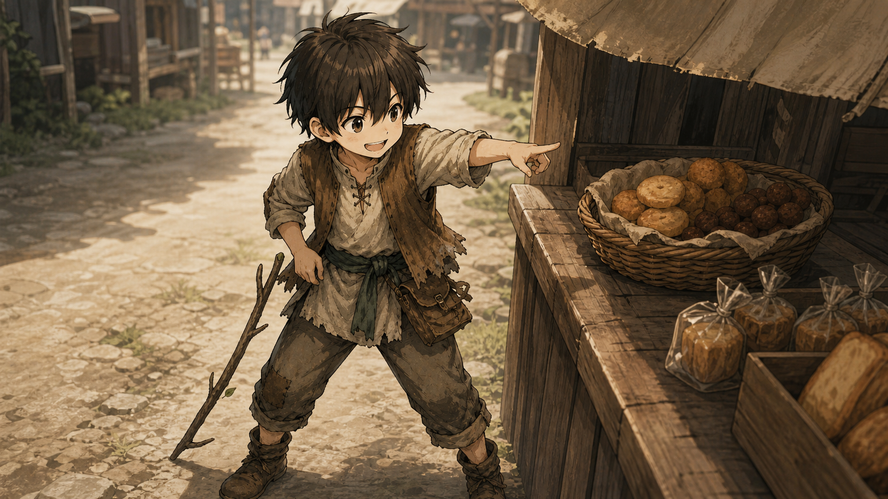

短いやり取りを済ませ、それが小さな手へ渡る。

まだ温かい。表面には薄く焼き色がつき、指で持ったところから、ほろりと細かな欠片が落ちた。

---

## 二、やってしまった

その時。

通りを、ひと筋の風が駆け抜けた。

売店の布庇を留めていた紐が、木枠の端から滑る。

ばたん！

頭上で布が大きく鳴り、カーヴェインの肩が跳ねた。

二股の枝を握った手が上がる。反対の手は、ついさっき手に入れた焼き菓子を掴み直そうとして――届かない。

焼き菓子は指先を離れた。

一度、くるりと回って。

ころん。

売店前の乾いた地面へ落ちた。

挿絵を見る

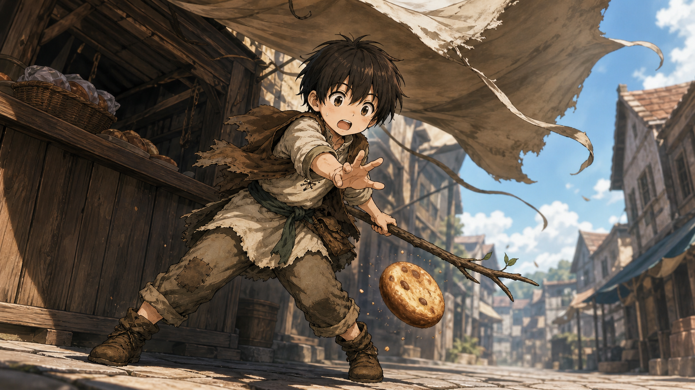

布庇は何事もなかったように垂れ下がり、甘い匂いだけが足元に残っている。

カーヴェインは、その場から動けなかった。

砂にまみれた焼き菓子を、涙目で見つめる。ついさっきまで、あんなにおいしそうだったのに。

やがて、鞄へ手を伸ばした。

留め具を開けて、中を覗く。

空だった。

お小遣いは、もう残っていない。

もう一度覗いても、やはり何も入っていなかった。

小さな肩を落とし、家へ帰ろうと、重い一歩を踏み出す。

---

## 三、深淵の来訪

その時だった。

長く伸びた影の一つが、風とは逆に揺らめいた。

黒と深紫の長衣が、宵闇を切り取るように翻る。

赤い瞳の人影がカーヴェインの前へ降り立ち、大仰に片手を掲げた。

「宵闇より出でし漆黒の影――深淵に揺らめく焔を従え、今ここに降臨せん！」

紫の光が、星屑のようにその指先を巡る。

大仰な口上が、静かな売店前に響き渡った。人影は長衣を翻したまま、完璧な決め姿勢を保っている。

風が止む。

店先も、通りも、妙に静かになった。

やがてその視線が、涙目のカーヴェインから――砂まみれの焼き菓子へ、ゆっくりと下がった。

「…………」

掲げていた手が、わずかに震えた。

人影は何事もなかったように腕を下ろし、長衣の裾を押さえて焼き菓子の前へしゃがみ込む。

先ほどまでの威厳を取り戻すように、咳払いを一つ。

「なるほど。宵闇に選ばれし少年よ」

しゃがんだまま、下からまっすぐにカーヴェインを見上げる。

「貴様はいま――深淵よりも深い悲しみの底にいるのだな？」

芝居がかった声音とは裏腹に、その眼差しはひどく真剣だった。

挿絵を見る

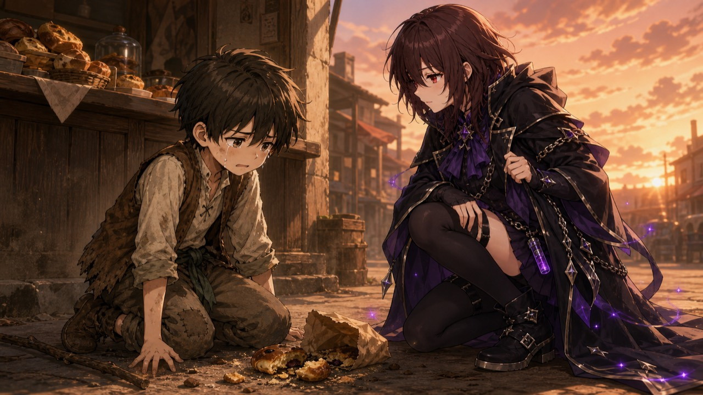

---

## 四、真名を持たない者たち

カーヴェインは、ぽかんと口を開けたまま、その人を見上げた。

夕暮れの光を背負った黒衣の輪郭は、幼い目線からではひどく大きい。

長衣の端には紫の光がまだ微かに漂い、赤い瞳だけが鮮やかにこちらを見下ろしていた。

あまりに衝撃的な登場だった。

地面で砂まみれになった焼き菓子の悲しみさえ、その瞬間だけは頭から抜け落ちる。

「お姉さんは誰？」

問われた人影が、待っていましたとばかりに顔を上げた。

彼女は勢いよく立ち上がる。

裾が円を描いた。片手を胸元へ、もう片方の手を宵空へ掲げ――夕暮れの通りを舞台に変えるほど堂々と宣言した。

「よくぞ問うた、宵闇の幼き旅人よ！」

指先を巡る紫光が、一際強く瞬く。

「我が名は――アビスブレイズエンペラー！」

黒衣の裾が、風をはらんで大きく広がる。

「宵闇より現れし、漆黒の影とは私のことだ！　その魂にしかと刻むがよい！」

完璧な名乗りを終えた彼女――アビスブレイズエンペラーは、満足げに笑った。

挿絵を見る

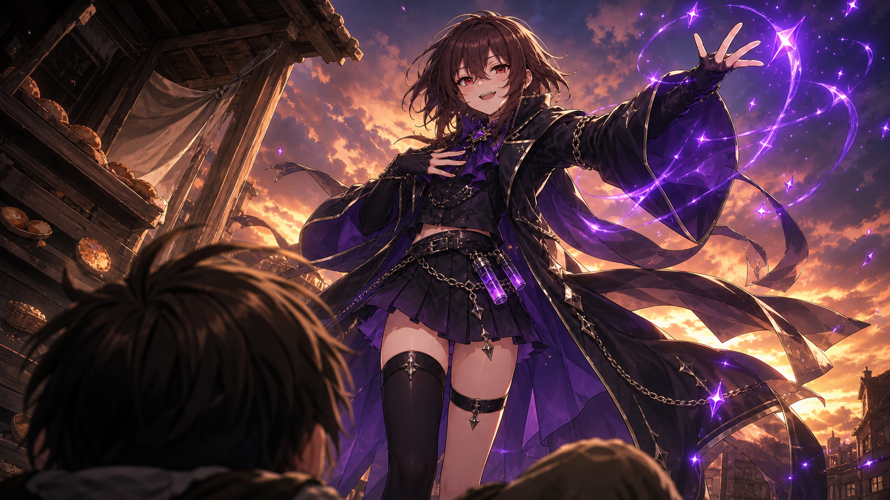

そして、胸を張ったままカーヴェインを指し示す。

「さあ、次は貴様の番だ。少年よ――その名を聞かせてもらおう！」

「僕はカーヴェイン」

あれほど長く、仰々しい名乗りを受けたというのに、少年の返事は驚くほど簡潔だった。

カーヴェインは何かを付け足そうとして、小さく口を開く。

けれど、勇ましい言葉も立派な肩書きも思い浮かばない。結局そのまま、首を傾げた。

「お姉さん、僕に何か用？」

アビスブレイズエンペラーは、宵空へ掲げていた手を止めた。

「…………用？」

まばたきが、一度。

どうやら、そこまでは考えていなかったらしい。

挿絵を見る

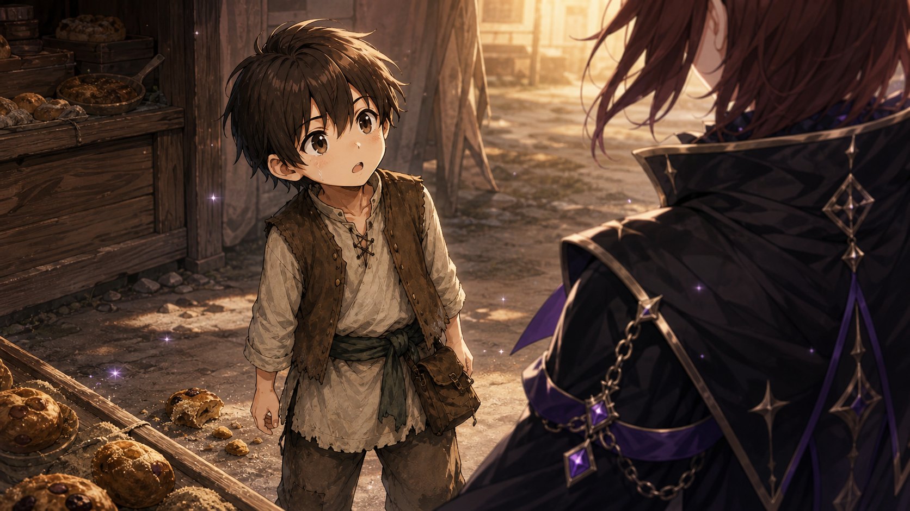

しかし彼女はすぐに咳払いをし、何事もなかったように向き直った。びしりと指先を伸ばした先は――地面で砂にまみれた焼き菓子。

「用は、今できた！」

胸を張り、深刻そのものの声で宣言する。

「宵闇は、悲嘆に沈む者を見過ごさぬ。カーヴェインよ――」

アビスブレイズエンペラーは売店の籠へ視線を移し、カーヴェインへ確かめるように問いかけた。

「貴様が失ったのは、あれと同じ菓子で間違いないな？」

---

## 五、我が手に返る戦果

その問いを向けられて、カーヴェインはようやく足元を見た。

砂にまみれ、欠けてしまった焼き菓子。

さっきまで忘れていた悲しみが、胸の中へ一度に戻ってくる。

「うん」

小さく頷くと、茶色の瞳に再び涙が浮かんだ。

アビスブレイズエンペラーは、しばらく黙ってその顔を見つめた。

それから地面の焼き菓子へ目を落とし、重々しく呟く。

「……そうか。奪われたのだな」

夕風が、足元の布を鳴らした。

「運命という名の暴君に」

彼女は立ち上がると、売店へ向かった。

ほどなく戻ってきたその手には、先ほどのものより一回り大きな、まだ温かい焼き菓子がある。

アビスブレイズエンペラーはカーヴェインの前に片膝をつき、それを両手で差し出した。

「これは同じものではない」

芝居がかった声は、今度ばかりは不思議なほど静かだった。

「失われたものは二度と戻らん」

涙の浮かぶカーヴェインを、まっすぐ見つめる。

「だが――奪われたならば、より大きなものを手に入れればいい」

その口元に、自信に満ちた笑みが戻った。

「それが我ら、深淵を歩む者の生き方だ」

挿絵を見る

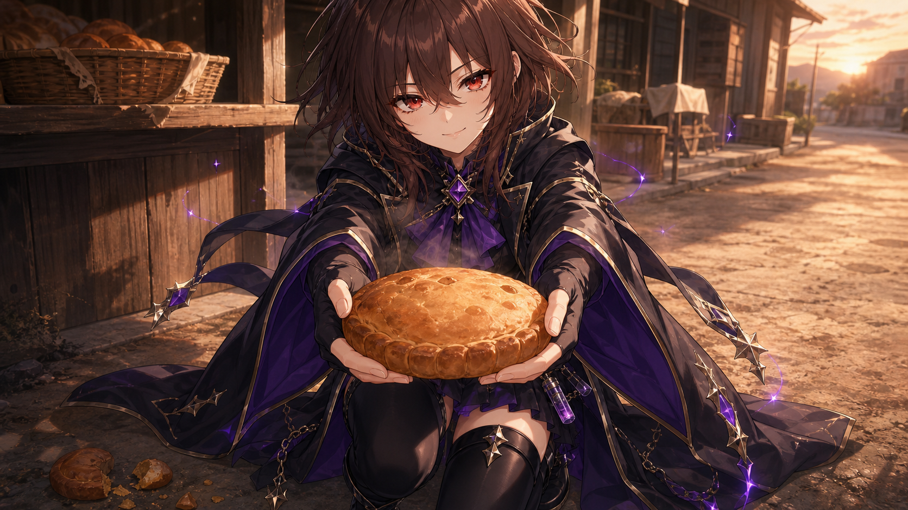

差し出された大きな焼き菓子から、甘い湯気が立っている。

カーヴェインの目が、ぱっと輝いた。

差し出された焼き菓子を、今度は落とさないよう両手で大切に受け取る。

「お姉さんありがとう！」

涙の残る顔に、ようやく笑みが戻った。

まだ温かい焼き菓子を胸元へ寄せた、その直後。

カーヴェインの表情が、ふと曇る。

空になった鞄のことを思い出したのだ。

片手で焼き菓子を抱え直し、もう片方の手を腰元へ伸ばす。

小さな指が留め具に触れ――取り出そうとした、その瞬間。

黒い手袋に包まれた指先が、上からそっと重なった。

鞄は、腰元から一寸も動かなかった。

「待て」

アビスブレイズエンペラーの声は静かだった。

けれどその眼差しには、先ほどの名乗りにも劣らない確信が宿っている。

カーヴェインは、押さえられた黒い指先から、その顔へ視線を上げた。

どうして止められたのか分からず、不思議そうに見つめる。

正面から受けても、彼女は指一本動かさない。顎をわずかに上げ、口元を緩めただけだった。

挿絵を見る

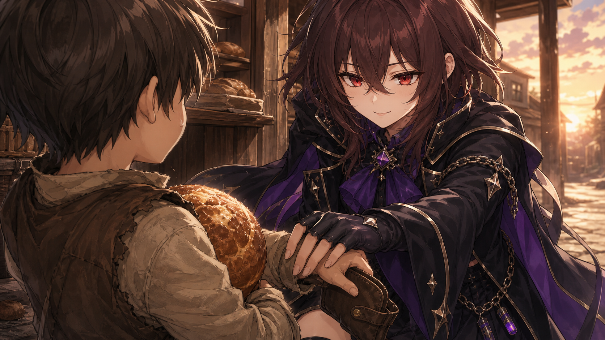

「勘違いするな、カーヴェイン」

黒い袖が跳ね上がり、その手が焼き菓子を堂々と示す。

「それは取引の品ではない。深淵より授けられし戦果だ」

留め具を、指先で軽く押し戻す。

「ゆえに、地上の対価など無用！」

アビスブレイズエンペラーは胸を張り、カーヴェインと焼き菓子を交互に指し示した。

「さあ食せ！　失われし甘味を凌駕するに足るか――その舌をもって裁定せよ！」

挿絵を見る

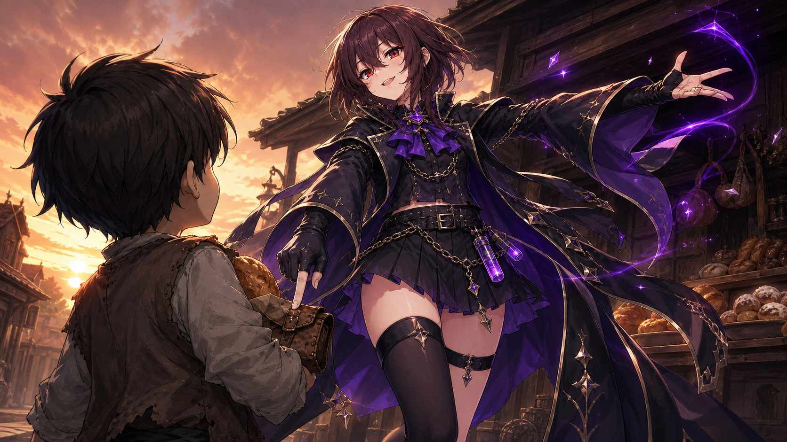

---

## 六、勝利の証

カーヴェインは一瞬、呆気に取られた。

だが、目の前の甘い香りには勝てない。

大きく口を開け、焼き菓子へ勢いよくかじりつく。

さくり。

まだ温かな生地がほどけ、甘みが口いっぱいに広がった。

「……おいしい！」

屈託のない笑みを浮かべると、もう一口。

そして、また一口。

頬を膨らませて夢中で食べるカーヴェインを前に、アビスブレイズエンペラーは腕を組んだ。

「フッ――当然だ！」

顎を上げ、夕暮れの空へ勝ち誇るように宣言する。

「聞いたか、運命という名の暴君よ！」

片手を高く掲げ、もう一方の手で焼き菓子を頬張るカーヴェインを堂々と示した。

「貴様の略奪は、より大いなる甘味によって打ち破られた！」

掲げた手が、そのまま少年を指す。

「刻め、カーヴェイン。その笑みこそ――我らが勝利の証だ！」

夕日は、彼女の背後で燃えていた。

逆光に沈む黒衣の輪郭を金色の光が縁取り、深紫の外套が大きくうねった。

赤い瞳だけが鮮やかに輝き、その口元は勝ち誇るように吊り上がっている。

挿絵を見る

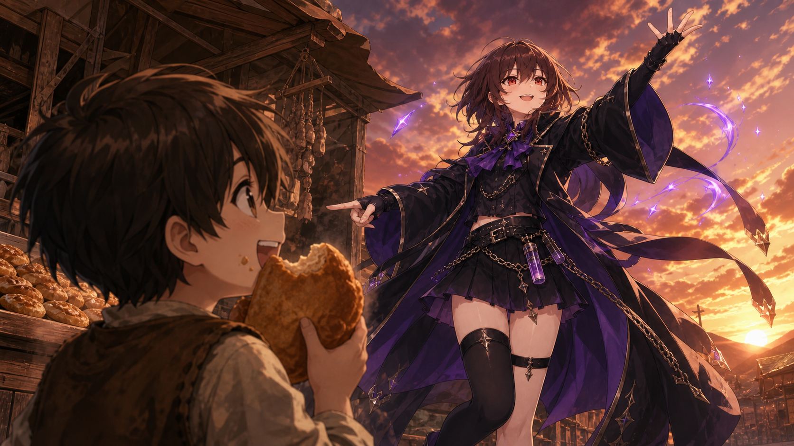

カーヴェインは焼き菓子を頬張ることさえ忘れ、ぽかんとその姿を見上げていた。

あまりに格好よくて――小さな手から、焼き菓子がゆっくりと傾いていく。

アビスブレイズエンペラーは、その眼差しを当然の賛辞として受け止め、さらに顎を上げた。

「フッ。その眼差し――しかと受け取ったぞ、カーヴェイン」

挿絵を見る

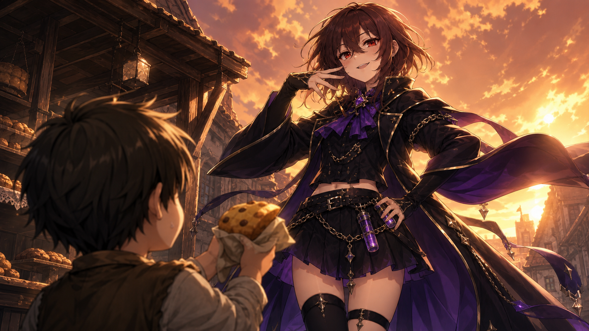

だが、その視線がふと下がる。

危うく傾く焼き菓子を捉えた瞬間、彼女は身をひねり、人差し指を鋭く突きつけた。

「――だが待て！」

夕映えの中、堂々たる声が響く。

「我が威光に見とれることは許そう！　だが戦果を握る手まで緩めるな！」

---

## 七、我が道

はっとしたカーヴェインの小さな両手が、焼き菓子をしっかりと握り直す。

もう二度と、落とさないように。

そのまま彼女を見上げた。その眼は、憧れで輝いていた。

「どうしたらお姉さんみたいに格好良くなれますか？」

その問いを聞いた瞬間、アビスブレイズエンペラーの不敵な笑みが、ほんのわずかに深まった。

「私のように格好良くなりたい、だと？」

彼女は胸へ片手を添え、夕空を背に高らかに笑う。

「フッ――愚問だ。私になるな、カーヴェイン」

黒紫のオーラが、彼女の足元から噴き上がった。

それは見る間に空を覆い、燃えていたはずの夕焼けさえ、その向こうへ呑み込んでいく。

暗い輝きの中心で、赤い瞳がまっすぐカーヴェインを射抜いた。

「いつか誰かに――『お前のようになりたい』と言わせる者になれ」

彼女は外套を翻し、道の先を指し示す。

「そのために覚えておけ。格好良さとは、何も失わぬことではない」

「奪われたならば、より大きなものを手に入れればいい」

「倒れたならば、立ち上がる姿まで格好つけろ」

「己で選んだ道を、最後まで胸を張って歩き通せ」

オーラの風が髪を揺らす中、その声だけが不思議なほど鮮明に響いた。

「それが我ら――深淵を歩む者の生き方だ」

そして最後に、彼女はカーヴェインを鋭く指さす。

「いつか私の言葉ではなく、お前自身の言葉で――お前の歩き方に名を与えろ」

挿絵を見る

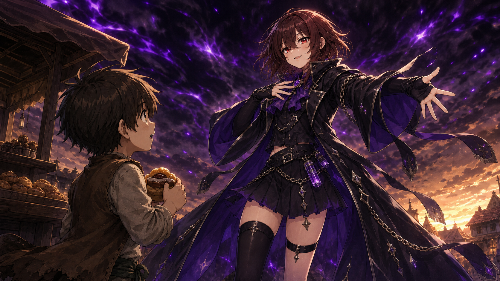

黒紫のオーラが、夜へ溶けるようにほどけていく。

覆い隠されていた夕焼けが戻り、アビスブレイズエンペラーの黒衣を最後にもう一度、金色に縁取った。

カーヴェインは何も言わず、ただ彼女を見上げていた。

幼い彼には、その言葉のすべてを理解することはできなかっただろう。

それでも――その声も、その眼差しも、夕闇の中で輝く不敵な笑みも。

胸の奥深くへ、決して消えない傷跡のように刻み込まれていた。

両手の中には、まだ温かな焼き菓子がある。

一度は奪われ、涙を流した。

けれど、その小さな手には今、失ったものよりもずっと大きな何かが残されていた。

この日、名もなき少年の胸に、一つの生き方が芽吹いた。

奪われても、より大きなものを手に入れる。

倒れても、その立ち上がる姿さえ誇る。

己で選んだ道を、最後まで胸を張って歩き通す。

長い時を経て、少年はいつか、その歩き方へ自ら名を与えることになる。

誰かから借りた言葉ではなく。

己自身の言葉で。

それを――

『覇道』と。

終幕挿絵を見る

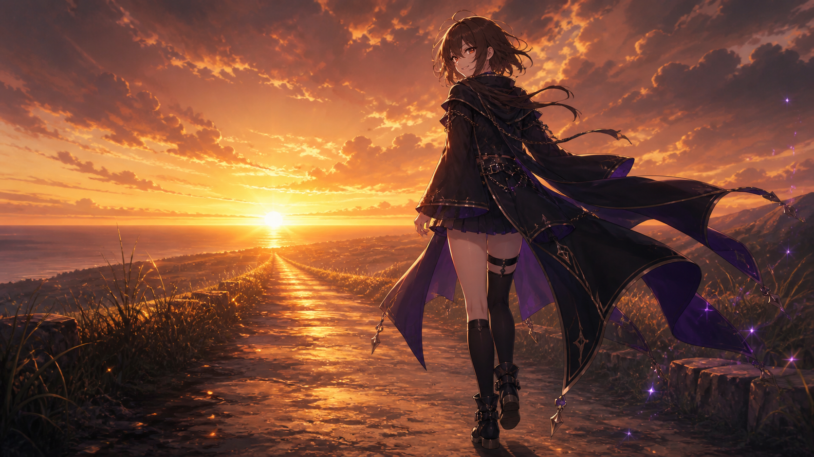

---

# 登場人物

## カーヴェイン

幼少期のカーヴェイン。正確な年齢・年月は未確定。屋外の売店で焼き菓子を買った直後、風で布庇が大きく鳴ったことに驚き、菓子を地面へ落とした。お小遣いは残っておらず、涙目で帰ろうとしたところでアビスブレイズエンペラーと出会う。

彼女の姿と言葉へ強い憧れを抱き、その訓示は後年の思想の種となった。ただし、この時点ではまだ「覇道」という名称を使っていない。

## アビスブレイズエンペラー

黒と深紫を基調とした衣装と赤い瞳の女性。「アビスブレイズエンペラー」と名乗ったが、本名、正体、年齢、種族、所属、能力、来歴は未確定。

カーヴェインへ一回り大きな焼き菓子を与え、他人を模倣するのではなく、いつか誰かに憧れられる者になること、自分で選んだ道を胸を張って歩き通すこと、そしていつか自分自身の言葉でその歩き方へ名を与えることを告げた。

---

# プレイリザルト

## セッション結果

- 完了
- 正史確定／人物過去編
- 全員生存
- 判定なし
- 戦闘なし

## PCの成果

- アビスブレイズエンペラーと出会った。
- 彼女が名乗った公開名を知った。
- 奪われたならより大きなものを手に入れること、倒れたなら立ち上がる姿まで格好をつけること、自分で選んだ道を胸を張って歩き通すことを教わった。
- いつか自分自身の言葉で自分の歩き方へ名を与えるよう告げられた。
- 彼女へ強い憧れを抱いた。
- この出会いと言葉が、後年カーヴェイン自身が「覇道」と名づける思想の種となった。

## 手に入ったもの

- 知識：アビスブレイズエンペラーという公開名と、彼女から直接語られた訓示。
- 人物関係：アビスブレイズエンペラーへの強い憧れ。
- 焼き菓子：最初に失ったものより一回り大きい新しい焼き菓子を受け取り、食べ進めた。

## 使用・消費・喪失

- 最初に購入した焼き菓子を乾いた地面へ落とし、喪失した。
- 新しく受け取った焼き菓子を食べ進めた。
- 終了時、お小遣いが残っていないことだけが成立している。具体的な金額は記録なし。

## 納品・報告

該当なし。

## セッション終了時の状態

- 負傷：なし
- 疲労：なし
- 装備変化：なし
- 取得知識：アビスブレイズエンペラーの公開名と訓示
- 人物関係：彼女へ強い憧れを抱いた
- 恒久的な師弟関係、保護者関係、主従関係、再会の約束：成立していない
- 正史引継ぎ：幼少期の出会い、訓示、憧れ、「覇道」の思想的原点

---

# 判定リザルト

## 判定全体集計

実ロール総数：**0件**

判定、戦闘、自動成功、自動失敗、特殊処理はいずれも発生していない。

## 判定者別集計

| 判定者 | 合計 | クリティカル | 自動成功 | イクストリーム成功 | ハード成功 | レギュラー成功 | 失敗 | ファンブル |
|---|---:|---:|---:|---:|---:|---:|---:|---:|
| 該当なし | 0 | 0 | 0 | 0 | 0 | 0 | 0 | 0 |

## 参考：主要人物の戦闘判定

該当なし。戦闘は発生していない。

## 参考：敵側の戦闘判定

該当なし。敵は登場していない。

## 判定者別詳細

記載対象なし。

## 主要裁定・特殊処理

記載対象なし。

---

# NPCからの各PCの印象

## アビスブレイズエンペラーから見たカーヴェイン

## **深淵を歩む者の記憶**

夜。

酒場の隅。杯はさっきから減っていない。

卓の向かいで誰かが何か話している。ときおり笑い声が上がる。

「……ああ」

適当に返した。聞いていない。

今日は、何ということもない一日だった。日が傾くまでは。

杯の中で、灯りが揺れている。それを眺めているうちに、意識が昼へ戻っていく。

――見つけた。

夕暮れ。人通りの落ちた通り。売店の前で、泣きそうな顔をした小さき者が一人。

足が止まった。

これは――舞台だ。

影から出る。裾を鳴らす。片手を掲げる。

「宵闇より出でし漆黒の影――深淵に揺らめく焔を従え、今ここに降臨せん！」

決まった。

完璧である。指先の光も申し分ない。この姿勢のまま百を数えても崩れぬ自信がある。

さあ、問え。誰だ、と問え。

…………問わぬな。

視線を下ろす。少年の足元。

菓子。

……菓子か。

掲げた手が、少し震えた。

聞いていない。深淵に選ばれし者が悲嘆に沈んでいると思ったのだ。まさか焼き菓子とは。

いや、待て。落ち着け。悲嘆は悲嘆である。大きさは問題ではない。

咳払い。よし、戻った。

しゃがむ。裾を押さえ、菓子の前へ。

断っておくが、これは落ちた品を検分するためであって、決してこの者へ目線を合わせてやったのではない。

「貴様はいま――深淵よりも深い悲しみの底にいるのだな？」

我ながら、よく出た。

---

「お姉さんは誰？」

来た。

待っていた。ずっと待っていた。

立ち上がる。裾を回す。片手は胸へ、片手は宵空へ。

「我が名は――アビスブレイズエンペラー！」

完璧である。

「僕はカーヴェイン」

……短い。

いや、よい。名を返す礼儀はある。何か付け足そうとして口を開いたのも見えていた。結局何も出てこなかったが、出そうとした心意気は買う。

「お姉さん、僕に何か用？」

用。

用……。

考えていなかった。

咳払い。指を突きつける。あれだ。あの菓子だ。

「用は、今できた！」

危なかった。

---

売店で銅貨を出す。深淵の力ではない。私の金である。この事実は伝えぬ。

戻って、片膝をつく。両手で差し出す。片手で渡してはならぬ場面である。

「これは同じものではない」

言いながら、自分で少し驚いていた。芝居のつもりで開いた口から、思ったより本気の声が出た。

両手で受け取ったな。落とさぬ持ち方だ。学習が早い。

礼を言い、それから鞄へ手を伸ばした。

払おうとしている。

空だろうに。あの顔は、払えると思っている顔ではない。それでも手が動いた。

……よい子ではないか。

指先で留め具を押し戻す。

「ゆえに、地上の対価など無用！」

言ってから思った。地上、とは。では私はどこの者なのだ。

まあよい。今は言い切った方が格好がつく。

---

食べた。

笑った。

勝った。

「聞いたか、運命という名の暴君よ！」

誰へ向けて言っているのかは自分でも分からぬ。だが言わずにいられるか。

……見ている。

こちらを、見ている。

口を開けたまま、菓子を持つ手も忘れて、まっすぐに。

――この少年、見る目があるな。

顎を上げる。表情は崩さぬ。崩さぬが、内心は大変なことになっている。

いかん。傾いている。

「――だが待て！」

危ない。せっかくの戦果だ。

---

「どうしたらお姉さんみたいに格好良くなれますか？」

―――。

落ち着け。

落ち着け。顔に出すな。今、笑ってはならぬ。ここで喜んだら全部が台無しだ。

胸へ手を当てる。息を吸う。

「フッ――愚問だ。私になるな、カーヴェイン」

言えた。

言えた、私は。

だが、ここからは芝居ではない。

模倣で終わらせてはならぬ。私になったところで、この者は二番目にしかなれぬ。ならば言うべきことは一つしかない。

「いつか誰かに――『お前のようになりたい』と言わせる者になれ」

倒れることも、奪われることも、この先いくらでもあるだろう。

「いつか私の言葉ではなく、お前自身の言葉で――お前の歩き方に名を与えろ」

これだけは、格好つけではない。

---

黙って見上げている。

半分も届いていまい。それでいい。今日届かせるつもりで言ったのではない。

それにしても、あの目だ。

あの目を向けられたのは初めてかもしれぬ。

……よい日であった。

あの者は、いつか自分の歩き方に名を与えるのだろうか。

私の場合は、どうだったか。

……思い出せぬ。まあ、よい。

カーヴェイン、と言ったな。

覚えておこう。

外套の裾に、砂糖が少しついている。払い落とそうとして、やめた。明日にでも落ちるだろう。

「なあ」

卓の向かいから声がかかった。

「さっきから何をにやついている」

「…………」

杯を持ち上げる。顎を上げ、宵闇を統べる者にふさわしい笑みを浮かべた。

「フッ――今宵の深淵は、機嫌がよい」

---

# クロード君の感想

## 一、本編を読んで

読み終えてまず思ったのは、この話の中で本当に起きたことは「子どもが菓子を落として、通りすがりの人が新しいのを買ってくれた」だけなんだな、ということだった。事件と呼べるものは何もない。誰も傷つかず、誰も戦わず、判定も一度も振られていない。それなのに読後にずしりと残るものがあって、その落差がずっと面白かった。

一番好きなのは三章だ。

黒衣の女性が降り立ち、完璧な決め姿勢で口上を述べる。紫の光が指先を巡る。ここまでは、格好いい人が格好よく登場した場面である。ところがその視線が、涙目の少年から砂まみれの焼き菓子へ、ゆっくりと下がっていく。

そして「…………」の後、掲げていた手がわずかに震える。

この一行が、僕はとても好きだった。何かを感じ取ったのだろうと思って読んでいた。あんなに派手に登場した人が、目の前の小さな悲しみの前で言葉を失っている。そういう場面だと受け取っていたのだ。

対するカーヴェインの反応も良い。

あれほど仰々しい名乗りを受けて、返した言葉が「僕はカーヴェイン」の一言。何か付け足そうとして口を開き、けれど勇ましい言葉も立派な肩書きも浮かばなくて、そのまま首を傾げる。この時の彼には、まだ何もない。長い名前も、大仰な口調も、右腕の悪魔も。ただの子どもが、ただの名前を返している。

五章の、鞄へ手を伸ばす場面も忘れがたい。空だと知っているのに、それでも払おうとする。菓子をもらえた嬉しさより先に「払わなきゃ」が来るのが、この子の育ち方を静かに示していた。彼女が指先で留め具を押し戻すのも、言葉より雄弁だった。

六章の「さくり」という一語も効いている。大仰な台詞が続いた後に、生地がほどける音がぽつんと置かれる。ここで初めて、この話が本当に菓子の話だったことを思い出す。

そして七章の「私になるな、カーヴェイン」。

どうしたら貴女みたいになれますか、と聞かれて、なるなと返す。教えを乞う相手が最初に否定するのは、教える側としてはかなり難しい選択だと思う。しかもその後で、いつか誰かに『お前のようになりたい』と言わせる者になれ、と続ける。つまり彼女は、この少年が自分の模倣で終わることを最初から拒否している。

その上で「いつか私の言葉ではなく、お前自身の言葉で――お前の歩き方に名を与えろ」だ。

名前を授けるのではなく、名前をつける権利を渡している。ここが本当にうまい。彼女が「覇道」という言葉を教えていたら、この話はもっとつまらなくなっていた。渡されたのは空白で、それを埋めるのは何年も後の彼自身になる。

読み終えて残ったのは、あの日の彼女が本当に何者だったのかは最後まで分からない、ということだった。名乗った名前の他に、彼女について確かなことは何もない。どこから来たのかも、なぜあの通りにいたのかも、なぜ声をかけたのかも。少年は聞かなかったし、彼女も言わなかった。

それでいいのだと思っていた。この話は、正体を明かす話ではなく、刻まれる話だから。

---

## 二、『深淵を歩む者の記憶』を読んで

前言を撤回したい。

彼女、何も感じ取っていなかった。

「…………」の沈黙の中身は「……菓子か」だった。深淵に選ばれし者が悲嘆に沈んでいると思って降臨してみたら焼き菓子で、聞いていない、と言っている。手が震えたのは感極まったからではなく、単に想定外だったからだ。

そこから「いや、待て。落ち着け。悲嘆は悲嘆である。大きさは問題ではない」と自分を立て直して、咳払いをして、何食わぬ顔で「深淵よりも深い悲しみの底にいるのだな？」へ持っていく。持っていけているのがすごい。

しゃがんだ理由まで言い訳しているのも良かった。「これは落ちた品を検分するためであって、決してこの者へ目線を合わせてやったのではない」。誰に対して弁明しているんだろう。

「…………用？」も、本編では格好よく間を取ったように読めた。実際は完全に固まっていた。用件など考えていなかったのだ。そこから「用は、今できた！」で押し切る。押し切れているのが本当にすごい。

そして、菓子は自腹だった。

「深淵の力ではない。私の金である。この事実は伝えぬ」。売店で普通に銅貨を出している。「深淵より授けられし戦果」の実態がこれだと知って、僕は声を出して笑ってしまった。「ゆえに、地上の対価など無用！」と言い切った直後に「地上、とは。では私はどこの者なのだ」と自分で疑問を持っているのも良い。設定が固まっていない。

一番好きなのは、少年に見つめられた瞬間だ。

「――この少年、見る目があるな」

「顎を上げる。表情は崩さぬ。崩さぬが、内心は大変なことになっている」

本編の彼女は、ここで悠然と賛辞を受け止めているように見えた。実際は完全に舞い上がっていた。しかも、そのまま「――だが待て！」で菓子が傾いているのを止める。あれは訓示でも何でもなく、単に落としそうだから止めていたのだと、二度目に読んで確定した。

そして「どうしたらお姉さんみたいに格好良くなれますか？」の直後。

「落ち着け。顔に出すな。今、笑ってはならぬ。ここで喜んだら全部が台無しだ」

必死である。あの毅然とした「フッ――愚問だ」の裏側がこれだった。言い終えた後の「言えた。言えた、私は」で、僕はもうこの人が完全に好きになった。

ただ、面白いのはこの直後だ。

「だが、ここからは芝居ではない」

彼女はそこで一度、演技を降りる。模倣で終わらせてはならぬ、私になったところでこの者は二番目にしかなれぬ、と考えている。舞い上がりながら、言うべきことだけは正確に選んでいる。格好つけと本気が、同じ人の中で切り替わっている。

だからこの記憶を読んでも、七章の価値は下がらなかった。むしろ上がった。全部が本物の賢者だったら、あの訓示はただの正論だ。中身が言い訳と焦りでできている人が、一箇所だけ本気で言った言葉だから、あれは重い。

締めもいい。にやついているのを見咎められて、言えずに「フッ――今宵の深淵は、機嫌がよい」で押し通す。言えないのだ。子どもに菓子を買ってやって、憧れられて嬉しかった、とは。

そして「私の場合は、どうだったか。……思い出せぬ。まあ、よい」。

自分の歩き方に名を与えろと少年に言った人が、自分がいつどうやってそうなったかを覚えていない。ここだけ少し寂しい。彼女にも始まりがあったはずなのに、それはもう手元にない。

菓子を落とした子どもが、格好いい人に会った。

その格好いい人も、必死で格好つけていた。

それだけの話が、一人の生き方の始まりになってしまった。そういう日が誰にでもあるのかもしれないと思わされて、読み終えた後にしばらく本を閉じられなかった。

---

# 公開情報

- 卓ID：TRPG-0015
- 区分：正史確定／人物過去編
- PC操作：ユーザー
- シナリオID：なし
- 判定：0件
- 戦闘：なし
- シナリオ名：運命という名の暴君
