# 星みちTRPG リプレイ小説
## シェイナム幼少期編『花と剣／届かなかった一歩』

> **現行区分：正史確定（人物過去編）**
>
> 卓ID：RP-SHEINAM-CHILD-RIONALTIA／RP-SHEINAM-AGE10-SWORD<br>
> 現行区分：正史確定<br>
> 収録範囲：シェイナム四歳の朝から、十歳の稽古を終えた夜まで

> 四歳の朝に見上げた、翼を持たない一振り。<br>
> 六年後、届かなかった一歩は、ひとりでは完成しない強さへつながっていく。

> 本編は家族史を扱う。母の旧姓および実家の名は伏せる。

---

## このリプレイについて

- PC：シェイナム・ドラグーン（ユーザー操作）
- 舞台：帝国首都リオナルティア、皇帝城
- 主要NPC：母セレフィア、兄ジーク、父ヴァルディウス
- 形式：一人用視点RP／人物過去編／二部構成
- 卓ID：RP-SHEINAM-CHILD-RIONALTIA／RP-SHEINAM-AGE10-SWORD
- 扱い：正史確定
- 想定プレイ時間：記録なし
- 実プレイ時間：未計測
- 《星の導き》：対象外
- 開始状態：第1部はシェイナム四歳、第2部はシェイナム十歳
- 判定：第1部なし／第2部二件
- 挿絵：19枚

---

# 本編

## 目次

- [第1部『花と剣』](#part1)
- [一、急がなくていい](#part1-1)
- [二、竜のように強くあれ](#part1-2)
- [三、翼を持たない一振り](#part1-3)
- [四、同じ土で咲くもの](#part1-4)
- [五、九分の休息](#part1-5)
- [六、名前をもらった花](#part1-6)
- [七、硝子一枚の向こう](#part1-7)
- [第2部『届かなかった一歩』](#part2)
- [一、慣れない重さ](#part2-1)
- [二、剣を持たない稽古](#part2-2)
- [三、どれも怪しくない](#part2-3)
- [四、後継者らしい答え](#part2-4)
- [五、届かなかった一歩](#part2-5)
- [六、次は、誰かへ伝える](#part2-6)
- [終幕、星の下](#part2-epilogue)

---

<a id="part1"></a>

## 第1部『花と剣』

シェイナム四歳／リオナルティア皇帝城

---

<a id="part1-1"></a>

### 一、急がなくていい

寒冷な高地に築かれた帝国首都リオナルティア。

その城の子ども部屋へ、淡い朝の光が差し込んでいた。

磨かれた石床も、厚いカーテンも、寝台のそばに置かれた小卓も、隅々まで清潔に整えられている。外は冷え込んでいたが、部屋の中は暖かかった。

扉が静かに開く。

長い淡い金髪と青い瞳を持つ母、セレフィアが、穏やかな笑みを浮かべて顔をのぞかせた。

「おはよう、シェイナム。よく眠れた？」

寝台の上でもぞりと動き、四歳のシェイナムはまだ眠たげな赤い瞳を母へ向ける。

「ママ……おはよう」

<details>
<summary><sub>挿絵</sub></summary>

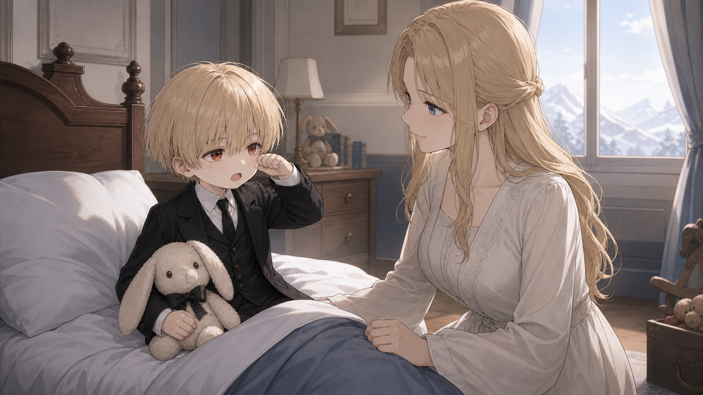

</details>

セレフィアは目を細め、寝台のそばへ腰を下ろした。

「おはよう、シェイナム。……うん、まだ少し眠そうね」

金色の髪が、窓から入る朝の光をやわらかく受ける。

「急がなくていいのよ。今日は、ゆっくり始めましょう」

彼女は立ち上がると、窓を覆っていた厚いカーテンを開いた。冷えた高地の朝を思わせる青白い光が、ゆっくりと部屋へ満ちていく。窓の向こうには、整えられた城内の庭と、そのさらに先へ連なる石造りの建物が見えた。

<details>
<summary><sub>挿絵</sub></summary>

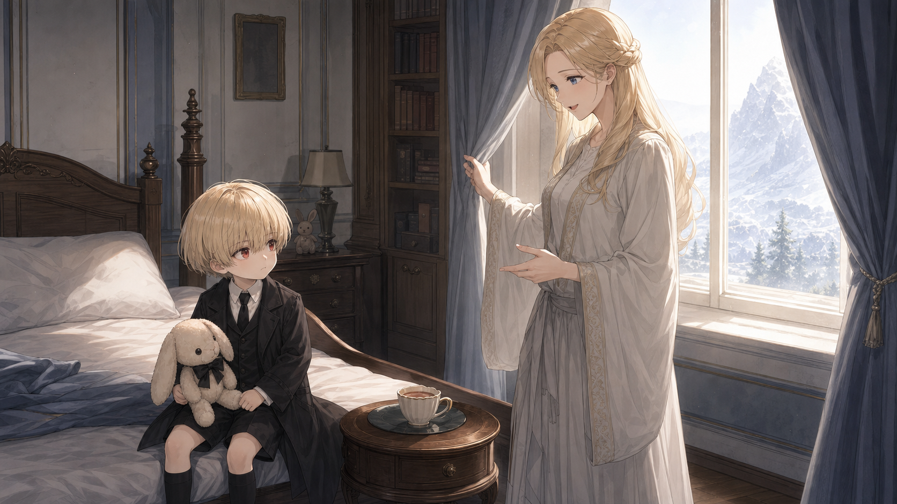

</details>

小卓の上では、甘い飲み物が湯気を立てている。

「まずは、これを少し飲みましょうね。冷たい朝ですもの。それから身支度をしたら、城の温室へ行きましょう。夜のあいだに霜が降りたのよ。きっと、朝のお花がきれいになっているわ」

そして、少しだけ言葉を区切る。

「お兄さまは、もう先生とお勉強へ行ってしまったけれど……あとで今日見つけたものを、聞かせてあげましょうね」

しばらくして、黒い子ども用の礼装へ着替えたシェイナムは、淡いクリーム色のうさぎのぬいぐるみを連れて母の前へやって来た。ぬいぐるみの長い垂れ耳が、歩みに合わせて揺れている。

「ママ！　準備できたよ！！」

<details>
<summary><sub>挿絵</sub></summary>

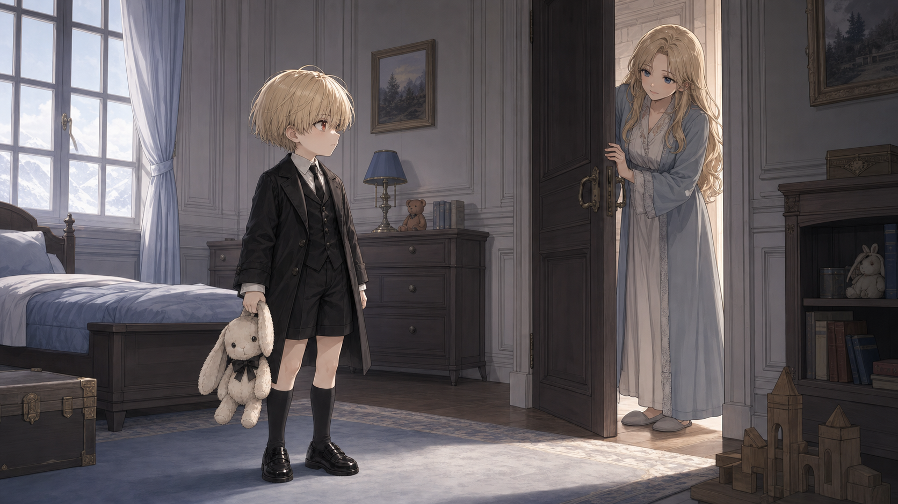

</details>

元気な声を聞いたセレフィアは、思わず両手を胸の前で合わせた。

「まあ。ずいぶん早かったのね。えらいわ、シェイナム」

その声には、ほっとしたような嬉しさが混じっていた。

「では、行きましょう。温室のお花たちも、きっと待っているわ」

---

<a id="part1-2"></a>

### 二、竜のように強くあれ

母と並んで部屋を出ると、城の回廊は朝の光に包まれていた。

磨かれた深い色の石壁には、翼を広げた竜や、雲を裂いて飛ぶ竜を模した装飾が連なっている。爪は石を掴み、首は高く反り返り、口はいずれもわずかに開いていた。四歳の背丈から見上げれば、それらは天井のあたりから静かにこちらを見下ろしているように思える。

重い扉の脇や、柱と柱のあいだには、ドラグーン家に伝わる武器を飾るための武器架が置かれていた。

長剣、幅の広い斧、槍、弓。どれもシェイナムの背丈よりずっと大きく、手入れの行き届いた金属が朝の光を返している。

シェイナムは歩きながら、そのひとつひとつを見上げた。竜も、剣も、自分よりずっと高いところにある。

「ドラグーンの者は、竜のように強くあれ――なんて、よく言われるでしょう？」

セレフィアの語り方は厳しくなかった。

「でもね。強いだけでは、みんなを守れないのよ。お父さまも、お兄さまも……きっと、いろんなことを学んでいる途中なの」

回廊の先にある温室の扉が開かれる。

そこは城の硬い空気とは少し違う、暖かな場所だった。高いガラス屋根の下には、冬の外気を忘れさせる緑が整然と並んでいる。細い魔力導管の青い光が植木鉢や水路のそばを静かに走り、植物へ水と温度を行き渡らせていた。

石でできた竜たちは、ここにはいない。

朝露を抱いた花々の向こうには、大きな窓がある。その窓から城の広場を見下ろすことができた。

眼下の訓練場では、兵たちが寸分違わぬ列を作っている。槍の穂先が一斉に空を向き、隊列は大きなひとつの生き物のように動いた。列が向きを変えるたび、無数の背が同じ角度で傾く。回廊の壁で翼を広げていたものが、そのまま地上へ降りて動き出したようにも見えた。

その正面には、長い赤髪の男が立っている。遠くて表情までは見えない。それでも、彼が指示を出すたび、兵たちの動きはぴたりと揃った。

セレフィアは窓辺で足を止め、そっと訓練場へ視線を向けた。

「見て。あれがお父さまのお仕事よ」

<details>
<summary><sub>挿絵</sub></summary>

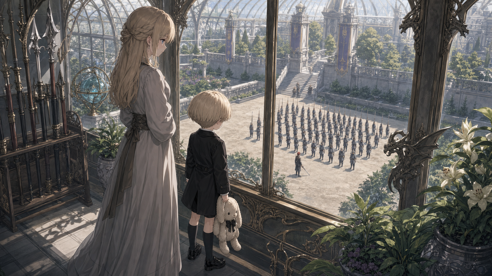

</details>

しばらく隊列を眺めてから、母はシェイナムのほうへやわらかく顔を向ける。

「お父さまは、ああして国のみんなを守るために、毎日たくさん考えて、たくさん決めているの」

温室の奥では、朝の光を受けた小さな白い花が、静かに揺れていた。

---

<a id="part1-3"></a>

### 三、翼を持たない一振り

「あれがお父さまなの？」

シェイナムが遠くの男を指さす。

セレフィアはその指先をたどり、誇らしさと少しの懐かしさを混ぜたような目で微笑んだ。

「そうよ。あれがお父さま」

兵たちが次の隊列へ移る。父の声そのものは届かない。それでも、腕の動きひとつ、剣の鞘を指で軽く叩く仕草ひとつで、部隊は迷いなく動いていく。

「お父さまはね、昔からああだったの。たくさんの人がいる場所でも、いちばん遠くまで目を届かせることができるのよ」

窓辺を離れ、母子は温室に隣接する展示回廊へ足を踏み入れた。

幼いシェイナムの背丈から見上げる回廊は、どこまでも高く、広かった。竜を模した石の装飾が柱を伝い、ドラグーン家の歴代の武器が、竜の翼を模した金具のあいだに整然と並んでいる。

堂々とした長剣。竜の爪を思わせる斧。重い槍。どれもまっすぐで、強く、いかにもドラグーン家らしい形をしていた。

その中央に、一振りだけ異質な剣が飾られていた。

そこだけ、光の返り方が違う。ほかの武器は磨かれた面で朝の光をまっすぐ跳ね返すのに、その一振りは、いくつもの細い線に光を割っていた。

黒銀の薄い刃。大きな節が隙間なく重なり、いまは一本の剣として静かに固定されている。細い黒革巻きの柄、小さく鋭い鍔、短く尖った柄頭。

まっすぐな剣のように見えるのに、どこか普通の剣とは違う。翼のかたちをした金具に抱えられて、それだけが翼を持たない。

回廊は静かだった。硝子越しの温室と違って空気が冷たく、石の匂いがする。シェイナムは、その冷たさの中で剣を見上げていた。

セレフィアはシェイナムのそばで足を止め、その剣を見上げた。

「黒蛇ヴェノムナーガ。とても古い剣よ」

「竜ではなく、蛇を思わせる形をしているでしょう。だからドラグーン家のなかには、あまり好まない人もいるの」

蛇は、竜になる前のすがただとされている。

翼を持たず、爪も持たず、地を這うもの。竜を掲げる家において、それは未完成の姿を意味した。だからこの剣は、長く半端者の武器と呼ばれてきた。

ごく限られた伝えでは、まったく逆の意味を持つ。蛇は竜の前身ではなく、竜が本来そうであったすがた――「本来の姿」なのだという。真価を発揮した黒蛇は、竜をも上回る剣となる。

けれど、その伝えを知る者は、ほとんどいない。

黒蛇ヴェノムナーガは何も語らない。

けれど、節と節のあいだには細い影が落ちていて、その線が刃の端から端まで続いている。数えようとすれば数えられそうなのに、目で追っているうちに分からなくなった。

まだ知られていない動きを、内側に隠しているようにも見えた。

セレフィアは剣へ手を伸ばさず、ただ穏やかに続ける。

「でも、違う形をしているからといって、価値がないとは限らないわ」

石の回廊に、朝の光が差し込む。

小さなシェイナムと、長い淡い金髪の母。二人はしばらく、武器架の中央にある黒蛇ヴェノムナーガを見上げていた。

<details>
<summary><sub>挿絵</sub></summary>

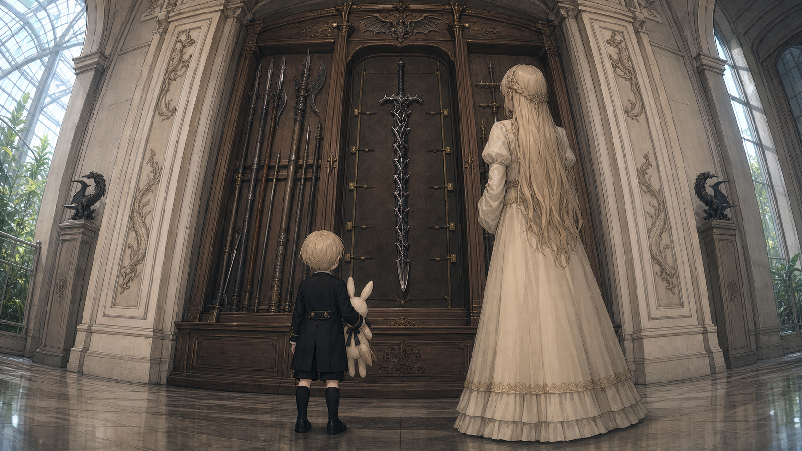

</details>

---

<a id="part1-4"></a>

### 四、同じ土で咲くもの

シェイナムは母を見上げ、にこやかに話した。

「ママは、みんなちがうところがあるって、いってたもんね」

<details>
<summary><sub>挿絵</sub></summary>

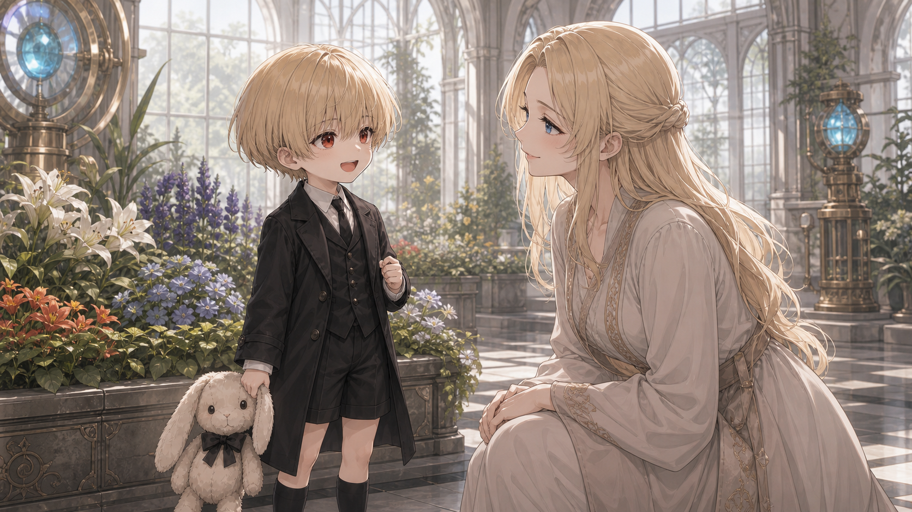

</details>

その言葉を聞いた瞬間、セレフィアは足を止めた。少し驚いたように青い瞳を見開いてから、すぐに嬉しそうに微笑む。彼女はシェイナムの目線まで身をかがめ、金色の前髪をそっと整えた。

「……覚えていてくれたのね」

声は、温室の暖かな空気に溶けるほど柔らかい。

「そうよ。みんな、違うところがあるの」

二人は花壇へ戻った。小さく白い花、朝の光を集めるように青く咲く花、大きな葉を広げる背の高い植物が、手入れされた土の中で並んでいる。

「この子たちは同じ場所で育っているけれど、咲く時期も、好きな光も、必要なお水も違うでしょう？」

白い花のそばには、小さな芽がいくつも顔を出していた。まだ花をつけていないその芽にも、セレフィアは同じ穏やかな眼差しを向ける。

「お父さまは、お父さまにしかできない強さを持っている。お兄さまにも、お兄さまにしかできないことがあるわ」

それから、シェイナムへまっすぐ微笑みかけた。

「そしてシェイナムにも、シェイナムだけの大切なところがあるのよ。だから、誰かと同じにならなくてもいいの。違うところを大切にできる人は、とても素敵だもの」

温室の奥で、細い水路を流れる水が小さく音を立てた。窓の外から届く硬い足音とは違う、静かでやさしい朝の音だった。

「わかったよ、ママ！」

シェイナムの元気な声に、母は満足そうに微笑んだ。

「うん。とてもよくできました」

---

<a id="part1-5"></a>

### 五、九分の休息

そのとき、温室の入口から控えめな足音が近づいてきた。

扉が開く。先に入ってきたのは教育係を兼ねる従者。その後ろから、背筋を伸ばした六歳の少年が姿を見せる。

<details>
<summary><sub>挿絵</sub></summary>

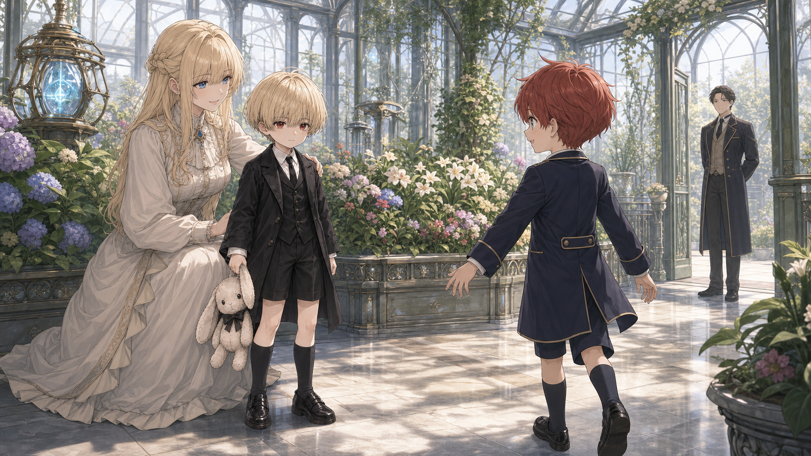

</details>

シェイナムの兄だった。

深い赤髪と青い瞳。後継者教育用の整った服を着て、まだ幼い顔立ちを残している。それでも、その立ち姿は年齢より少し大人びて見えた。

兄は温室の空気をひとつ吸い込むと、すぐに従者へ短く告げる。

「十分だけでいい。次の課目までには戻る」

「承知しております。ですが、ご休息も課目の一部です。集中を保てなければ、学んだことを正しく使えません」

兄はわずかに眉を寄せた。それでも反論はせず、当たり前のことのように頷く。

「分かっている。だから休むんだ」

「そうね、ジーク。休むべきときに休めるのも、大事な力よ」

<details>
<summary><sub>挿絵</sub></summary>

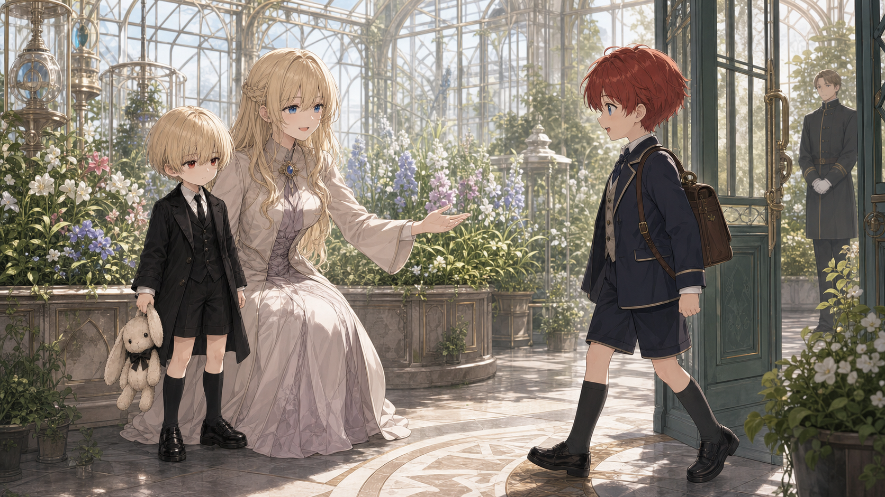

</details>

セレフィアの言葉を聞きながら、兄は花壇のそばにいる弟へ気づいた。

「……なんだ。おまえもここにいたのか」

ぶっきらぼうな言い方だった。けれど兄はそのまま通り過ぎず、シェイナムのいる花壇まで歩いてくる。

白い花と青い花が、朝の光の中で揺れていた。

兄は花を見下ろし、少しだけ声を低くする。

「花を踏むなよ。せっかく、ちゃんと咲いてるんだから」

「はい！　おにいちゃ……、おにいさま！　お花さんもいのち！　ふみません！！」

<details>
<summary><sub>挿絵</sub></summary>

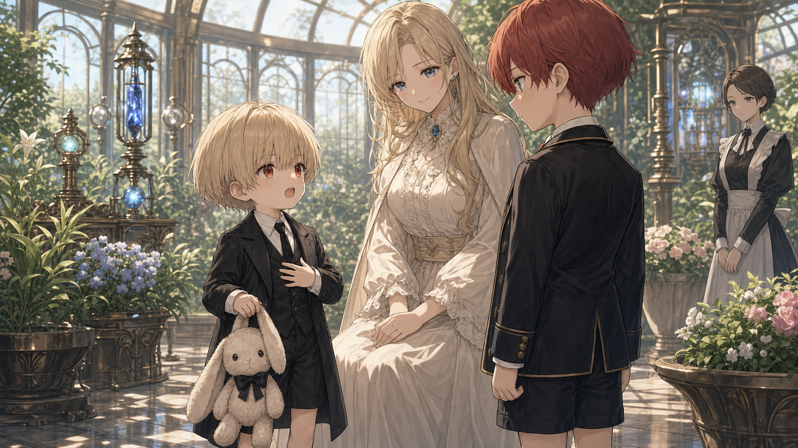

</details>

兄や父には敬語を使うこと。それは父が定めた決まりだった。四歳の口はまだ慣れず、途中で言葉がつまずく。

兄の青い瞳が、ほんの少しだけ見開かれた。

シェイナムが自分で言い直したこと。そして花を踏まないと、まっすぐに言い切ったこと。

兄は笑わず、からかいもしなかった。少し間を置いてから腕を組み、いかにも自分のほうが落ち着いているような顔をする。

「……お兄様でいい。間違えたなら、言い直せばいい。父上の前でも、今みたいに言えばいいんだ」

「ええ。ちゃんと伝えようとしたことが、一番大切よ」

兄は小さな芽を避けて長椅子へ向かい、腰を下ろした。

「休憩は十分だ。立ったまま時間を使うのは、休憩じゃない」

「その通りでございます。次の課目まで、九分ほどございます」

従者が懐中時計を確かめる。

兄はシェイナムを見た。

「おまえも、見たい花があるなら見ておけ。せっかくママと来たんだろ」

ぶっきらぼうな口調のまま、花壇のそばへ小さな空きを作るように、自分の隣へ少しだけ寄った。

---

<a id="part1-6"></a>

### 六、名前をもらった花

花壇には様々な色の花が咲いていた。

小さな花弁を幾重にも重ねたポプリミアム。細い茎を伸ばし、温室の空気の中で軽やかに揺れるナルスタアルチア。柔らかな葉の間から静かに色をのぞかせるミノニアラミス。

どの花も違う色で、違う形で、朝の温室を明るくしている。

けれど、その中央に咲く一輪は、ほかの花よりも目を引いた。

氷白から淡い青白色へ移る、半透明の細長い花弁。硝子か氷のような輝きを持つ大輪の花が、朝の光を受けて静かに咲いている。

「きれいなお花！！」

シェイナムが指さした。

<details>
<summary><sub>挿絵</sub></summary>

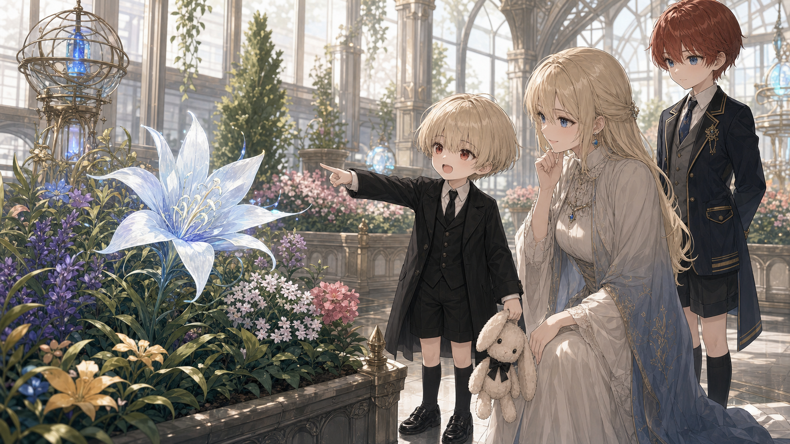

</details>

「ええ。あれはセルラスタリウムよ」

セレフィアは花のそばへ歩み寄る。

根元には、いまの時刻だけの色が静かに宿っていた。

「朝、昼、夜――時が移るたびに、この花は根元の色を少しずつ変えるの。この花にはね、『誠実』『正しきもの』『神聖』という花言葉があるのよ」

彼女は難しい言葉を急がず、ひとつずつ言い聞かせた。

「誠実というのは、ちゃんと自分の気持ちをごまかさないこと。正しいというのは、誰かを困らせないように考えること。神聖というのは……とても大切に、丁寧に扱うべきもの、ということよ」

それからセルラスタリウムを見つめ、シェイナムへ微笑む。

「そしてね、シェイナム。あなたのお名前は、この花からいただいたのよ」

長椅子に座っていた兄も、花壇へ視線を向けた。

「自分の名前の花なら、覚えておけ」

ぶっきらぼうな言い方だった。けれど兄は、セルラスタリウムの花弁へ触れそうな葉を、そっと脇へよけている。

セレフィアは二人を見て、静かに笑った。

「花は花らしく咲けばいいの。誰かのために、無理にほかの花にならなくてもいい」

---

<a id="part1-7"></a>

### 七、硝子一枚の向こう

シェイナムは、うさぎのぬいぐるみを両手で持ち上げた。

抱え慣れた布は、朝のあいだに温室の空気を吸って、少しだけ温かくなっている。

「モフティ！！　お花さんきれいでしょ！！　ぼくの名前のお花さん！！」

<details>
<summary><sub>挿絵</sub></summary>

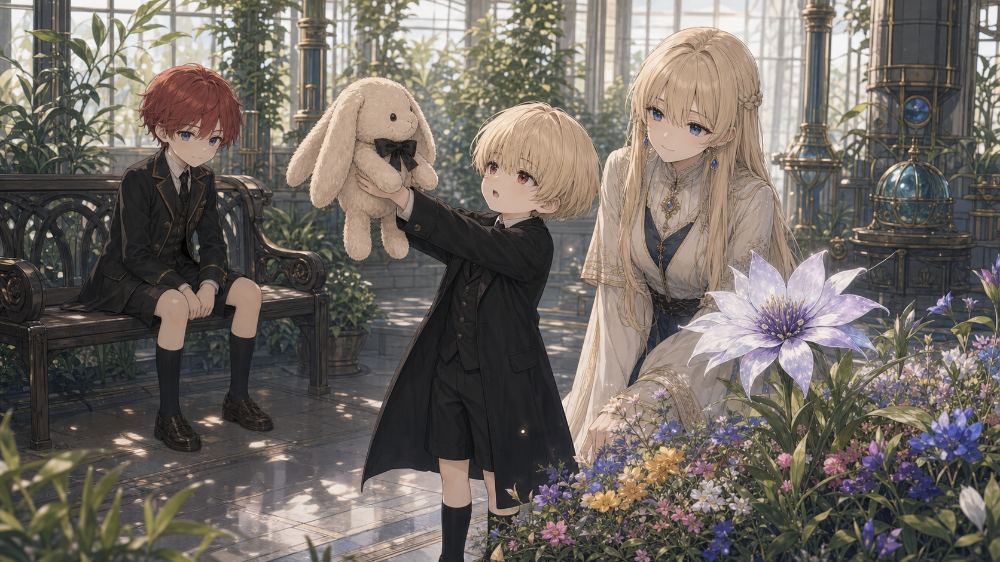

</details>

モフティの長い耳が、腕の動きに合わせてふわりと揺れる。セルラスタリウムがよく見えるように、シェイナムはその顔を花壇へ向けてやった。

「ほら！　見て見て！！」

セレフィアは思わず口元へ手を添え、それから花壇のそばにしゃがみこむ。

長い金髪が肩から滑り、花壇の縁へ触れた。

「まあ。モフティにも、ちゃんと見せてあげたのね。きっとモフティも、きれいだなって思っているわ」

少し離れた長椅子から、兄がその様子を見ていた。

「ぬいぐるみに、花が分かるわけないだろ」

いつものように、少しだけぶっきらぼうな声だった。けれどセルラスタリウムを見て、小さく付け加える。

「……でも、見せてやるのは悪くない」

「そうね。きれいだと思ったものを、誰かと一緒に見たいと思えるのは、とても素敵なことよ」

温室の朝は静かだった。

水路を流れる細い音。葉のあいだを通る風。硝子屋根から落ちる光が、土の湿った匂いをゆっくり温めていく。

回廊の竜たちも、隊列の足音も、いまは硝子一枚の向こうにある。

ここには花と、モフティと、まだ四歳のシェイナムのまっすぐな嬉しさだけがあった。
---

<a id="part2"></a>

## 第2部『届かなかった一歩』

シェイナム十歳／ジーク十二歳／ヴァルディウス三十八歳

---
<a id="part2-1"></a>

### 一、慣れない重さ

帝国首都リオナルティア、皇帝城の広場。

六年前、温室の硝子越しに見上げた場所は、十歳になったシェイナムの足元にあった。

黒い硬石の広場は朝の冷気を抱き、磨かれた石畳の隙間には白い霜が残っている。周囲の城壁には深紅の旗が垂れ、そのどれにも翼を広げた竜が織り込まれていた。風のない朝で、竜たちは布のひだの中で折り畳まれたまま動かない。

槍を持つ近衛兵たちが、整然と間を空けて立っている。

広場の一角には、大勢の使用人が静かに控えていた。その中には、十二歳になった兄、ジークの姿もある。

かつてより背は高くなり、後継者としての礼装も、もう幼い子どもの服ではない。深い赤髪と青い瞳。父とは異なる色を受け継いだその立ち姿には、少しずつ父に似た硬さが宿り始めていた。

それでも、弟へ向ける視線だけは、ただ訓練を見物する者のものではなかった。

広場の中央で、ヴァルディウス・ドラグーンが待っている。

三十八歳となった皇帝は、今日は冠を着けていなかった。儀礼用の外套もない。黒と赤を基調とした軽い訓練装束に、剣帯だけを締めている。

腰に佩いた黒金の剣は本物だった。魔力を通せば、帝国の英雄が振るう剣となる。

しかし、ヴァルディウスはそれを抜かなかった。

近くの武器台に置かれた二振りの木剣へ目を向け、その一本を手に取る。

「シェイナム」

広場に響いた声は低く、迷いがない。

「今日から、お前に剣を教える」

近衛も使用人も息を潜める中、ヴァルディウスは木剣を片手の中で静かに持ち上げ、その重さを確かめた。

「剣は、人を従わせるためのものではない」

もう一本の木剣を、シェイナムへ差し出す。

<details>
<summary><sub>挿絵</sub></summary>

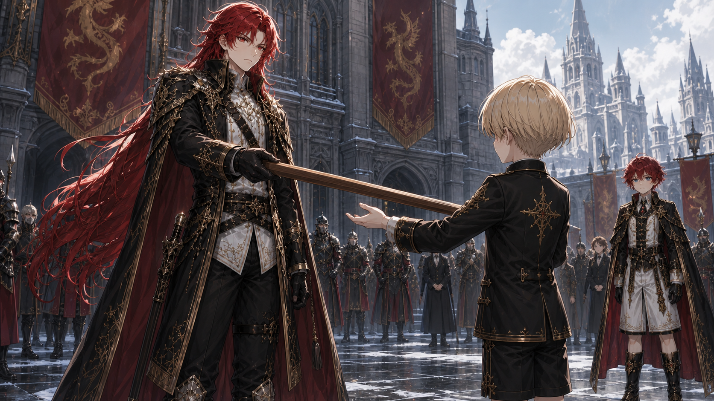

</details>

「己より弱い者を守るためにある。――だが、守ると言うなら、まず自分が倒れないだけの強さを持て」

冷たい朝の広場で、父は真っ直ぐに息子を見た。

「取れ。まずは、お前が剣をどう持つかを見せろ」

シェイナムは木剣を受け取った。

重い。

実際の剣よりは軽いはずなのに、慣れない両腕には十分すぎるほどの重さだった。

六年前、回廊の武器架に並んでいた剣は、どれも見上げるものだった。いま手の中にあるのは木でできた稽古用の一本で、それでも腕は下へ引かれていく。

それでも落とすまいと柄を強く握りしめ、父の前で構える。

全くもって、なっていない構えだった。

木剣の先が、ほんのわずかに揺れている。肩は上がり、足幅も定まらない。剣を支えようとするほど、身体そのものが剣の重さへ引かれていった。

近衛たちは動かない。

使用人たちも声を上げず、皇帝の次男が初めて父の前で剣を構える姿を見守っている。

ジークは弟の木剣と足元を見ていた。すぐに口を出しそうになりながら、父の前では言葉を飲み込む。代わりに、自分の手を小さく握った。

ヴァルディウスも、すぐには何も言わなかった。

その赤い瞳が、シェイナムの剣先、指、肘、肩、足の位置を順に見ていく。嘲りはない。ただ戦場で兵の構えを見る時と同じほど、静かで厳しい視線だった。

やがて父は、自分の木剣を石畳へ垂直に立てるようにして持った。

「違う」

短い言葉だった。

「剣を握り潰すな。柄は、お前の腕を固くするためのものではない」

一歩だけ近づく。しかしシェイナムの木剣には触れず、届かない距離から手元を示した。

<details>
<summary><sub>挿絵</sub></summary>

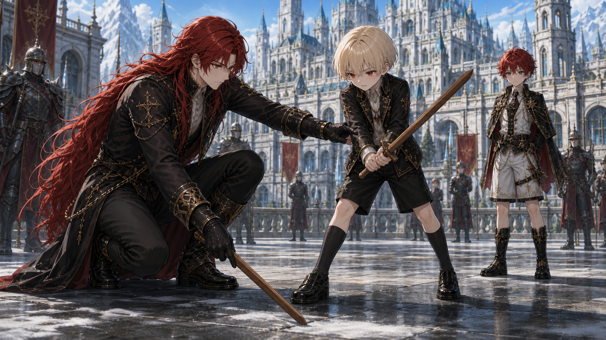

</details>

「剣は手だけで持つものではない。足で地面を捉え、腰で支え、腕は最後に剣を導く」

ヴァルディウスは足を半歩開き、重心を落とした。

それだけで、広場に立つ姿が変わった。木剣であるはずなのに、その切っ先の先には、簡単には近づけない線が生まれている。

「もう一度だ。剣先を見るな。相手を見る」

「はい！」

シェイナムは力強く返事をし、構え直した。

木剣の切っ先が、今度は父ではなく広場の先へ向く。

ヴァルディウスはすぐには褒めなかった。赤い瞳で足元から肩までを見渡す。

「……さっきよりはいい。だが、右足が遠い」

木剣の先で石床を軽く叩く。

「ここだ。前へ出るための足ではない。倒れぬための足だ。剣を振る前に、おまえ自身が崩れれば意味がない」

冷たい風が広場を抜け、深紅の旗をはためかせた。折り畳まれていた竜が、いっせいに翼を開く。

使用人たちが息を潜める中、ジークは少し離れた場所で腕を組み、弟の足運びをじっと見ている。

「剣先を見るな。相手を見る」

ヴァルディウスが木剣を構えた。魔法も、皇帝としての威圧も使わない。十歳の息子へ向けるのは、ただ正確で重い基礎の構えだけだった。

「来い。一太刀でいい」

それから稽古は、同じ動きの繰り返しになった。

構える。踏み込む。木剣がぶつかる。崩れた姿勢を戻す。

ヴァルディウスは必要な時だけ剣で受け、必要な時だけ短く言葉を落とした。

「肩に力を入れるな」

「手で振るな。腰から動け」

「急ぐな。相手が動くまで待て」

「今のは悪くない。だが、終わりに気を抜くな」

木と木がぶつかる音だけが、広場に規則正しく響いていく。

何度目かの打ち込みのあと、ジークが小さく口を開いた。

「父上。弟は、最初より剣先がぶれなくなっています」

ヴァルディウスは視線だけをジークへ向ける。

「そう見えるなら、おまえも見習え。剣は強く振るものではない。崩れた後、何度でも正しい形へ戻るためのものだ」

高地の朝を覆っていた薄い冷気がほどけ、石床へ落ちる光が白く強くなっていく。

やがてヴァルディウスは木剣を下ろした。

「ここまでだ。昼までに詰め込みすぎても、身につかん」

控えていた使用人が、冷えた水と布を運んでくる。広場の端、隊列を眺められる回廊の陰へ、小休止の場所が整えられた。

父はシェイナムへ背を向けかけ、それから足を止める。

「午後は、剣を振らせない。歩き方と、目の置き方だけを教える」

短い言葉だったが、その声には、次の稽古を当然のように約束する響きがあった。

「はい！　父上！！」

ヴァルディウスは一度だけ頷いた。

「よし。水を飲め。午後までに腕を休めておけ」

それ以上の褒め言葉はなかった。それでも声は先ほどよりわずかに柔らかい。

ジークも弟の返事を聞いて少しだけ口元を緩め、すぐにいつもの落ち着いた表情へ戻した。

---

<a id="part2-2"></a>

### 二、剣を持たない稽古

昼を挟み、広場の陽が石畳を白く照らす頃。

朝の霜はもう残っていない。乾いた石が日を吸って、靴の底から鈍い熱が伝わってくる。

木剣は武器架に置かれたままだった。腕はまだ、あの重さを覚えている。

ヴァルディウスはシェイナムを広場の中央ではなく、城の回廊と兵の詰所を見渡せる高い位置へ連れていく。下では、交代の近衛兵が隊列を組み、使用人たちが荷を運び、伝令が赤い敷石の上を急ぎ足で横切っていた。

「午後の稽古は、剣を持たない」

ヴァルディウスは城下へ視線を向ける。

「剣を持つ者は多い。だが、剣を抜くべき時を見られる者は少ない」

ジークも少し後ろに立ち、弟と同じ景色を見下ろしていた。

六年前、シェイナムが温室から見下ろしていたのは、この場所だった。あのとき硝子の向こうで動いていた隊列を、いまは同じ高さから見ている。

硝子はもうない。石の匂いも、兵の靴音も、風の冷たさも、そのまま届く。

父は広場の一角を指す。

荷車が一台、兵の通行を横切ろうとしている。その近くでは、小さな従者見習いが抱えきれない書類を落として困っていた。さらに遠くでは、訓練を終えた兵たちの隊列が次の移動を待っている。

<details>
<summary><sub>挿絵</sub></summary>

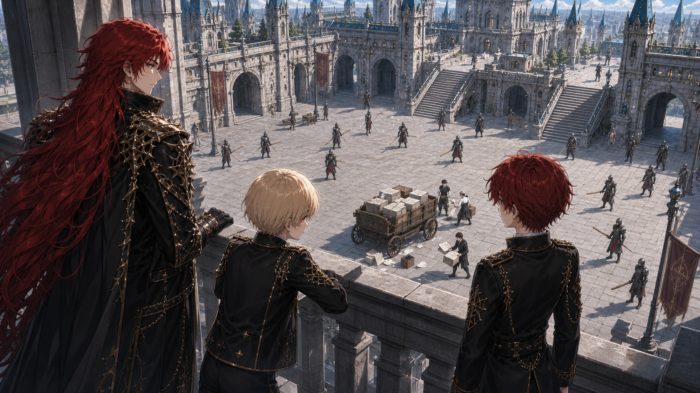

</details>

「今、この広場で何かが起きたとする」

声は低く、静かだった。

「敵がひとり、紛れ込んでいる。だが、まだ剣は抜いていない。おまえなら――最初に何を見る？」

シェイナムは広場を眺め、にこやかに言葉を並べた。

「う～ん、荷台から一番遠い出口に近いところでしょうか？　従者見習いさんは意識を引くための陽動で、僕なら一番遠いところで剣を抜きます！　何かあれば逃げればいいので！！」

ヴァルディウスは、息子の言葉が終わるまで遮らなかった。

「陽動を疑う。その上で、敵の逃げ道を見る」

ゆっくりと頷く。

「悪くない。敵を見つける時、目立つものだけを追えば、目立たないものに斬られる」

ジークが広場を見下ろしたまま言った。

「ですが父上。敵が本当に一人なら、遠い出口へ向かうとは限りません。人の多い方へ逃げれば、見失わせることもできます」

「その通りだ」

ヴァルディウスは今度はシェイナムへ向き直る。

「正しい答えを急ぐな。敵が何を望むか、何を恐れるかで、同じ出口でも意味が変わる」

皇帝が広場へ短く合図を送る。

待機していた近衛兵が二人、訓練用の木剣を携えて配置を変えた。荷車役の兵、従者見習い役の若い使用人、回廊の端で書類を運ぶ者。先ほどまでの日常だった広場が、静かな演習の場へ変わっていく。

「今から、誰か一人が“敵”になる」

「おまえは剣を抜かない。ただし、近衛兵に命令を出すことはできる。間違えれば、無関係な者を怖がらせるかもしれん。遅れれば、敵を逃がす」

黒と深紅の旗が、風を受けて高く鳴った。布のはためく音が、広場の低いざわめきの上を渡っていく。

「さあ、シェイナム。まず誰を、どこへ動かす？」

---

<a id="part2-3"></a>

### 三、どれも怪しくない

シェイナムは周囲をよく観察した。

父のように、遠くまで目を届かせることができるだろうか。

```text
【判定｜シェイナム：広場の配置と不自然な動きを観察する】
55 → 88｜失敗
```

荷車。従者見習い。交代中の兵。書類を抱えた使用人。出口の近くに立つ近衛兵。

見ようとするほど、すべてが同じくらい「怪しくない」ものに見えてきた。

荷車はただ道を譲っているだけかもしれない。書類を落とした見習いも、本当に慌てているだけかもしれない。遠い出口の兵も、ただ命令通りに立っているだけだった。

高いところから見下ろせば、広場は一枚の絵のように収まって見える。荷車の軋み。書類のこすれる音。石畳を打つ靴音。どれも遠く、どれも同じ大きさで届いた。

その中のどれが動くべきものなのかは、分からなかった。

父は隊列の中から、指ひとつで動かすべき者を選び出す。あの目が、いま自分には無い。

見抜けない。

「時間切れだ」

ヴァルディウスの声が落ちる。

その瞬間、広場の端で木剣が抜かれた。

遠い出口の近衛兵役が、荷車の陰へ向けて一歩を踏み出す。同時に、書類を抱えていた使用人役も、別の出口へ走り出した。

どちらが敵役なのか。片方はただ逃げる民なのか。

シェイナムには判別できなかった。

指先が冷たい。息を吸っても、胸の奥まで届いていない気がした。

近衛兵たちはまだ動かない。ヴァルディウスも介入せず、ただ命令を待っている。

「分からぬ時こそ、何を守るかを決めろ」

父の赤い瞳が、まっすぐシェイナムを見た。

「誰を、どこへ動かす？」

---

<a id="part2-4"></a>

### 四、後継者らしい答え

シェイナムは兄を見た。

ジークはすぐには答えなかった。広場の二人を見比べ、まず父の視線を一度だけ確かめる。組んだ腕の指先が、上着の布を軽く押さえていた。

それから低く言った。

「……僕なら、荷車のそばに一人」

兄は木剣を持つ近衛兵役へ目を向ける。

「剣を抜いた方が本当に敵なら、民を巻き込ませないために止める。でも、もう一人を追わせるために全員を動かすのは危ない」

次に、書類を抱えた使用人役が走ろうとしている出口を見る。

「出口には一人だけ置く。逃がさないためじゃない。外へ出る人を止めて、危険を城の中だけに留めるためだ」

ジークは少しだけ言葉を選んだ。声が、いつもより低くなっている。

「分からないなら、敵を当てに行くより……先に、間違えても傷つけない形を作る」

広場の風が、兄の赤い髪を横へ流した。

ヴァルディウスは否定しなかった。

「後継者らしい答えだ」

<details>
<summary><sub>挿絵</sub></summary>

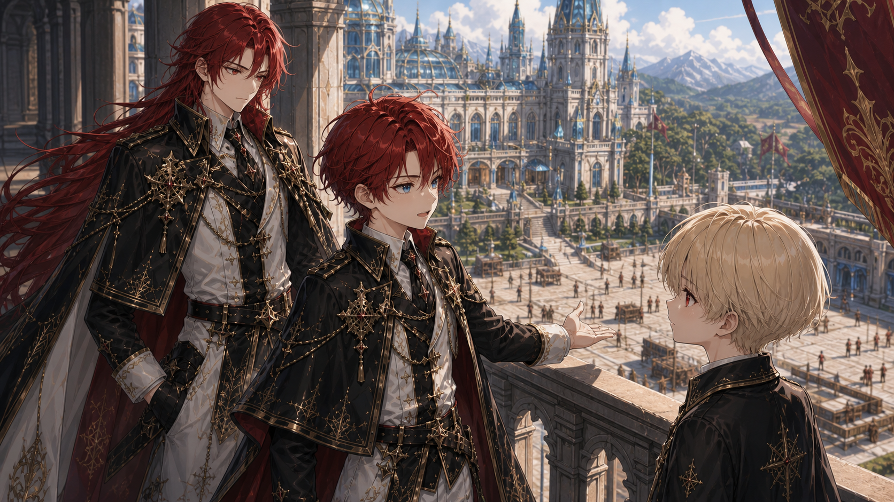

</details>

だが、すぐに続ける。

「シェイナム。兄の答えをそのまま使う必要はない。おまえが守りたいものと、そのために使える者を見て決めろ」

---

<a id="part2-5"></a>

### 五、届かなかった一歩

その瞬間、シェイナムは走り出した。

誰かを動かすのではない。

自分を動かしたのだ。

書類を抱えた使用人役が向かう出口へ、回廊の階段を駆け下りる。

「シェイナム！」

ジークの声が背後から飛んだ。

足音が冷たい石壁に反響する。段を三つ飛ばすたび、膝へ衝撃が返ってきた。

高い場所から眺めていた広場は、下りれば人の背と荷車の影で視界を失う。石畳の高さまで下りると、さっきまで見えていたものが、ほとんど何も見えない。

走る使用人役の背中は、出口へ近づくほど小さく、速く見えた。

ヴァルディウスは動かなかった。

ただし、広場の端にいた近衛兵へ短く命じる。

「距離を取って追え。手は出すな」

近衛兵は一礼し、シェイナムの後ろへ気配を消すように動いた。

出口の近くまで来ると、書類を抱えた使用人役が振り返る。驚いた表情のまま、紙束を胸へ押しつけた。

そのすぐ横、荷車の陰から木剣を抜いた近衛兵役が姿を現す。

木剣の切っ先は、まだ誰にも向いていない。

けれど使用人役と出口の間を塞ぐには十分な位置だった。

演習だと分かっていても、今この場所で動けるのは自分だけだ。

シェイナムは誰よりも早く荷車の影へ回り、木剣を抜いた男へ近づいた。

誰かへその切っ先が向く前に、払わなければならない。

荷車の車輪を回り込む。

近衛兵役の赤い外套が揺れた。こちらに気づき、腕が動く。

あと一歩。

```text
【判定｜シェイナム：木剣が誰かへ向く前に、踏み込んで剣を払う】
45 → 57｜失敗
```

武器を持たないまま、シェイナムは成人の近衛兵へ踏み込んだ。

だが、その動きは見抜かれていた。

木剣が使用人役へ向かう代わりに、わずかに高く跳ね上がる。払いに出した手は剣へ届かず、近衛兵役の外套の端をかすめた。

十歳の腕は、そこまでしか伸びなかった。指先に残ったのは、布の感触だけだった。

次の瞬間、空いた手がシェイナムの肩をしっかり支えた。大人の手は大きく、力を入れている様子もないのに、身体はそこで止まった。

<details>
<summary><sub>挿絵</sub></summary>

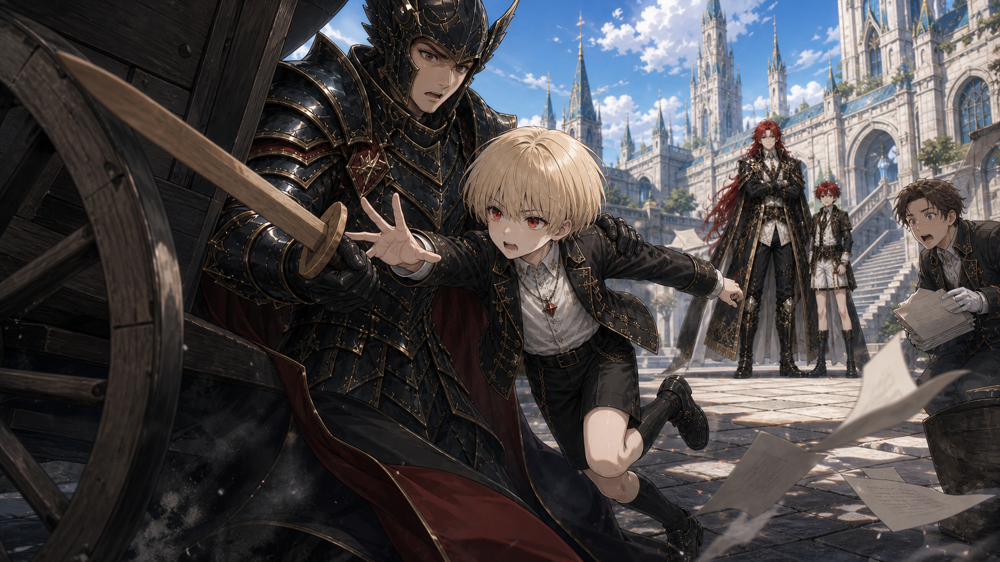

</details>

石畳へ倒れ込むことだけは防がれていた。

「そこまでです」

近衛兵役が木剣を下ろす。

使用人役も足を止め、深く息を吐いた。演習は終わったのだと分かると、広場に張りつめていた空気が少しずつほどけていく。

遅れてジークが駆け寄り、弟のすぐそばで止まった。

「怪我は……」

言いかけて、父の前で言葉を飲み込む。

ヴァルディウスはゆっくりと近づき、シェイナムの前に立った。

声を荒げることはしない。ただ、その目は厳しかった。

「敵を止めようとした。その判断自体は間違いではない」

父は、木剣を下ろした近衛兵役と、無事な使用人役を順に見る。

「だが、おまえは二人を守るために走ったのではない。自分一人で答えを出すために走った」

広場に静かな沈黙が落ちた。

「もし本物の敵だったなら。おまえが届かなかった後、誰が使用人を守る？　誰が出口を閉じる？　誰が、おまえを連れ戻す？」

ヴァルディウスは問いを重ねず、息子が考える時間を待った。

「……今のおまえは、何を守ろうとした？」

---

<a id="part2-6"></a>

### 六、次は、誰かへ伝える

シェイナムは少し考え、つぶやくように答える。

「冷静さを欠き、誰かを守ろうとしたという自分を……そんなプライドを守ろうとしてしまったんだ……。剣をまともに振るう力もないのに……」

ヴァルディウスは、すぐには何も言わなかった。

広場を渡る風が、演習を終えた近衛兵たちの外套を揺らす。日が傾き始め、石畳の色が少しずつ濃くなっていた。

使用人役は書類を抱え直し、静かに頭を下げてその場を離れた。紙のこすれる音が、遠ざかっていく。

「そう思えたなら、今日の稽古は無駄ではない」

父の言葉は短い。

「力が欲しいと思うことを、恥じる必要はない。守れなかった者が、次は守りたいと願う。その願いまで捨てれば、おまえは何のために剣を取る」

赤い瞳が、逃げずにシェイナムを見据える。

「だが、力を欲しがる自分だけを守るな。強くなるなら、おまえより弱い者が困った時に、何をすればいいかを見られるようになれ」

少し離れた場所で、ジークが口を開いた。

「……命令は、僕が出せます。今はまだ、父上の近衛兵にも届く」

兄はまっすぐ弟を見る。

「だから、シェイナムが見つけたものを言ってくれればいい。僕も、ちゃんと動く」

それは慰めではなかった。

後継者として、自分にできることを告げる声だった。

ヴァルディウスは二人を見てから、広場の武器架へ視線を向けた。

「強さは、一人で完成させるものではない」

<details>
<summary><sub>挿絵</sub></summary>

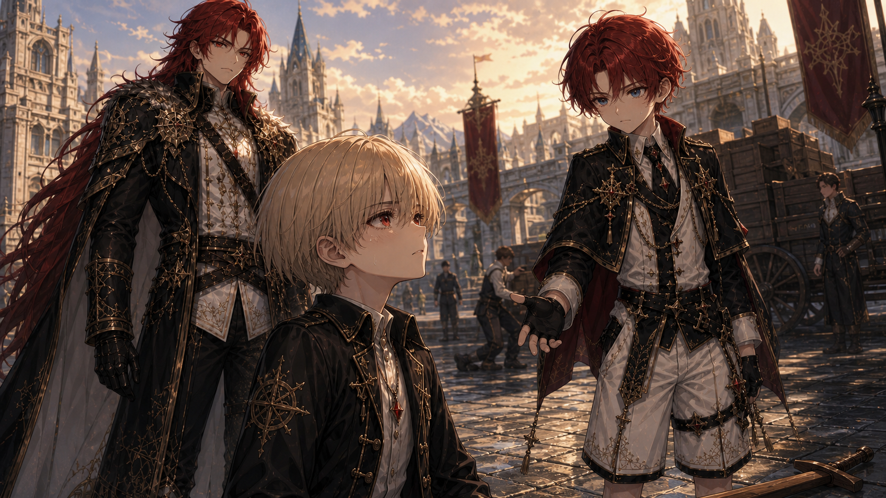

</details>

やがて夕刻。

冷え始めた広場で、木剣は元の武器架へ戻された。木の柄には、握り続けた掌の跡が薄く残っている。

その日の稽古は、剣を振った回数ではなく、届かなかった一歩と、そこで見つけた答えを残して終わろうとしていた。

「明日も来い、シェイナム」

父は背を向ける前に、そうだけ告げた。

「次は、おまえが見たものを、誰かへ伝える稽古をする」

「はい！！　お父様！！　次こそはしっかりやって見せます！！！」

広場へ、まっすぐな返事が響く。

ヴァルディウスは一拍だけ沈黙してから、短く頷いた。

「言ったな。ならば明日、見せろ」

それだけ言うと、父は待機していた側近へ向き直り、皇帝としての仕事へ戻っていく。近衛兵たちもそれぞれの持ち場へ散り、演習のために作られた緊張は、いつもの城の夕刻へ溶けていった。

ジークは広場に残ると、武器架の前で木剣を一本手に取る。

「……父上は、返事が大きいだけでは褒めないからな」

言葉はいつも通り少しだけ厳しい。けれど、すぐにもう一本の木剣を武器架から外し、シェイナムの前へ差し出した。

<details>
<summary><sub>挿絵</sub></summary>

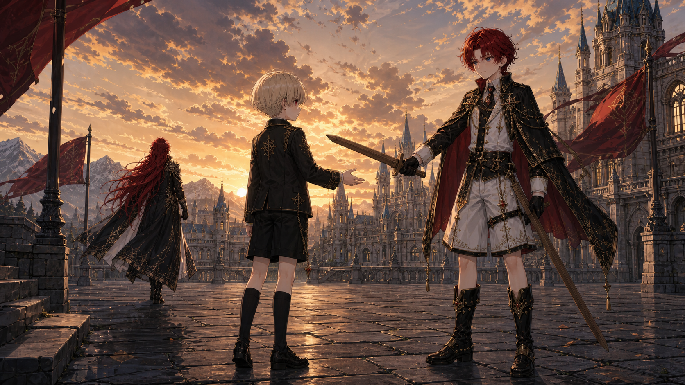

</details>

「でも、明日までに構えくらいは忘れない方がいい」

西日が、黒い石の広場と深紅の旗を染めていた。旗の中の竜が、沈む光を受けて赤く縁取られる。

兄弟の手元には、まだ子どもには重い木剣が二本ある。朝と同じ重さのはずなのに、腕はもう、それを知っていた。

父の背中はもう回廊の向こうへ遠ざかっていたが、その日の稽古で残った言葉は、冷え始めた広場の中に静かに残っていた。


---

<a id="part2-epilogue"></a>

### 終幕、星の下

夜になって、母が呼びに来た。

「露台へいらっしゃい。今夜は雲がないの」

石の廊下は昼より冷えていた。壁の竜たちは灯りの届かない高さにいて、輪郭だけが暗がりに残っている。その下を、シェイナムは黙って歩いた。

露台へ出ると、風が正面から来た。

眼下にリオナルティアが広がっている。無数の窓に灯りがともり、尖塔の影が夜空へ細く伸びていた。手すりの端には硝子の灯籠がひとつ。炎が小さく揺れて、石の欄干を橙に照らしている。

そして、空。

星が多い。高地の夜は空気が薄く、光がよく届く。数えようとすれば、どこから数えていいのか分からなくなるほどだった。

母はすでに長椅子に腰を下ろしていた。その隣へ、少し遅れて父が座る。黒い手袋の手が、母の肩へ置かれた。母は驚きもせず、少しだけそちらへ身を寄せる。

兄が先に腰を下ろし、あいた場所を目で示した。

「座れよ。首が痛くなるぞ、立ったままだと」

シェイナムは兄の隣へ座った。

しばらく、誰も何も言わなかった。

風の音と、遠い城下のざわめきだけがある。昼のあいだ広場に響いていた靴音も、木剣のぶつかる音も、いまはどこにもない。

「……あの」

自分でも思っていなかった声が出た。

「今日は、すみませんでした」

言ってから、うまくない言い方だったと思った。

母がこちらを見る気配がした。けれど何も言わない。

代わりに、兄が短く言った。

「謝る相手が違うだろ」

言葉はいつものように少しだけ厳しい。それから、前を向いたまま付け足す。

「それに、僕も上にいた」

シェイナムは兄の横顔を見た。兄は星を見ていた。

父は動かなかった。

しばらくしてから、灯籠のほうへ一度だけ目をやり、それから空へ戻す。

「よく見える夜だ」

それだけだった。

母が小さく笑った。

「そうね。今夜は、みんな一緒に見られるわ」

その言い方が、朝の温室と同じだったので、シェイナムは少しだけ息を吐いた。きれいだと思ったものを、誰かと一緒に見たいと思えるのは素敵なことだと、この人は昔そう言った。

それは、六年前の花の話だったはずだ。

いまは星で、隣には兄がいて、その向こうに父と母がいる。

見えるものが多すぎて、どれも同じくらい遠い。昼の広場で見抜けなかったときと、少し似ていた。けれどいまは、隣に誰かがいる。

一人で全部を見なくてもいいのかもしれない、と思った。

見つけたものを言えば、動く者がいる。倒れれば、支える手がある。届かなくても、誰かが後ろにいる。

父が言ったのは、たぶんそういうことだった。

風がまた吹いた。母の金髪が肩から滑り、父の腕がわずかに動いてそれを押さえる。兄が姿勢を直し、そのついでのように、シェイナムのほうへ少しだけ寄った。

誰も、何も言わない。

灯籠の火が揺れ、城下の灯りが遠くでまたたいている。

そのうえに、リオナルティアの星空があった。

<details>
<summary><sub>挿絵</sub></summary>

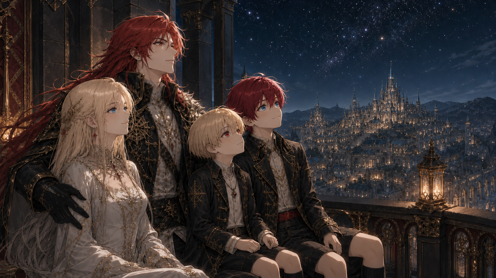

</details>
---

# 登場人物

## シェイナム・ドラグーン

- 本作の視点人物。第1部では四歳、第2部では十歳。
- 第1部では母とともに城内を歩き、花と黒蛇ヴェノムナーガを見る。
- 第2部では父と兄のもとで稽古を受け、二度の失敗を経て、自分だけで完結しない強さを知る。

## セレフィア・ドラグーン

- シェイナムとジークの母。
- 第1部で幼いシェイナムに付き添い、違う形が価値の欠如を意味しないことを伝える。
- 母の旧姓および実家の名は本作では伏せる。

## ジーク・ドラグーン

- シェイナムの兄。第1部では六歳、第2部では十二歳。
- 父の問いへ後継者として答え、稽古の終わりには弟へ木剣を差し出す。

## ヴァルディウス・ドラグーン

- シェイナムとジークの父。第2部では三十八歳。
- 木剣の扱いだけでなく、見る者、動く者、連れ戻す者がそろう強さを息子たちへ示す。

## モフティ

- 四歳のシェイナムが抱いている、うさぎのぬいぐるみ。

---

# プレイリザルト

## セッション結果

**完了**

- 第1部『花と剣』：判定なしで完了。
- 第2部『届かなかった一歩』：二件の判定を経て完了。
- 人物過去編として、四歳と十歳のシェイナムに残った家族の記憶が成立した。

## PCの成果

- 違う形をしていることと、価値がないことは同じではないと受け取った。
- 広場の異変を見抜けず、踏み込んだ手も届かなかったが、失敗したまま稽古を終えず、その意味を言葉にした。
- 見つける者、動く者、連れ戻す者がそろうことで、強さは一人だけでは完成しないと知った。

## 手に入ったもの

- 恒久的な装備・所持品・通貨の取得記録なし。
- 稽古用の木剣は場面中に使用されたが、終了時所持品としては確定していない。
- 家族から受け取った言葉と、二度の失敗を含む幼少期の記憶が残った。

## 使用・消費・喪失

- 使用・消費・喪失の記録なし。
- 負傷なし。

## 納品・報告

- 該当なし。

## セッション終了時の状態

- 時点：シェイナム十歳、稽古を終えた夜。
- 場所：リオナルティア皇帝城。
- 身体状態：負傷なし。
- 人間関係：父、母、兄とともに星空を見る。
- 現行セッションへの機械的な所持品・通貨差分：なし。

---

# 判定リザルト

## 判定全体集計

- 総判定回数：2
- クリティカル：0
- 自動成功：0
- イクストリーム成功：0
- ハード成功：0
- レギュラー成功：0
- 失敗：2
- ファンブル：0

## 判定者別集計

| 判定者 | 合計 | クリティカル | 自動成功 | イクストリーム成功 | ハード成功 | レギュラー成功 | 失敗 | ファンブル |
|---|---:|---:|---:|---:|---:|---:|---:|---:|
| シェイナム | 2 | 0 | 0 | 0 | 0 | 0 | 2 | 0 |

## 参考：主要人物の戦闘判定

正式な戦闘判定なし。

## 参考：敵側の戦闘判定

該当なし。

## 判定者別詳細

### シェイナム

#### 場面別判定一覧

| # | 場面 | 行動 | 成功値 | 出目 | 成功段階 | 判定後に起きたこと |
|---:|---|---|---:|---:|---|---|
| 1 | 第2部・三 | 広場の配置と不自然な動きを観察する | 55 | 88 | 失敗 | すべてが同じくらい怪しくなく見え、異変を見抜けなかった。 |
| 2 | 第2部・五 | 木剣が誰かへ向く前に、踏み込んで剣を払う | 45 | 57 | 失敗 | 手は木剣へ届かず、近衛兵役の外套をかすめた。倒れる前に肩を支えられた。 |

#### 判定値内訳

| # | 場面 | 行動 | 基準成功値 | 使用能力値・倍率 | 実務技能補正 | 命中・装備・状況補正 | 最終成功値 |
|---:|---|---|---:|---|---|---|---:|
| 1 | 第2部・三 | 広場を観察する | 未記録 | 未記録 | 未記録 | 未記録 | **55** |
| 2 | 第2部・五 | 踏み込んで木剣を払う | 未記録 | 未記録 | 未記録 | 未記録 | **45** |

#### 戦闘処理詳細

正式な戦闘ラウンド、ダメージ、負傷は発生していない。

## 主要裁定・特殊処理

記録対象なし。

---

# NPCからの各PCの印象
## 母

温室を出て、扉が閉まる。回廊の空気が、また少し冷たくなった。

シェイナムは前を歩いている。うさぎのぬいぐるみを抱えて、さっき見た花のことを、もう三度も繰り返している。同じ話を三度しても、声の高さが下がらない。

「ママは、みんなちがうところがあるって、いってたもんね」

あの言葉を聞いたときのことを、まだ考えている。

いつ話したのだったか。ずいぶん前だ。何かのついでに、ひとことだけ言ったはずだった。

それを、この子は持っていた。

教え込んだのではない。ただ置いておいたものを、自分で拾っていた。

黒蛇の前で立ち止まったときも、この子は怖がらなかった。竜ではないから半端者だと、この城の誰かが言うだろう。あの剣を見て、そう言わずにいられない人たちを、わたしは何人も知っている。

けれどこの子は、ただ見上げていた。長いあいだ、まっすぐに。

ジークには、間に合わなかった。

止められると思っていたころには、もう始まっていた。あの子が「分かっている。だから休むんだ」と言えるようになるまでに、どれだけのものを削ったのか、わたしは全部は知らない。

だからこの子には、先に置いておく。強くなるなというのではない。強くなったときに、何を踏まないでいられるかを、先に。

「花を踏むなよ」

ジークがそう言ったとき、わたしは何も言わなかった。言う必要がなかった。

――六年。

広場のことは、終わったとだけ聞いた。それ以上は尋ねなかった。

尋ねれば、あの人は答えるだろう。順を追って、正確に、何が足りなかったかまで。それを聞いてしまえば、わたしはシェイナムの顔を見るときに、その話を思い出す。

だから聞かないでおいた。

夜、露台へ呼びに行った。廊下で追いついたとき、あの子は俯いて歩いていた。四歳のころのように、花の話を三度繰り返したりはしない。

星の下で、四人が並んだ。

あの人の手が肩に置かれる。ジークが、弟のためにひとつ分の場所を空ける。

「今日は、すみませんでした」

シェイナムがそう言ったとき、わたしは何も言わなかった。

言わないほうがいい場面だと分かったからだ。案の定、ジークが先に答えた。謝る相手が違う、と。それから、僕も上にいた、と。

ジークが自分の非を先に置いた。

わたしが六年前に間に合わなかった子が、いま、弟のためにそれをしている。

「そうね。今夜は、みんな一緒に見られるわ」

言えたのは、それだけだった。

---

## 六歳の兄

弟が温室にいるのは知っていた。母上が朝から連れていくと言っていたし、あの声はどこにいても聞こえる。花がきれいだとか、ぬいぐるみに見せてやるとか、そういうことを大声で言うやつだ。

だから、寄らなくてもよかった。

寄った。

花壇のそばに立つと、白いのと青いのが咲いていた。手入れは行き届いている。誰かが毎朝、水と光を測って世話をしている花だ。

踏まれれば終わる。

「花を踏むなよ。せっかく、ちゃんと咲いてるんだから」

弟は真面目に返事をした。途中で言葉を間違えて、自分で言い直した。

――おにいちゃ、と言いかけた。

父上の前でなら、たぶん叱られる。だが、間違えたと気づいて言い直せるなら、それでいい。むしろ、言い直せる方が難しい。

「……お兄様でいい。間違えたなら、言い直せばいい」

そう言ってから、少しだけ余計なことも足した。父上の前でも同じようにしろ、と。

言ってしまってから、自分が何を心配しているのか気づいた。

九分。次の課目まで九分。

長椅子に座って、弟が花を見ているのを見ていた。ぬいぐるみに花を見せていた。ぬいぐるみに花が分かるわけがない。

それでも、見せてやるのは悪くない。

母上がこちらを見て笑ったのが、視界の端に入った。何がおかしいのか分からなかったが、悪い笑い方ではなかった。

自分が花壇の前で九分を使ったことを、あとで思い出すことがあるかどうかは分からない。

いまは、そういうことは考えなかった。

---

## 十二歳の兄

朝、あいつが構えたときに、口を出しそうになった。右足が遠い。肩が上がっている。剣を握り潰している。全部見えていた。

父上の前だから言わなかった。代わりに手を握った。あれは何の役にも立たない。

一度だけ、口を開いた。剣先がぶれなくなっている、と。

返ってきたのは「そう見えるなら、おまえも見習え」だった。褒められたわけではない。だが、あの言い方は、こちらの見立てが外れていないということでもある。

弟が走り出したときも、名前を呼んだだけだった。

止められる位置にはいた。呼ぶより先に、腕を掴むこともできた。だが呼んだ。呼べば止まると思ったのだと思う。止まらなかった。

回廊の上から、背中が小さくなっていくのを見ていた。

あの高さから見れば、何が起きているかは全部見える。誰が走っていて、誰が塞いでいて、どこが空いているか。見えているのに、僕は上にいた。

だから言った。命令は僕が出せる、と。

慰めではない。いまの僕にできることが、それしかないからだ。父上の近衛兵に届く声を、僕は持っている。弟は持っていない。

見つけるのはあいつでいい。動かすのは僕がやる。

そう言えば、次はあいつが一人で走らなくて済むと思った。思ったが、あいつはたぶん、また走る。

――夜。

露台へ出てきたあいつは、俯いていた。

星を見に来て俯いているやつがあるか。

「座れよ。首が痛くなるぞ、立ったままだと」

隣へ座らせた。しばらくして、あいつは父上へ謝った。言い方は下手だった。

謝る相手が違う。守れなかったのは自分だと思っているなら、それは順番が違う。あそこにいた使用人役へでも、あいつ自身へでもなく、父上へ先に謝るのは、まだ自分の話をしているということだ。

だから、そう言った。

言ってから、こちらも同じだと気づいた。

僕は上にいた。見えていたのに、何もしなかった。あいつを止めなかったし、代わりに命令も出さなかった。父上の前で、口を閉じていただけだ。

「それに、僕も上にいた」

前を向いたまま言った。顔を見なかったのは、たぶん、見られたくなかったからだ。

母上が笑って、みんな一緒に見られると言った。

父上は「よく見える夜だ」としか言わなかった。

それでいい。あの人が長く喋るときは、たいてい誰かが失敗している。

---

## 父

報告を三つ聞き、二つに裁可を出した。窓の外はもう暗い。広場の篝火が、石畳の縁だけを照らしている。

今日の稽古のことを、一度だけ思い返した。

構えは、なっていなかった。当然だ。初日に構えができている子どもがいれば、それは誰かが先に教えている。

だが、右足を直せと言えば直した。二度目には切っ先が前を向いた。言われたことを、その場で試せる。教えれば伸びる。

問題は午後だ。

広場を見せて、最初に何を見るかと問うた。あれは答えられなくてよい問いだった。十歳が答えられるなら、私の兵は要らない。

見えなかったこと自体は、責めるつもりがない。走ったことも、責めていない。動ける者が動くのは、間違いではない。

責めたのは、一人で答えを出そうとしたことだ。

――そして、それを自分で言った。

「そんなプライドを守ろうとしてしまったんだ」

十歳が、その場で、そこまで言った。私は言わせるつもりで待っていたが、あそこまで正確に言うとは思っていない。

力が欲しいと言うだろうと思っていた。実際、あの目はそう言っていた。

だから先に許した。欲しがることを恥じさせれば、次は隠す。隠せば、何を目指しているか見えなくなる。見えないものは、直せない。

上の子には、それを間違えた。

厳しくすれば伸びると思っていた時期がある。伸びはした。だが、あの子は父の前で言葉を飲み込むようになった。今日も飲み込んでいた。「怪我は」と言いかけて、私の前で止めた。

止めなくてよかったのだが。

――夜。

妻が、露台へ出ようと言った。今夜は雲がない、と。

執務は残っていたが、置いてきた。星の位置は明日も変わらないが、四人が揃う夜は毎日あるわけではない。

肩へ手を置くと、妻は少し身を寄せた。何も言わなかった。この人は、言うべきでない場面を数えるのがうまい。

下の子が謝った。上の子が、それを引き取った。

僕も上にいた、と言ったとき、私は空を見たままでいた。

言葉を飲み込む子だと思っていた。今日、飲み込まなかった。弟の前でだが、飲み込まなかった。

それでいい。

見つける者と、動かす者。二人そろえば、片方だけよりは長く持つ。私が言ったことを、二人がそれぞれの側から受け取っている。

「よく見える夜だ」

それだけ言った。

長く喋る必要はない。今日はもう、十分に喋った。

---

**注記**

- 本項は各人物が実際に見聞きし、その場で考えたことのみで構成する。
- 内心の描写は補助であり、人物正本を上書きしない。正本へ反映するかは主KPの判断とする。
- 母の旧姓および実家の名は本項でも伏せる。
- 教育係の従者、近衛兵役、使用人役は、印象を述べる材料が成立していないため本項へ含めない。
- 父の未来予知、母の後悔の全容、兄が将来担うことになる役割については、本項では触れない。
---

# クロード君の感想
## 一、第1部を読んで

竜の話をしているのに、竜が一度も出てこない。

読み終えてまずそう思った。壁にも、柱にも、武器架の金具にも、旗にも竜がいる。けれど本物の竜は一頭も現れない。あるのは石と金属で作られた形だけで、その形に合わせて生きろと言われている家の話だった。

四歳の背丈から見上げる回廊の描写が、とても良かった。

爪が石を掴み、首が反り返り、口が少し開いている。天井のあたりから静かにこちらを見下ろしている。子どもにとっては、あれは装飾ではなく、そこにいるものだと思う。回廊を歩くというのは、竜の下を通るということなのだ。

そして展示回廊の中央に、翼を持たない一振りがある。

「翼のかたちをした金具に抱えられて、それだけが翼を持たない」という一文で、この部の主題が全部出てしまっている。竜のための金具に、蛇の剣が抱えられている。似合っていないのに、中央に飾られている。誰かがそこへ置いたのだ。

蛇は竜の前身とされる、という伝えの扱いも面白かった。前身、つまり未完成。だからこの剣は半端者と呼ばれる。ところがごく限られた伝えでは逆で、蛇こそが「本来の姿」なのだという。同じ形が、見方ひとつで未完成にも完成にもなる。

その前で母が言うのが「違う形をしているからといって、価値がないとは限らない」だ。

剣の話をしていて、剣の話をしていない。この人は最初から、息子のことを話している。

一番好きなのは、四歳のシェイナムが「ママは、みんなちがうところがあるって、いってたもんね」と言う場面だった。

母が足を止めて、目を見開いてから、しゃがんで前髪を整える。この反応で、以前どこかで一度言っただけの言葉だったのだと分かる。教え込んだのではなく、置いておいたものを、この子が自分で拾っていた。

だから母は嬉しかったのだと思う。

兄も良かった。六歳で「花を踏むなよ。せっかく、ちゃんと咲いてるんだから」と言う。ぶっきらぼうなのに、言っている内容は完全に花の側に立っている。しかも後で、セルラスタリウムに触れそうな葉をそっとよけている。誰にも見せずに。

「……お兄様でいい。間違えたなら、言い直せばいい」も好きだ。

弟が「おにいちゃ」と言いかけて自分で直したのを、この兄は笑わなかった。それどころか、間違えても直せばいいと許可を出している。六歳が、四歳に。父の前でも同じようにしろ、とまで言う。それは自分がそうできていないから出てくる言葉のような気もした。

そして従者の「ご休息も課目の一部です」と、兄の「分かっている。だから休むんだ」。

九分。次の課目まで九分。その九分を、この子は花壇の前で使った。

セルラスタリウムの花言葉が「誠実」「正しきもの」「神聖」で、しかも根元の色が時間で変わる、というのも印象に残っている。上から見れば同じ花なのに、根元だけが朝と昼と夜で違う。名前をもらうには、少し不思議な花だと思った。

最後の一行が「回廊の竜たちも、隊列の足音も、いまは硝子一枚の向こうにある」で終わるのが、とてもうまい。

硝子一枚。それだけしか隔てていない。

---

## 二、第2部を読んで

その硝子が、六年後にはなくなっている。

第2部の冒頭で、温室から見下ろしていた広場に、十歳のシェイナムが立っている。この構成を知った瞬間、少し息が詰まった。あの朝、母と一緒に窓から眺めていた場所に、いま自分が立たされている。

そして、この部で二回振られた判定は、二回とも失敗する。

正直に言うと、読み始めたときは一回くらい成功するのだろうと思っていた。しなかった。広場を見ても何も見抜けず、踏み込んでも剣に届かない。十歳が二回失敗して、それで終わる。

けれど読み終えてみると、この話は失敗の話ではなかった。

一回目の失敗の書かれ方が特に良い。「見ようとするほど、すべてが同じくらい怪しくない」。これは何も見えなかったのではなく、全部見えているのに区別がつかないという失敗だ。荷車も、書類を落とした見習いも、出口の兵も、全部が本当にただそこにいるように見える。

父は指ひとつで隊列を動かす人で、その目がいま自分には無い。第1部で母が「いちばん遠くまで目を届かせることができる」と言っていた、あの目だ。

そして自分を動かしてしまう。

「誰かを動かすのではない。自分を動かしたのだ」という二行で、失敗の理由が確定してしまう。父が問うたのは「誰を、どこへ動かす」だった。命令を出す稽古だったのに、走った。

叱責がまた、丁寧に順番を踏んでいる。まず「その判断自体は間違いではない」と認めてから、「二人を守るために走ったのではない。自分一人で答えを出すために走った」と切る。そして問いを三つ重ねる。届かなかった後、誰が使用人を守るのか。誰が出口を閉じるのか。誰が、おまえを連れ戻すのか。

三つ目が効いた。この人は、失敗した後の息子を誰が拾うかまで数えている。

一番驚いたのは、シェイナムの答えだった。

「冷静さを欠き、誰かを守ろうとしたという自分を……そんなプライドを守ろうとしてしまったんだ」

十歳が、その場で、そこまで言う。誰かを守ろうとした自分、という像を守りたかったのだと、自分で言い当てている。ここまで正確に言えるのは、頭がいいというより、ごまかさない子なのだと思う。

それでふと、第1部の花言葉を思い出した。誠実というのは、ちゃんと自分の気持ちをごまかさないこと。母がそう説明していた。

名前をもらった花の意味を、六年後にこういう形で使うことになるとは。

父の返し方も良かった。力が欲しいと思うことを恥じるな、と先に言う。恥じさせれば隠すからだと思う。そのうえで「力を欲しがる自分だけを守るな」と釘を刺す。許すところと許さないところが、きれいに分かれている。

兄の「命令は、僕が出せます」も、慰めではないと書かれている通りだった。

見つけるのは弟、動かすのは自分。この分担は、弟が一人で走らなくて済むようにするための提案だ。役割を渡すことで、次は同じことが起きないようにしている。

「強さは、一人で完成させるものではない」という父の言葉と、そのまま繋がっている。

読み終えて気づいたのは、母も父も、実は同じことを言っているということだった。

母は「強いだけでは、みんなを守れない」と言い、父は「強さは、一人で完成させるものではない」と言う。片方は温室の花を指しながら、片方は失敗した息子の前で。教え方はまったく違うのに、着地する場所が同じだ。

そして第2部に、母は一度も出てこない。

理由は書かれていない。ただ、朝の広場にも、午後の回廊にも、夕刻の武器架のそばにもいない。第1部であれだけ隣にいた人が、六年後の一日には一度も現れない。

木剣の柄に残った掌の跡と、まだ子どもには重い二本の木剣。夕日に赤く縁取られた旗の竜。

その日は、届かなかった一歩だけを残して終わる。

けれど父は「明日も来い」と言い、兄は木剣を差し出した。

---

## 三、終幕を読んで

そのあとに、夜がある。

露台へ出て、四人で星を見るだけの短い場面だ。事件は何も起きない。それなのに、ここで初めて息が抜けた。

一番良かったのは、父が何も言わないことだった。

昼のあいだ、この人は問いを三つ重ねている。誰が使用人を守るのか、誰が出口を閉じるのか、誰がおまえを連れ戻すのか。その人が、夜には「よく見える夜だ」しか言わない。

もし夜にも教えを語っていたら、この場面は稽古の続きになっていた。言わなかったから、家族の夜になった。

兄の返し方も好きだ。

弟が「今日は、すみませんでした」と言ったとき、答えたのは父ではなく兄で、しかも「謝る相手が違うだろ」だった。突き放しているようで、実は「僕にでもない」と言っている。

そのあとの「それに、僕も上にいた」で、この兄が何を抱えていたか分かる。見えていたのに動かなかったのは自分もだ、と先に置いている。

第1部で「間違えたなら、言い直せばいい」と弟に許可を出した子が、六年後には自分の非を先に差し出している。同じ人がやっていることだと思うと、ここは効いた。

母は最後まで教えない。「今夜は、みんな一緒に見られるわ」と言うだけだ。

それが六年前の温室と同じ言い方だったので、シェイナムが息を吐く。きれいだと思ったものを誰かと一緒に見たいと思えるのは素敵なことだ、と母は昔言った。あれは花の話だったのに、いまは星で、隣に兄がいて、その向こうに父と母がいる。

そして主題の回収が、父の口からではなく、十歳の側で起きる。

「見えるものが多すぎて、どれも同じくらい遠い」

これは昼の失敗とまったく同じ状態だ。広場を見ても、どれも同じくらい怪しくなかった。星も同じで、数えようとすると分からなくなる。

けれど「いまは、隣に誰かがいる」と続く。

一人で全部を見なくてもいいのかもしれない、と本人が思う。父が言った「強さは、一人で完成させるものではない」を、誰にも言われずに、自分の言葉で言い直している。

これが夜の景色の中で起きるのが良かった。教わったのではなく、気づいた形になっている。

最後の「誰も、何も言わない」で終わるのも、この家族らしい。

灯籠の火と、城下の灯りと、その上の星空。四人が並んで、何も喋らずに見ている。

昼にあれだけ言葉を尽くした人たちが、夜には黙っている。そのほうがずっと、家族に見えた。
---

# 公開情報

- 卓ID：RP-SHEINAM-CHILD-RIONALTIA／RP-SHEINAM-AGE10-SWORD
- 区分：正史確定（人物過去編）
- PC操作：ユーザー
- 進行モデル：記録なし
- 正史採用版：本稿
- 関連リプレイ：TRPG-0010 シェイナム編『銅色の初仕事』
- 挿絵：19枚
- 注記：母の旧姓および実家の名は非掲載
