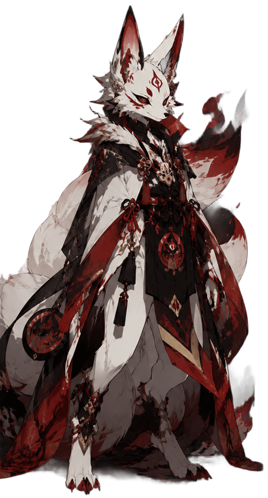
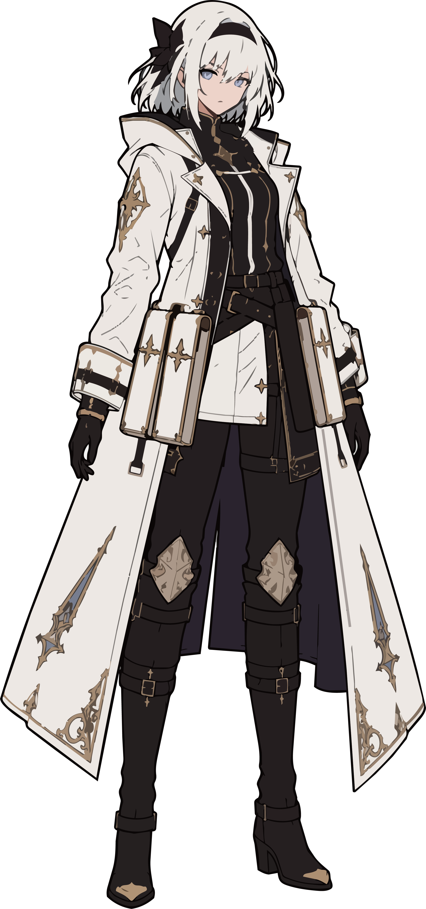

# キャラクター設定

[公開資料トップへ戻る](../README.md) / [公開ルールブック](../公開設定/星みちTRPG_公開ルールブック.md) / [公開キャラクターシート用テンプレート](公開キャラクターシート用テンプレート完全版.md) / [キャラクタービルドシミュレーター](https://sealicealtair.github.io/hoshimichi-character-sheet-builder/) / [シナリオ『銅色の初仕事』](../【ネタバレ注意！】SCN-0001_シナリオ「銅色の初仕事」/README.md)

「星明かりの道しるべTRPG」の同行者であるシーリスと、実際のプレイから人物像や冒険履歴が生まれたPCたちの公開資料です。現在の状態は、正史セッションの結果に応じて更新します。

> 各プロフィールには、通過シナリオのネタバレが含まれます。

## マイン・A・レッドフォックス

  

暗殺一家で育ち、父の言葉を受けて、広い世界を知るため冒険者となった小太刀使いの少女。

| 項目 | 現在の状態 |
|---|---|
| 現在の立場 | 銅級冒険者 |
| 主な操作担当 | ユーザー |
| 通過シナリオ | 1 |
| 現在地 | 中継都市の冒険者ギルド |
| 現在の負傷 | なし |

[マイン・A・レッドフォックスの公開プロフィールを見る](マイン・A・レッドフォックス.md)

[マイン編の正史リプレイを見る](../【ネタバレ注意！】SCN-0001_シナリオ「銅色の初仕事」/TRPG-0006_マイン_A_レッドフォックス編/TRPG-0006_マイン_A_レッドフォックス編_銅色の初仕事_正史リプレイ.md)

## カーヴェイン

  

右腕に悪魔を封じた永劫の存在を名乗り、世界を手中に収める覇道を歩き始めた仕込み刀使いの少年。

| 項目 | 現在の状態 |
|---|---|
| 現在の立場 | 銅級冒険者 |
| 主な操作担当 | ユーザー |
| 通過シナリオ | 1 |
| 現在地 | 中継都市の冒険者ギルド |
| 現在の負傷 | なし |

[カーヴェインの公開プロフィールを見る](カーヴェイン.md)

[カーヴェイン編の正史リプレイを見る](../【ネタバレ注意！】SCN-0001_シナリオ「銅色の初仕事」/TRPG-0005_カーヴェイン編/TRPG-0005_カーヴェイン編_銅色の初仕事_正史リプレイ.md)

## 紅焔

  

一族相伝の狐火と両手の鉤爪を扱い、失敗と負傷を隠さず初仕事を完遂した狐系獣人の冒険者。

| 項目 | 現在の状態 |
|---|---|
| 現在の立場 | 銅級冒険者 |
| 主な操作担当 | ユーザー |
| 通過シナリオ | 1 |
| 現在地 | 中継都市の冒険者ギルド支部 |
| 現在の負傷 | 左前腕刺し傷／応急処置済み |

[紅焔の公開プロフィールを見る](紅焔.md)

[紅焔編の正史リプレイを見る](../【ネタバレ注意！】SCN-0001_シナリオ「銅色の初仕事」/TRPG-0009_紅焔編/TRPG-0009_紅焔編_銅色の初仕事_正史リプレイ.md)

## カイト

  

村を守れる人になるため、中継都市で冒険者として歩き始めた少年。

| 項目 | 現在の状態 |
|---|---|
| 現在の立場 | 銅級冒険者 |
| 主な操作担当 | ユーザー |
| 通過シナリオ | 1 |
| 現在地 | 中継都市の冒険者ギルド |
| 現在の負傷 | 左肩打撲／応急処置済み |

[カイトの公開プロフィールを見る](カイト.md)

[カイト編の正史リプレイを見る](../【ネタバレ注意！】SCN-0001_シナリオ「銅色の初仕事」/TRPG-0001_カイト編/TRPG-0001_カイト編_銅色の初仕事_正史リプレイ.md)

## フィトリアット・マリアベル

  

特大剣グランを相棒と呼び、自分の強さを信じて歩き始めた少女。

| 項目 | 現在の状態 |
|---|---|
| 現在の立場 | 銅級冒険者 |
| 主な操作担当 | AI代理 |
| 通過シナリオ | 1 |
| 現在地 | 中継都市 |
| 現在の負傷 | 左前腕の深い刺創／教会治療後も未完治 |

[フィトリアット・マリアベルの公開プロフィールを見る](フィトリアット・マリアベル.md)

[フィトリアット編の正史リプレイを見る](../【ネタバレ注意！】SCN-0001_シナリオ「銅色の初仕事」/TRPG-0002_フィトリアット編/TRPG-0002_フィトリアット編_銅色の初仕事_正史リプレイ.md)

## シーリス・アルタイル

  

ただ冒険者として幸せになりたいと願いながら、新米冒険者の初回実地依頼へ同行した銀級冒険者。

[シーリス・アルタイルの公開プロフィールを見る](シーリス・アルタイル.md)

[最新の公開正史リプレイを見る](../【ネタバレ注意！】SCN-0001_シナリオ「銅色の初仕事」/TRPG-0009_紅焔編/TRPG-0009_紅焔編_銅色の初仕事_正史リプレイ.md)

---

[公開キャラクターシート用テンプレート完全版](公開キャラクターシート用テンプレート完全版.md)

---

[公開資料トップへ戻る](../README.md)
