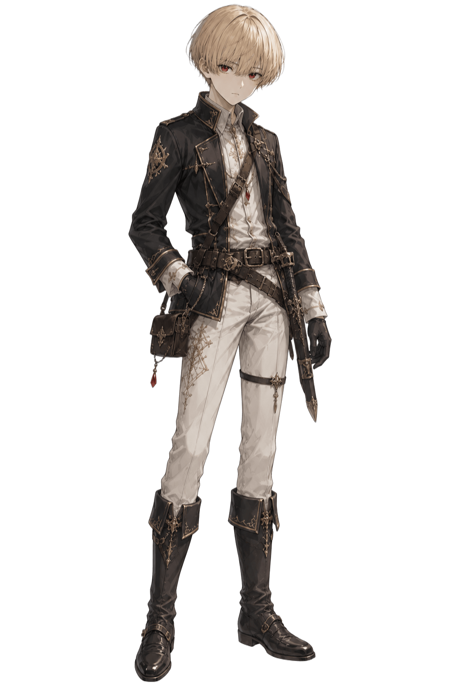

<!--
公開キャラクター設定資料

このファイルは公開用です。
非公開正本、KP専用情報、本人が作中で話していない秘密は記載しません。

確定情報だけを記載します。
候補・妄想・画像からの推測・未確認事項を確定設定へ変換しません。

表記区分：
- 未決定：設定としてまだ決まっていない
- 未確認：作中または資料上で確認できていない
- 未登録：キャラクタービルダーへ登録されていない
- 非公開：設定は存在するが公開しない
- なし：確認の結果、本当に存在しない
-->

<table width="100%">
<tr>
<td width="50%" valign="top">

<h1>シェイナム</h1>

<blockquote>
「兄を超えるためです！！」 
その言葉を胸に、少年は銅色の留め具を受け取った。
</blockquote>

<blockquote>
<strong>ネタバレ注意</strong> 
このプロフィールには、シナリオ『銅色の初仕事』の結果が含まれます。
</blockquote>

  

遠方から中継都市へやってきた、金髪のマッシュルームヘア、赤い瞳、色白の肌を持つ十六歳の少年です。

漆黒の蛇腹剣「黒蛇ヴェノムナーガ」を扱い、冒険者として経験と強さを積み、兄を超えることを目標にしています。

初仕事では、必要な装備を揃え、赤縁草を傷めず採取し、負傷後も敵を深追いせず、依頼品と危険情報を持ち帰りました。

</td>
<td width="50%" valign="top">

<h1>&nbsp;</h1>

<pre>
名前：シェイナム
武器：黒蛇ヴェノムナーガ
防具：名称未登録
スキル：未登録

CP：☆☆☆☆
キャラクターシート：未登録
</pre>

基礎ステータス、潜在能力、実務技能、HP、AP、BLD、武器攻撃型、攻撃力、防護点は、キャラクタービルダーへ未登録です。

</td>
</tr>

<tr>
<td width="50%" valign="top">

<h2>現在の状態</h2>

<strong>現在地</strong> 中継都市の冒険者ギルド支部

<strong>負傷・体調</strong> 左肩から背中にかけて、棍棒による重い打撲があります。左腕は動かせます。

<strong>処置・治療</strong> シーリスの自作軟膏を塗り、布で固定済みです。当日は温めず、冷やして休むよう助言を受けています。

<strong>現在できること</strong> 通常の移動と日常動作は可能です。手当て後は、通常行動へ一律の負傷補正を受けない状態です。

<strong>現在できないこと</strong> 明確な行動不能はありません。

<strong>悪化し得る動作</strong> 同日中に左腕や肩を激しく使う動作は、痛みを強める可能性があります。

<strong>装備・行動制限</strong> 黒蛇ヴェノムナーガは使用可能で、損傷はありません。修理中または使用不能の装備はありません。

<strong>継続中のこと</strong> 左肩の養生、キャラクターシートへのCP4の配分、次回依頼の選定が未完了です。

</td>
<td width="50%" valign="top">

<h2>冒険・所持情報</h2>

<strong>現在の立場</strong> 中継都市ギルド支部所属の銅級冒険者

<strong>所属</strong> 中継都市の冒険者ギルド支部

<strong>主な操作担当</strong> ユーザー

<strong>現在の装備</strong>

<ul>
  <li>黒蛇ヴェノムナーガ</li>
  <li>銅級留め具</li>
  <li>黒と白を基調に金色の装飾を配した衣装</li>
</ul>

<strong>所持品</strong>

<ul>
  <li>水筒（水は多く残っている）</li>
  <li>採取用の布袋</li>
  <li>清潔な布</li>
  <li>簡易手当道具（未使用）</li>
  <li>赤縁草の傷薬（満量・未使用）</li>
  <li>保存食の残り（パン1個、干し肉の残り、干し果実）</li>
  <li>巾着袋</li>
</ul>

<strong>所持金</strong> 銀貨6枚

<strong>消耗・喪失・未確定</strong> 水を少量、パン1個、干し肉の一部を消費しました。蜂蜜を固めた菓子2粒はシーリスへ渡しました。装備・所持品の喪失はありません。能力値と装備性能は未登録です。

<strong>通過シナリオ数</strong> 1

<strong>最新シナリオ</strong> TRPG-0010『銅色の初仕事』

<strong>最新の正史リプレイ</strong> 
<a href="../【ネタバレ注意！】SCN-0001_シナリオ「銅色の初仕事」/TRPG-0010_シェイナム編/TRPG-0010_シェイナム編_銅色の初仕事_正史リプレイ.md">
TRPG-0010『銅色の初仕事』を読む
</a>

</td>
</tr>
</table>

---

## 目次

- [人物設定](#人物設定)
- [戦闘・技能](#戦闘技能)
- [人間関係](#人間関係)
- [成長・変化](#成長変化)
- [冒険の履歴](#冒険の履歴)
- [通過シナリオ](#通過シナリオ)
- [統計情報](#統計情報)
- [関連資料](#関連資料)
- [公開情報の境界](#公開情報の境界)

---

## 人物設定

### 人物像

明るく礼儀正しく、相手の目を見て率直に話す少年です。

分からないことを知ったふりで済ませず、必要な装備や採取方法を自分から尋ねます。持ち合わせが少ないことも隠さず、値引きを頼む際には、後から支払う提案まで含めて筋を通そうとしました。

周囲の様子や人の反応を確かめる習慣があり、依頼では準備、休憩、採取物の保存、帰還後の報告まで丁寧に行います。一方、戦闘では普段と異なる冷たい声と強い執念が一度表れました。その背景は公開されていません。

負傷と怒りの中でも、逃げる敵を追わず、依頼品を持ち帰る判断へ戻れます。強さだけでなく、引き際を選べることが、初仕事で確認された長所です。

### 目標・動機

| 項目 | 内容 |
|---|---|
| 冒険者になった理由 | 兄を超えるため |
| 現在の目標 | 冒険者として経験と強さを積み、兄を超える |
| 大切にしていること | 依頼を果たして生きて帰ること、礼を欠かさないこと |
| 避けたい結末 | 依頼品や危険情報を持ち帰れないまま、無意味な深追いをすること |

### 口調・話し方

- **一人称：** 僕
- **二人称：** 相手の名前＋さん、職員さんなど
- **基本的な話し方：** 明るく、はきはきとした話し方。年上や職員には丁寧に接する
- **特徴的な言い回し：** 感情が乗ると感嘆符が増え、勢いよく言い切る
- **感情が強く出た時：** 声が低く冷たくなり、間を長く取ることがある
- **緊張・恐怖時：** 一度言葉を詰まらせても、必要な返答や判断は言葉にする
- **親しい相手への話し方：** 未確認

### 代表的な台詞

> 「冒険者になろうと思った理由は、兄を超えるためです！！」

> 「貴様だけは..............................殺す...............！！！」

> 「任務が最優先ですし、ここは帰還しましょう！」

### 好きなもの・苦手なもの

| 項目 | 内容 |
|---|---|
| 好きなもの | 未確認 |
| 苦手なもの | 未確認 |
| 興味を持つもの | 地図、冒険者の装備、森や依頼先の具体的な情報 |
| 避けたいもの | 準備不足と、依頼を外れた無意味な深追い |
| 食べ物・飲み物 | 未確認 |
| 趣味・習慣 | 周囲の様子を確かめ、人へ質問すること。趣味としての詳細は未確認 |

### 外見

| 項目 | 内容 |
|---|---|
| 身長 | 未決定 |
| 体格 | 細身に見える。正式な体格値は未登録 |
| 髪 | 金髪のマッシュルームヘア |
| 瞳 | 赤い瞳 |
| 肌・毛並み | 色白の肌 |
| 衣装 | 黒と白を基調に、金色の細かな装飾を配した衣装 |
| 特徴 | 十六歳の少年。端正で落ち着いた立ち姿 |
| 立ち絵に描かれていない装備 | 黒蛇ヴェノムナーガの鞘・可変機構の細部は未確認 |

画像だけを根拠として、衣服・武器の素材、装備性能、紋様の意味、所属、出自、能力を新しく確定しません。

### 背景・来歴

出身地の詳細は非公開です。

貿易商の馬車へ乗り、中継都市へ到着しました。冒険者登録の面談では、冒険者になった理由を「兄を超えるため」と答えています。

それ以上の来歴は、本人が作中で明かしていないため、公開情報へ含めません。

### 未公開・未確認事項

#### 本人が伏せている情報

- 非公開

#### 設定として未決定

- 身長と正式な体格値
- 黒蛇ヴェノムナーガの製作者、入手経緯、素材
- キャラクターシートの能力値、装備性能、武器攻撃型
- 名前付き技の正式なゲームデータ

#### 作中で未確認

- 兄の名前、立場、現在地
- 具体的な出身地
- 親しい相手への普段の話し方
- 好きな食べ物、苦手な食べ物、趣味

#### 非公開情報

- 非公開

### 行動傾向

- **危険への対応：** 戦う覚悟を示しつつ、太刀打ちできない場合は逃げる方針を先に共有する
- **依頼への姿勢：** 現地での達成だけでなく、保存、帰還、報告までを依頼として扱う
- **仲間との接し方：** 礼を言い、必要な役割を具体的に頼む。相手へ判断を丸投げせず、自分の方針も伝える
- **初対面への接し方：** 少し遠慮しながら話しかけるが、名前や目的は目を見てはっきり答える
- **失敗した時の反応：** 失敗後も条件を考え直し、別の場所や方法を自分で選ぶ
- **負傷した時の反応：** 痛みに耐えて武器を保持する。手当ての申し出には素直に従う
- **判断の傾向：** 準備と観察を重視し、最後は依頼と生還を優先する
- **報告時の姿勢：** 成果だけでなく、群生地、敵の武装、負傷個体、遭遇場所を正確に伝える

---

## 戦闘・技能

### 戦闘傾向

通常時は直刀として扱い、必要に応じて刀身を複数の刃へ分割し、ワイヤーでつながった鞭状へ変形させます。

直刀形態では近距離、鞭形態では少し離れた位置や、武器を振り回せる開けた場所を利用できます。初実戦では、敵の武器腕へ刃を巻き付け、右腕へ深い傷を与えて棍棒を落とさせました。

命中後も敵を追わず、依頼品を持ち帰る判断を選んでいます。

### 武器

#### 黒蛇ヴェノムナーガ

- **攻撃力：** 未登録
- **強化値：** 未登録
- **武器攻撃型：** 未登録
- **命中に使う能力：** 未登録
- **武器受けカテゴリ：** 未登録
- **武器受け倍率：** 未登録
- **使用状態：** 使用可能
- **外見・特徴：** 普段は非常に黒い直刀。刀身が複数の刃へ分かれ、ワイヤーでつながった鞭状へ変形する
- **来歴：** 未確認

### 防具

#### 名称未登録

- **防護点：** 未登録
- **強化値：** 未登録
- **使用状態：** 未登録
- **外見・特徴：** 黒と白を基調に金色の装飾を配した衣装。防具としての性能は未登録
- **来歴：** 未確認

### 固有能力

公開情報なし。

### スキル

正式にゲームデータとして登録されたスキルはありません。

### 未成立・確認中の能力

#### 黒蛇牢獄（こくじゃろうごく）

蛇腹剣を対象へ巻き付け、刃を食い込ませて引き裂く、または拘束する名前付き技です。

- **正式なスキル登録：** 未登録
- **威力、消費、命中補正：** 未登録
- **使用条件：** 未確認
- **作中での使用実績：** TRPG-0010では未使用
- **成立境界：** 宣言だけで自動的な拘束、切断、即死を成立させない

実戦で行った「武器腕への巻き付き攻撃」は、通常の蛇腹剣攻撃として処理されました。黒蛇牢獄の正式な使用実績には数えません。

---

## 人間関係

### シーリス・アルタイル

初回実地依頼の同行者です。準備、採取、警戒、撤退、手当てまで、冒険者としての仕事を見守りました。

- **本人から見た関係：** 初仕事を支えてくれた先輩冒険者。感謝を言葉と贈り物で伝えた
- **相手から見た関係：** 準備、丁寧さ、報告、引き際を評価している。「また組んでもいい」と思われている
- **本人から相手への呼称：** シーリスさん
- **相手から本人への呼称：** シェイナム
- **成立した出来事：** 握手、採取指導、戦闘の見守り、左肩の手当て、蜂蜜菓子2粒の贈呈
- **現在の距離感：** 初回依頼を終え、互いを冒険者として認め始めた段階
- **関係の変化：** 初対面の警戒から、再同行を考えられる信頼へ変化
- **関係の境界：** 恒久パーティー、正式な師弟、家族、恋愛関係は成立していない

### 中継都市ギルド支部の受付員

登録、面談、講習、依頼提示、帰還後の検品と査定を担当しました。

- **本人から見た関係：** 冒険者登録と初依頼を担当した職員
- **相手から見た関係：** 丁寧な所作、正確な報告、資源を残す採取を評価している
- **本人から相手への呼称：** 受付員、お姉さん
- **相手から本人への呼称：** シェイナム様
- **成立した出来事：** 冒険者登録、実技試験への立ち会い、講習、依頼受注、納品・報告
- **現在の距離感：** ギルド職員と、登録直後の銅級冒険者
- **関係の変化：** 登録希望者から、報告の正確な新人冒険者として認識された
- **関係の境界：** 私的な友人関係や恒久的な担当関係は成立していない

### 購買の店番職員

ギルド購買を預かる元冒険者です。

- **本人から見た関係：** 装備選びを教え、値引きしてくれた職員
- **相手から見た関係：** 馬鹿正直だが筋を通し、装備の意味を理解して帰ってきた新人
- **本人から相手への呼称：** 職員さん
- **相手から本人への呼称：** 坊主から、冒険者殿へ変化
- **成立した出来事：** 必需品の助言、値引き交渉、帰還後の礼と報告
- **現在の距離感：** 顔と初仕事を覚えられた客と店番
- **関係の変化：** 新人扱いから、一人の冒険者としての呼びかけへ変化
- **関係の境界：** 師弟、雇用、貸借関係は成立していない

### 実技試験担当職員

黒蛇ヴェノムナーガの攻撃を確認し、合格を出した職員です。

- **本人から見た関係：** 冒険者登録の実技試験担当
- **相手から見た関係：** 珍しい武器を安全に扱えるが、制御にはまだ荒さのある新人
- **本人から相手への呼称：** 未確認
- **相手から本人への呼称：** 未確認
- **成立した出来事：** 実技試験合格
- **現在の距離感：** 試験担当者と合格者
- **関係の変化：** なし
- **関係の境界：** 継続的な指導関係は成立していない

### 兄

シェイナムが「超える」と公言している人物です。

- **本人から見た関係：** 超えるべき兄
- **相手から見た関係：** 非公開
- **本人から相手への呼称：** 兄、兄さん
- **相手から本人への呼称：** 未確認
- **成立した出来事：** リプレイ内で本人は登場していない
- **現在の距離感：** 非公開
- **関係の変化：** 未確認
- **関係の境界：** 名前、立場、詳しい関係、内心は公開されていない

---

## 成長・変化

### 物語開始時点

冒険者登録前で、黒蛇ヴェノムナーガを扱う力はありましたが、森での探索、赤縁草の識別、採取、保存、ゴブリンの群れへの対処は未経験でした。

「兄を超える」という目標ははっきりしていましたが、冒険者の仕事が、戦闘だけでなく準備、依頼品の保全、帰還、報告まで続くことは、初仕事で実地に学ぶ段階でした。

### 現在

- **学んだこと：** 赤縁草の識別、株を残す採取、葉を傷めない保存、傷薬の使い方、打ち身の養生、ゴブリンは群れるという危険
- **変化した行動：** 失敗後に場所と探し方を変え、焦る場面でも手順を崩さず採取できるようになった
- **変わらなかった部分：** 兄を超えるという目標、明るさ、礼を欠かさない姿勢
- **残っている課題：** 薄暗い森での発見、湿った足場での回避、蛇腹剣の全刃制御、強い怒りが出た時の扱い
- **新しく得た目標：** 明示的な新目標はなし。次の依頼へ進む段階
- **失ったもの：** なし

### キャラクターシートの変化

| 時点 | CP | 能力・技能 | 装備 | スキル |
|---|---:|---|---|---|
| 初期作成 | 3 | キャラクターシート未登録 | 黒蛇ヴェノムナーガ | 黒蛇牢獄は正式データ未登録 |
| TRPG-0010後 | 4 | 配分未登録。赤縁草の識別・採取・保存を実地で学習 | 銅級留め具、水筒、採取用布袋、手当用品、傷薬、保存食を取得 | 変更なし |

---

## 冒険の履歴

遠方から貿易商の馬車で中継都市へ到着し、冒険者ギルドで登録を申し込みました。

黒蛇ヴェノムナーガを用いた実技試験へ合格し、面談では「兄を超えるため」と冒険者になった理由を答え、銅級の留め具を受け取りました。

最初の依頼は、赤縁草10株分の成熟葉の採取でした。ギルド購買で必要な道具を揃え、銀級冒険者シーリス・アルタイルと森へ向かいました。

森の入口と林道脇では探索に失敗しましたが、水気のある低地を自分で選び、状態のよい群生地を発見しました。シーリスから株を残す採取方法を学び、最初の7株分と、危険が迫る中で残り3株分を損傷なく採取しました。

帰路の前にゴブリンと交戦し、棍棒の直撃で左肩から背中を負傷しました。その直後、蛇腹剣を大柄な個体の武器腕へ巻き付け、右腕へ深い傷を与えて棍棒を落とさせました。

逃げる敵を追わず、依頼を優先して帰還しました。赤縁草10株分を納品し、再採取可能な群生地2か所、武装したゴブリン、負傷した大柄な個体、遭遇場所を報告しました。

現在は、中継都市ギルド支部所属の銅級冒険者です。

---

## 通過シナリオ

### TRPG-0010『銅色の初仕事』

| 項目 | 内容 |
|---|---|
| 区分 | 正史確定／正史の個別外伝 |
| 形式 | 1人用シングル導入／キャラクター作成兼チュートリアル |
| 操作区分 | ユーザー操作 |
| 進行AI | Claude Fable 5（準備：高／実卓：低） |
| 同行者 | シーリス・アルタイル |
| 依頼 | 赤縁草の成熟葉10株分の採取、帰還、納品、報告 |
| 結果 | 達成 |
| 成果 | 赤縁草10株分を損傷なく納品。群生地2か所とゴブリン情報を報告。大柄なゴブリン1体を重傷化し、武器を喪失させた |
| 失敗 | 森入口の観察、林道脇の探索、動くものの確認、棍棒攻撃への回避に失敗 |
| 負傷 | 左肩から背中への重い打撲。手当て済み |
| 取得物 | 銅級留め具、水筒、採取用の布袋、清潔な布、簡易手当道具、傷薬、保存食、依頼報酬銀貨5枚、CP1 |
| 喪失物 | なし |
| 人間関係の変化 | シーリス、受付員、購買職員から高い評価を得た |
| 現在への影響 | 銅級冒険者となりCP4へ成長。赤縁草の実地知識と初実戦経験を得た。左肩を養生中 |

[正史リプレイを読む](../【ネタバレ注意！】SCN-0001_シナリオ「銅色の初仕事」/TRPG-0010_シェイナム編/TRPG-0010_シェイナム編_銅色の初仕事_正史リプレイ.md)

詳しい結果を見る

- **セッション：** TRPG-0010
- **戦闘：** 欠けた棍棒を持つ大柄なゴブリンと交戦。左肩を負傷した後、敵の右腕へ深い傷を与え、武器を落とさせて逃走させた。死亡個体なし
- **探索・採取：** 群生地2か所を発見。赤縁草10株分を損傷なく採取。株と根を残した
- **納品・提出：** 赤縁草10株分を納品。群生地、ゴブリンの武装、負傷個体、遭遇場所を報告
- **依頼進行：** 受注、準備、出発、探索、採取、戦闘、帰還、報告、査定まで完了
- **終了状態：** 中継都市ギルド支部、銅級、CP4。左肩から背中の打撲は手当て済み

---

## 統計情報

> 正史確定セッションで成立した記録だけを集計します。  
> 正史外、比較シミュレーション、IF、巻き戻された展開は含めません。

### 集計範囲

| 項目 | 記録 |
|---|---|
| 集計対象 | TRPG-0010 |
| 集計セッション | 1回 |
| 判定記録を集計できる卓 | 1／1 |
| 判定記録なし・不完全 | なし |
| 集計期間 | 冒険者登録から初依頼終了まで |
| 最終更新 | 2026-07-25 |

### セッション・依頼

<table width="100%">
<tr>
<td width="50%" valign="top">

<strong>セッション</strong>

<pre>
参加：1回
├─ 生還：1／1回
├─ 戦闘不能：0／1回
├─ 無傷終了：0／1回
└─ 負傷終了：1／1回
</pre>

</td>
<td width="50%" valign="top">

<strong>依頼</strong>

<pre>
受注：1件
├─ 達成：1／1件
├─ 条件付き達成：0／1件
├─ 失敗：0／1件
├─ 放棄：0／1件
└─ 継続中：0／1件
</pre>

</td>
</tr>
</table>

| セッション | 依頼結果 | 主な出来事 |
|---|---|---|
| TRPG-0010 | 達成 | 冒険者登録、赤縁草10株分の採取、大柄なゴブリンの撃退、負傷、帰還・報告 |

### 非戦闘判定

#### 操作区分別

| 操作区分 | 成功 | 判定総数 | 成功率 |
|---|---:|---:|---:|
| ユーザー操作 | 5 | 8 | 62.5% |
| AI代理 | 0 | 0 | 対象外 |
| **総合** | **5** | **8** | **62.5%** |

#### 成功段階別

| 結果 | 回数 | 全判定に対する割合 |
|---|---:|---:|
| クリティカル | 0 | 0.0% |
| イクストリーム成功 | 1 | 12.5% |
| ハード成功 | 1 | 12.5% |
| レギュラー成功 | 3 | 37.5% |
| 弱成功 | 当該区分なし | 対象外 |
| 限定成功 | 当該区分なし | 対象外 |
| 成功段階不明 | 0 | 0.0% |
| 失敗 | 3 | 37.5% |
| **成功合計** | **5** | **62.5%** |

#### 判定種類別

| 判定種類 | 成功 | 総数 |
|---|---:|---:|
| 探索・観察 | 1 | 4 |
| 採取 | 2 | 2 |
| 手当 | 0 | 0 |
| 移動・体勢 | 0 | 0 |
| 知識・分析 | 0 | 0 |
| 交渉・報告 | 1 | 1 |
| その他（実技試験） | 1 | 1 |
| **合計** | **5** | **8** |

### 戦闘判定

#### 操作区分別

| 操作区分 | 成功 | 判定総数 | 成功率 |
|---|---:|---:|---:|
| ユーザー操作 | 1 | 2 | 50.0% |
| AI代理 | 0 | 0 | 対象外 |
| **総合** | **1** | **2** | **50.0%** |

#### 判定内容別

| 判定 | 成功 | 総数 |
|---|---:|---:|
| 攻撃 | 1 | 1 |
| 防御 | 0 | 0 |
| 回避 | 0 | 1 |
| 受け流し | 0 | 0 |
| 迎撃 | 0 | 0 |
| 反応迎撃 | 0 | 0 |
| その他の戦闘判定 | 0 | 0 |
| **合計** | **1** | **2** |

#### 成功段階別

| 結果 | 回数 | 全判定に対する割合 |
|---|---:|---:|
| クリティカル | 0 | 0.0% |
| イクストリーム成功 | 0 | 0.0% |
| ハード成功 | 1 | 50.0% |
| レギュラー成功 | 0 | 0.0% |
| 弱成功 | 当該区分なし | 対象外 |
| 限定成功 | 当該区分なし | 対象外 |
| 成功段階不明 | 0 | 0.0% |
| 失敗 | 1 | 50.0% |
| **成功合計** | **1** | **50.0%** |

### 戦闘・探索実績

<table width="100%">
<tr>
<td width="50%" valign="top">

<strong>戦闘</strong>

<pre>
参加戦闘：1回
├─ 勝利：0／1回
├─ 撤退：1／1回
├─ 敗北：0／1回
└─ 戦闘回避：0回

敵を戦闘不能：0体
討伐：0体
逃走させた敵：1体
戦闘不能になった：0回
相互命中：0回
</pre>

</td>
<td width="50%" valign="top">

<strong>探索・依頼</strong>

<pre>
探索した場所：4か所
危険を先行発見：0回
戦闘を避けた判断：1回
採取した素材：赤縁草10株分
納品した素材：赤縁草10株分
傷んだ素材：0
新発見の素材：1種
危険情報を報告：1回
救助した人物：0人
</pre>

</td>
</tr>
</table>

### 負傷・治療

<table width="100%">
<tr>
<td width="50%" valign="top">

<strong>負傷</strong>

<pre>
負傷した卓：1／1回
├─ 軽度負傷：1回
├─ 重度負傷：0回
├─ 戦闘不能：0回
└─ 死亡：0回

無傷終了：0／1回
未完治の負傷：1件
</pre>

</td>
<td width="50%" valign="top">

<strong>処置・治療</strong>

<pre>
応急処置を受けた：1回
応急処置を行った：0回
教会で治療：0回
薬品を使用：1回
自然回復：0件
生還：1／1回
</pre>

</td>
</tr>
</table>

### 旅・生活

<table width="100%">
<tr>
<td width="50%" valign="top">

<strong>旅</strong>

<pre>
生存日数：記録上1日
冒険日数：1日
累計移動距離：距離未確定
訪れた場所：4か所
訪れた都市・村：1か所
野営：0泊
宿泊：0泊
日帰り：1回
</pre>

</td>
<td width="50%" valign="top">

<strong>移動</strong>

<pre>
徒歩：距離未確定
馬車：1回（遠方から中継都市、距離未確定）
騎乗：0回
船：0回
転移：0回
護送された：0回
道に迷った：0回
</pre>

</td>
</tr>
</table>

> 作中で距離が確定していない移動は推測せず、`距離未確定`とします。

### 飲食・休息

<table width="100%">
<tr>
<td width="50%" valign="top">

<strong>飲食</strong>

<pre>
食事：1回
├─ 保存食：1回
├─ 酒場・食堂：0回
├─ 野営食：0回
└─ その他：0回

水を飲んだ：1回
酒を飲んだ：0回
お茶を飲んだ：0回
その他の飲料：0回
</pre>

</td>
<td width="50%" valign="top">

<strong>休息</strong>

<pre>
睡眠：0回
├─ 宿：0回
├─ 野営：0回
└─ その他：0回

短時間休憩：1回
徹夜：0回
気絶：0回
寝坊：0回
</pre>

</td>
</tr>
</table>

### 所持・収支

<table width="100%">
<tr>
<td width="50%" valign="top">

<strong>取得・消費</strong>

<pre>
取得品：7点
購入品：6点
消費品使用：4種類
喪失品：0点
装備破損：0回
装備変更：0回
</pre>

</td>
<td width="50%" valign="top">

<strong>収支</strong>

<pre>
報酬受取：1回
累計確定報酬：
銀貨5枚

累計支出：
銀貨9枚

現在の所持金：
銀貨6枚
</pre>

</td>
</tr>
</table>

### 人間関係統計

| 項目 | 記録 |
|---|---:|
| 同行した人物 | 1人 |
| 初対面 | 4人 |
| 再会 | 0回 |
| 共同戦闘 | 1回 |
| 助けた人物 | 0人 |
| 助けられた回数 | 1回 |
| 呼称が変化した関係 | 1件 |
| 恒久パーティー成立 | 0件 |

### 初記録・最多記録

| 記録 | 内容 | 出典 |
|---|---|---|
| 初めての依頼 | 赤縁草10株分の採取 | TRPG-0010 |
| 初めての戦闘 | 欠けた棍棒を持つ大柄なゴブリンとの交戦 | TRPG-0010 |
| 初めての負傷 | 左肩から背中への重い打撲 | TRPG-0010 |
| 初めての野営 | なし | なし |
| 初めての宿泊 | なし | なし |
| 初めて食べた野外の携行食 | 保存用パンと干し肉 | TRPG-0010 |
| 初めて取得した装備 | 銅級留め具 | TRPG-0010 |
| 最多判定 | 10回 | TRPG-0010 |
| 最長移動 | 距離未確定 | TRPG-0010 |
| 最大戦果 | 大柄なゴブリンの右腕を重傷化し、棍棒を落とさせて逃走させた | TRPG-0010 |

---

## 関連資料

- [キャラクター設定一覧](README.md)
- [最新の正史リプレイ](../【ネタバレ注意！】SCN-0001_シナリオ「銅色の初仕事」/TRPG-0010_シェイナム編/TRPG-0010_シェイナム編_銅色の初仕事_正史リプレイ.md)
- [シナリオ公開ページ](../【ネタバレ注意！】SCN-0001_シナリオ「銅色の初仕事」/README.md)
- [公開資料トップ](../README.md)

---

## 公開情報の境界

このページは公開資料です。

公開を承認された次の情報だけを掲載します。

- 公開名「シェイナム」、年齢、来訪経路、冒険者になった理由
- 立ち絵で確認でき、ユーザーが採用した外見
- 黒蛇ヴェノムナーガと、公開を承認された技名
- 正史リプレイ中に実際に成立した行動、失敗、負傷、成長
- 正史終了時の装備、所持品、所持金、現在状態
- NPCが実際に見聞きした範囲の人間関係と評価
- 正史確定セッションから集計できる統計

次の内容は混ぜません。

- 非公開正本だけに存在する秘密
- 本人が作中で話していない来歴、関係、動機
- 姓を含む正式な氏名
- 正確な出身国・出身地
- 公開条件を満たしていない身分・任務・家族情報
- NPCが実際に知っていない人物の内心
- KP専用情報
- 物語進行中の未公開情報
- 比較シミュレーション、正史外、IF資料
- 無効化・巻き戻された展開
- 画像だけから推測した設定
- 未確認の能力値、装備性能、通貨、所持品、負傷
- 未成立の能力を成立済みとする記述

公開版では、非公開情報の内容を説明せず、必要な箇所を`非公開`または`未確認`として扱います。

現在状態は、非公開正本と正史確定セッションの記録を優先します。

---

[キャラクター設定一覧](README.md) / [最新の正史リプレイ](../【ネタバレ注意！】SCN-0001_シナリオ「銅色の初仕事」/TRPG-0010_シェイナム編/TRPG-0010_シェイナム編_銅色の初仕事_正史リプレイ.md) / [シナリオ公開ページ](../【ネタバレ注意！】SCN-0001_シナリオ「銅色の初仕事」/README.md) / [公開資料トップ](../README.md)
